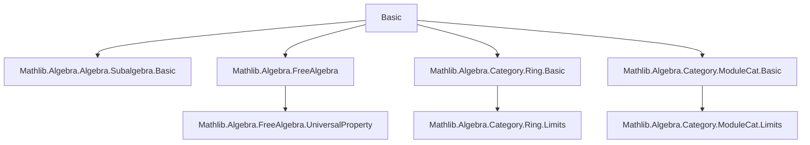
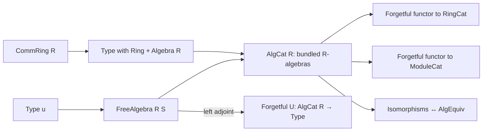

**Technical Brief: `Basic.lean` — Category of Algebras over a Commutative Ring**

---

### 1. **Key Definitions & Theorems**

| Name | Type / Structure | Purpose |
|------|------------------|---------|
| `AlgCat R` | `Type (u+1) → Type u → Type u` | Bundled category of $R$-algebras (with $R$ a commutative ring) and $R$-algebra morphisms. |
| `Hom A B` | `Type v` | Morphism space in `AlgCat R`, defined as `A →ₐ[R] B` (the type of $R$-algebra homomorphisms). |
| `of R X` | `AlgCat R` | Embedding of a type $X$ with `Ring X` and `Algebra R X` into `AlgCat R`. |
| `ofHom f` | `of R A ⟶ of R B` | Embedding of an $R$-algebra homomorphism $f : A →ₐ[R] B$ into a morphism in `AlgCat R`. |
| `free : Type u ⥤ AlgCat.{u} R` | Functor | Free $R$-algebra functor: $S \mapsto \mathrm{FreeAlgebra}\ R\ S$. |
| `adj : free R ⊣ forget (AlgCat R)` | `Adjunction` | Free–forgetful adjunction: free algebra is left adjoint to the forgetful functor. |
| `AlgEquiv.toAlgebraIso` | `X₁ ≃ₐ[R] X₂ → AlgCat.of R X₁ ≅ AlgCat.of R X₂` | Converts algebra equivalences to isomorphisms in `AlgCat`. |
| `toAlgEquiv` | `X ≅ Y → X ≃ₐ[R] Y` | Converts isomorphisms in `AlgCat` to algebra equivalences. |
| `algEquivIsoAlgebraIso` | `(X ≃ₐ[R] Y) ≅ (X ≅ Y)` | Equivalence between algebra isomorphisms and categorical isomorphisms in `AlgCat`. |
| `hasForgetToRing`, `hasForgetToModule` | `HasForget₂` | Forgetful functors from `AlgCat R` to `RingCat` and `ModuleCat R`. |
| `forget₂_module_obj`, `forget₂_module_map` | `simp` lemmas | Description of the forgetful functor to `ModuleCat`. |
| `AlgCat.forget_reflects_isos` | Instance | The forgetful functor reflects isomorphisms. |

---

### 2. **Naming Conventions**

- **Prefixes**:
  - `of_`: embedding constructions (`of`, `ofHom`, `ofHom_id`, `ofHom_apply`).
  - `hom_`: projection of underlying map (`hom`, `hom_id`, `hom_comp`, `hom_ext`, `hom_ofHom`).
  - `forget_`: forgetful functor actions (`forget_obj`, `forget_map`, `forget₂_*`).
  - `free_`: free algebra constructions (`free`, `adj`).
- **Suffixes**:
  - `_obj`, `_map`: for functor actions on objects/morphisms.
  - `_iso`, `_equiv`: for isomorphisms/equivalences (`toAlgebraIso`, `toAlgEquiv`, `algEquivIsoAlgebraIso`).
- **Structure fields**:
  - `carrier`, `hom'`: internal fields; `hom` is the public projection.

---

### 3. **Tactic Stack**

- **`aesop`**: Used in `adj` proof for left inverse verification.
- **`simp` / `simp only`**: Heavily used in `@[simp]` lemmas and proofs (`id_apply`, `comp_apply`, `hom_ext`, etc.).
- **`rfl`**: Reflexivity for definitional equalities (e.g., `coe_of`, `hom_id`, `ofHom_hom`).
- **`by aesop` / `by simp` / `by rw`**: Standard in short proofs.
- **`let` + `exact`**: In `AlgCat.forget_reflects_isos`, for constructing algebra isomorphism from reflected iso.

---

### 4. **Proof Logic**

- **Definitional equality reasoning**: Most structure instances (`Category`, `ConcreteCategory`) are defined by coercion and projection; proofs are mostly `rfl`.
- **Equivalence of categorical and algebraic notions**:
  - Isomorphisms in `AlgCat` ↔ algebra equivalences (`toAlgEquiv`, `toAlgebraIso`, `algEquivIsoAlgebraIso`).
  - Proofs use `ext` lemmas (`hom_ext`) and `simp` to reduce to underlying maps.
- **Adjunction proof**:
  - Constructed via `Adjunction.mkOfHomEquiv`.
  - Hom-set equivalence:  
    $$
    \mathrm{Hom}_{\mathbf{AlgCat}_R}(\mathrm{FreeAlgebra}(S), A) \cong \mathrm{Hom}_{\mathbf{Type}}(S, U(A))
    $$
    where $U$ is the forgetful functor.
  - Left/right inverses verified by `aesop` and `simp`.
- **Reflection of isomorphisms**:
  - Uses `asIso` to get an equivalence of underlying types, then upgrades to algebra equivalence.

---

### 5. **Imports**

| Import | Purpose |
|--------|---------|
| `Mathlib.Algebra.Algebra.Subalgebra.Basic` | Background on algebras and subalgebras. |
| `Mathlib.Algebra.FreeAlgebra` | Free algebra construction and universal property. |
| `Mathlib.Algebra.Category.Ring.Basic` | Category of rings (`RingCat`). |
| `Mathlib.Algebra.Category.ModuleCat.Basic` | Category of modules over $R$ (`ModuleCat R`). |

> These imports provide the foundational categorical and algebraic infrastructure.

---

### 6. **Mermaid Diagrams**

#### **Dependency Graph (Module-Level)**



#### **Overview of Theory Flow**



#### **Free–Forgetful Adjunction**

```mermaid
graph LR
  Type u -- free R --> AlgCat R
  AlgCat R -- forget --> Type u
  free R -.->|⊣|-.-> forget
```

---

### 7. **Notable Design Patterns**

- **Bundling**: `AlgCat R` bundles `Ring` and `Algebra` structures into a single type.
- **ConcreteCategory**: Morphisms are defined via underlying maps (`hom'`), enabling `ext` and `simp` reasoning.
- **Simp-normalization**: `initialize_simps_projections` and `@[simps]` ensure `hom (f ≫ g) = g.hom ∘ f.hom`.
- **Equivalence of notions**: Explicit isomorphisms between `AlgEquiv` and `Iso` in `AlgCat`.

---

### 8. **Summary**

This file formalizes the **category of algebras over a commutative ring** $R$, including:
- The category `AlgCat R` with $R$-algebra morphisms.
- Forgetful functors to `RingCat` and `ModuleCat`.
- The **free algebra functor** and its **adjunction** with the forgetful functor.
- Equivalence between categorical isomorphisms and algebra isomorphisms.
- Reflection of isomorphisms by the forgetful functor.

It serves as a foundational module for higher algebra in Lean, enabling constructions like tensor products, limits/colimits, and monadicity theorems in subsequent files.

--- 

*End of Technical Brief.*
