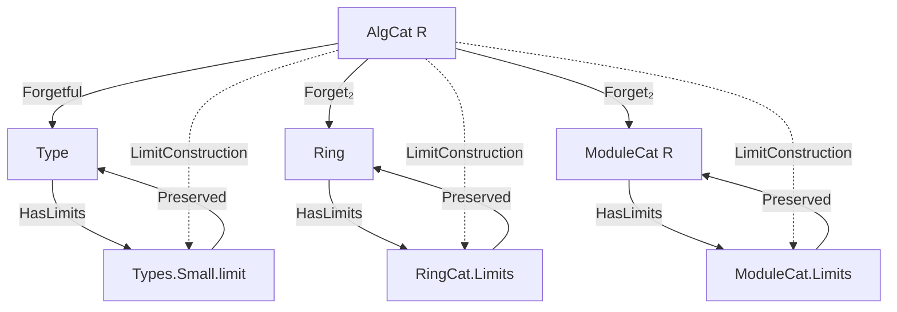
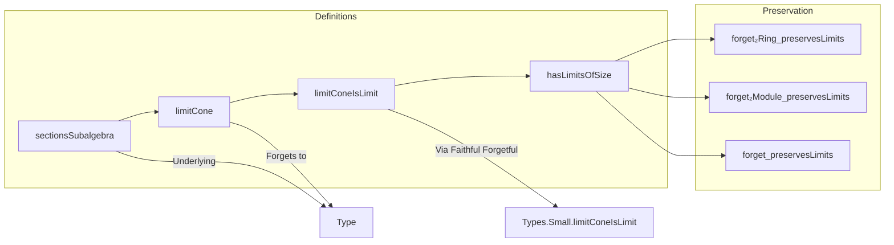

### Technical Brief: `Limits.lean` — Limits in the Category of R-Algebras

---

#### **1. Key Definitions & Theorems**

| Name | Type / Signature | Purpose |
|------|------------------|---------|
| `sectionsSubalgebra` | `def sectionsSubalgebra : Subalgebra R (∀ j, F.obj j)` | Constructs the subalgebra of *natural sections* of a diagram $F : J \to \mathsf{Alg}_R$, i.e., families $(s_j : F_j)$ compatible with all morphisms in $J$. |
| `limitπAlgHom` | `def limitπAlgHom (j) : limit →ₐ[R] F j` | The universal cone leg as an $R$-algebra homomorphism, lifting the limit projection in `Type` to `AlgCat`. |
| `limitCone` | `def limitCone : Cone F` | Constructs a cone over $F$ in $\mathsf{Alg}_R$ whose apex is the limit of the underlying types, equipped with the pointwise algebra structure inherited from `sectionsSubalgebra`. |
| `limitConeIsLimit` | `def limitConeIsLimit : IsLimit (limitCone F)` | Proves that `limitCone F` is a terminal cone — i.e., a limit — in $\mathsf{Alg}_R$. |
| `hasLimitsOfSize` | `lemma hasLimitsOfSize : HasLimitsOfSize (AlgCat R)` | States that $\mathsf{Alg}_R$ has all small limits (of size bounded by a universe level). |
| `hasLimits` | `instance hasLimits : HasLimits (AlgCat R)` | Instantiates the above for the default universe levels. |
| `forget₂Ring_preservesLimitsOfSize` | `instance ... : PreservesLimitsOfSize (forget₂ (AlgCat R) RingCat)` | Shows the forgetful functor $\mathsf{Alg}_R \to \mathsf{Ring}$ preserves all small limits. |
| `forget_preservesLimits` | `instance ... : PreservesLimits (forget (AlgCat R))` | Shows the forgetful functor $\mathsf{Alg}_R \to \mathsf{Type}$ preserves all small limits. |

---

#### **2. Naming Conventions**

- **Prefixes**:
  - `limitCone*`: internal constructions for the limit cone in `AlgCat`.
  - `forget_*`: forgetful functors (e.g., `forget`, `forget₂`).
  - `sectionsSub*`: constructions related to natural sections/subobjects.
  - `has*`, `preserves*`: properties of categories/ functors (e.g., `hasLimits`, `preservesLimitsOfSize`).
- **Suffixes**:
  - `IsLimit`: witness that a cone is terminal.
  - `OfSize`: universe-polymorphic version of a limit-preserving property.
  - `AlgHom`, `RingHom`, `ModuleHom`: morphism types in respective categories.

---

#### **3. Tactic Stack**

| Tactic | Usage |
|--------|-------|
| `ext` | To prove extensionality of functions/homomorphisms (e.g., `AlgHom`, `RingHom`). |
| `simp only [...]` | Simplification using explicit lemmas (especially about `limitCone`, `π`, `Shrink`, `equivShrink`). |
| `rfl` | For definitional equalities (e.g., in `commutes'` proofs). |
| `apply map_*` | To apply algebra/ring/module homomorphism axioms (`map_mul`, `map_add`, `map_zero`, `commutes`). |
| `congr` / `congrArg` | To reduce equality of homomorphisms to equality of underlying functions. |
| `exact` / `intro` / `refine` | Standard proof structuring. |
| `equiv_*` lemmas | E.g., `equivShrink_symm_mul`, `equivShrink_symm_add`, used to transport algebra structure via `Shrink`. |

---

#### **4. Proof Logic**

The proof proceeds in three phases:

1. **Construct the underlying set of the limit**:
   - Use `sectionsSubalgebra` to define the set of natural sections.
   - Show it inherits a ring and $R$-algebra structure.

2. **Lift the limit cone from `Type` to `AlgCat`**:
   - Define `limitCone` using `limitπAlgHom` as cone legs.
   - Verify naturality and algebra homomorphism properties.

3. **Show universality**:
   - Use `IsLimit.ofFaithful` with the faithful forgetful functor `forget : AlgCat ⥤ Type`.
   - Reduce to the known limit in `Type` (`Types.Small.limitConeIsLimit`).
   - Construct the mediating morphism as `ofHom` of a ring homomorphism, checking algebra homomorphism axioms (`map_one`, `map_mul`, `commutes`).

The preservation results follow similarly: show that the forgetful functor sends `limitCone F` to a limit cone in the target category (e.g., `Ring`, `Module R`, `Type`) and apply `preservesLimit_of_preserves_limit_cone`.

---

#### **5. Imports**

| Module | Role |
|--------|------|
| `Mathlib.Algebra.Algebra.Pi` | $R$-algebra structure on $\prod_i A_i$. |
| `Mathlib.Algebra.Algebra.Shrink` | Transport algebra structure along equivalences (e.g., `Shrink`). |
| `Mathlib.Algebra.Category.AlgCat.Basic` | Definition of $\mathsf{Alg}_R$, morphisms, forgetful functors. |
| `Mathlib.Algebra.Category.ModuleCat.Basic` & `Limits` | Module category and its limits. |
| `Mathlib.Algebra.Category.Ring.Limits` | Limits in $\mathsf{Ring}$ (used for comparison). |

---

#### **8. Mermaid Diagrams**

##### **Dependency Graph (High-Level)**

##### **Overview of `Limits.lean`**

---

#### **Summary**

This file establishes that the category $\mathsf{Alg}_R$ of commutative $R$-algebras has all small limits, and that the standard forgetful functors to $\mathsf{Type}$, $\mathsf{Ring}$, and $\mathsf{Mod}_R$ preserve them. The construction is *concrete*: limits are formed as subalgebras of product algebras (natural sections), and proofs rely on lifting limits from `Type` via faithfulness of the forgetful functor. The code exemplifies Lean’s categorical library’s ability to handle algebraic structure transport and universe polymorphism.
