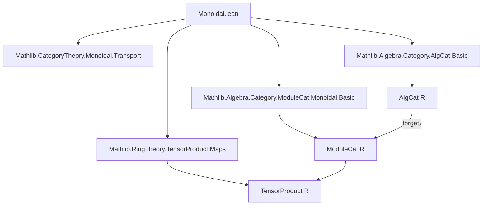
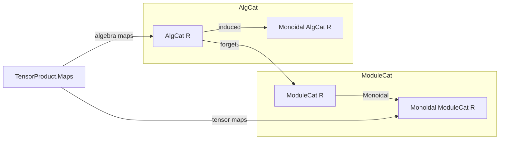

**Technical Brief: `Monoidal.lean` — Monoidal Structure on `R`-Algebras**

---

### 1. **Key Definitions & Theorems**

| Name | Type / Signature | Purpose |
|------|------------------|---------|
| `tensorObj` | `AlgCat R → AlgCat R → AlgCat R` | Defines the tensor product of two $R$-algebras as the underlying algebra of the tensor product of their underlying $R$-modules. |
| `tensorHom` | `(f : W ⟶ X) → (g : Y ⟶ Z) → tensorObj W Y ⟶ tensorObj X Z` | Defines the tensor product of algebra morphisms via `Algebra.TensorProduct.map`. |
| `instMonoidalCategoryStruct` | `MonoidalCategoryStruct (AlgCat R)` | Constructs the *pre*-monoidal structure on `AlgCat R` using tensor objects, whiskering, and structural isomorphisms derived from module-level tensor product isomorphisms. |
| `instMonoidalCategory` | `MonoidalCategory (AlgCat R)` | Proves the full monoidal category axioms (pentagon, triangle, naturality) by lifting from `ModuleCat R` via `Monoidal.induced`. |
| `hom_tensorHom` | `(f ⊗ₘ g).hom = Algebra.TensorProduct.map f.hom g.hom` | Identifies the hom-component of the tensor morphism in `AlgCat`. |
| `hom_whiskerLeft`, `hom_whiskerRight` | Express whiskering in terms of `Algebra.TensorProduct.map`. | Clarify how left/right whiskering acts on underlying module maps. |
| `hom_hom_*Unitor`, `hom_inv_*Unitor`, `hom_hom_associator`, `hom_inv_associator` | Equalities between hom-components of structural isomorphisms and algebra isomorphisms induced by module-level tensor product isomorphisms. | Bridge categorical structure with concrete algebraic maps. |

---

### 2. **Naming Conventions**

- **Prefixes**:
  - `tensorObj`, `tensorHom`: denote tensor product constructions.
  - `hom_*`: denote equalities involving the underlying homomorphism of a categorical morphism.
  - `inst*`: used for instance definitions (e.g., `instMonoidalCategory`).
- **Suffixes**:
  - `_leftUnitor`, `_rightUnitor`, `_associator`: denote structural isomorphisms.
  - `_toAlgHom`: indicates conversion from a module-level map to an algebra homomorphism.

---

### 3. **Tactic Stack**

- `rfl`: used extensively to prove definitional equalities (especially for hom-components).
- `ModuleCat.hom_ext`: used to extend equalities from underlying module maps to algebra maps.
- `TensorProduct.ext'`, `TensorProduct.ext_threefold`: used to prove equality of tensor product maps by testing on simple tensors.
- `inferInstance`: used to synthesize the monoidal category instance.
- `Monoidal.induced`: key tactic for constructing monoidal structures via a forgetful functor.

---

### 4. **Proof Logic**

The proof proceeds in two stages:

1. **Pre-structure construction**:
   - Define `tensorObj`, `tensorHom`, whiskering, and structural isomorphisms (`α`, `λ`, `ρ`) using module-level tensor product constructions.
   - Prove that the hom-components of these categorical morphisms match the expected algebra maps (via `rfl` and `ext` lemmas).

2. **Monoidal category verification**:
   - Use `Monoidal.induced` to lift the monoidal structure from `ModuleCat R` along the forgetful functor `forget₂ : AlgCat R → ModuleCat R`.
   - Verify the required equalities (`associator_eq`, `leftUnitor_eq`, `rightUnitor_eq`) by reducing to module-level equalities and applying `TensorProduct.ext'` or `ext_threefold`.

This avoids a direct, potentially timeout-prone, proof inside `AlgCat` by leveraging the known monoidal structure on modules.

---

### 5. **Imports**

| Import | Role |
|--------|------|
| `Mathlib.CategoryTheory.Monoidal.Transport` | Provides `Monoidal.induced`, used to transfer monoidal structures along functors. |
| `Mathlib.Algebra.Category.AlgCat.Basic` | Defines `AlgCat R`, its objects (algebras), morphisms (algebra homs), and basic constructions. |
| `Mathlib.Algebra.Category.ModuleCat.Monoidal.Basic` | Supplies the monoidal structure on `ModuleCat R`, including `tensorObj`, `tensorHom`, and structural isomorphisms. |
| `Mathlib.RingTheory.TensorProduct.Maps` | Contains `Algebra.TensorProduct.map`, `assoc`, `lid`, `rid`, and their properties. |

---

### 6. **Mermaid Diagrams**

#### **Dependency Graph (Module Scope)**

#### **Overview of Theoretical Flow**

---

### 7. **Summary**

This file constructs the canonical monoidal category structure on the category of $R$-algebras (`AlgCat R`), where the tensor product is given by the tensor product of algebras over $R$, and morphisms are induced by the universal property of the tensor product. The proof leverages the monoidal structure on modules and uses `Monoidal.induced` to avoid low-level coherence verification, ensuring efficiency and correctness.
