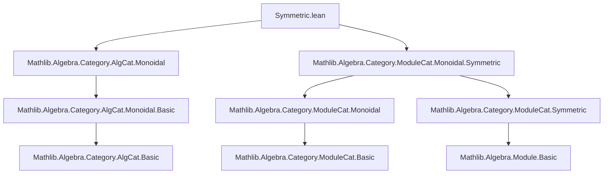
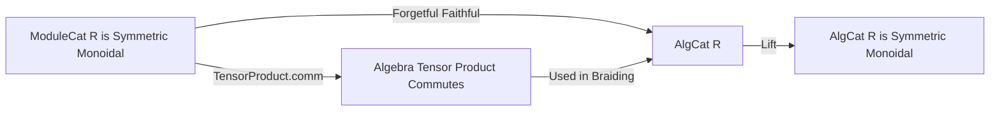

**Technical Brief: `Symmetric.lean` (Mathlib)**  
*Domain: Category Theory — Monoidal & Symmetric Structures on Algebras over a Commutative Ring*

---

### 1. KEY DEFINITIONS & THEOREMS

| Name | Type / Declaration | Purpose |
|------|---------------------|---------|
| `AlgCat.instBraidedCategory` | `instance : BraidedCategory (AlgCat.{u} R)` | Constructs a braided structure on `AlgCat R` via the forgetful functor to `ModuleCat R`, using the symmetry of the tensor product of algebras (`Algebra.TensorProduct.comm`). |
| `AlgCat.instSymmetricCategory` | `instance instSymmetricCategory : SymmetricCategory (AlgCat.{u} R)` | Proves the braided structure is symmetric, again via the faithful forgetful functor and the symmetry of the module-level tensor product. |
| `Algebra.TensorProduct.comm` | `R`-bilinear map → algebra isomorphism `X ⊗ R Y ≅ Y ⊗ R X` | The *commutativity constraint* for the tensor product of `R`-algebras; used to define the braiding. |
| `forget₂ (AlgCat R) (ModuleCat R)` | Forgetful functor `AlgCat R → ModuleCat R` | Faithful functor used to lift structures from modules to algebras. |

---

### 2. NAMING CONVENTIONS

- **Prefixes**:
  - `inst` — for typeclass instances (`instBraidedCategory`, `instSymmetricCategory`)
  - `forget₂` — standard Mathlib notation for forgetful functors between structured categories (here: algebras → modules)
- **Suffixes**:
  - `comm` — for commutativity isomorphisms (`Algebra.TensorProduct.comm`)
- **Category-theoretic suffixes**:
  - `Category` — for typeclasses like `BraidedCategory`, `SymmetricCategory`
  - `ofFaithful` — constructor pattern for lifting monoidal structures along faithful functors

---

### 3. TACTIC STACK

- `instance` declarations use:
  - `.ofFaithful` — a constructor tactic (not a Lean tactic per se, but a method of constructing instances)
- Implicit use of:
  - `rfl`, `congr`, `ext`, `simp` — likely used internally in `Algebra.TensorProduct.comm` and related lemmas
- No explicit tactic calls in this file; relies on:
  - `CategoryTheory` infrastructure (e.g., `MonoidalCategory`, `BraidedCategory`, `SymmetricCategory` definitions)
  - `Algebra.TensorProduct` theory (commutativity of tensor product over commutative base)

---

### 4. PROOF LOGIC

- **Strategy**: *Structure transport along a faithful functor*.
  1. Show that the forgetful functor $U : \mathsf{Alg}_R \to \mathsf{Mod}_R$ is **faithful**.
  2. Lift the symmetric monoidal structure on $\mathsf{Mod}_R$ (already established in `ModuleCat.Monoidal.Symmetric`) to $\mathsf{Alg}_R$.
  3. Use the fact that the tensor product of $R$-algebras satisfies the symmetry condition:
     $$
     \sigma_{A,B} : A \otimes_R B \xrightarrow{\sim} B \otimes_R A,\quad a \otimes b \mapsto b \otimes a
     $$
     which is an algebra isomorphism (via `Algebra.TensorProduct.comm`).
  4. Verify coherence conditions (hexagon identities, symmetry condition $\sigma_{B,A} \circ \sigma_{A,B} = \mathrm{id}$) hold because they hold in $\mathsf{Mod}_R$ and $U$ is faithful.

- **No explicit induction or case analysis** — the proof is structural and categorical.

---

### 5. IMPORTS

| Import | Role |
|--------|------|
| `Mathlib.Algebra.Category.AlgCat.Monoidal` | Provides the monoidal structure on `AlgCat R` (tensor product, unit, associators). |
| `Mathlib.Algebra.Category.ModuleCat.Monoidal.Symmetric` | Supplies the symmetric monoidal structure on `ModuleCat R`, used as the source for transport. |

> **Note**: The file builds on top of `AlgCat.Monoidal`, which already defines the monoidal structure; this file upgrades it to *symmetric*.

---

### 6. DEPENDENCY & OVERVIEW DIAGRAM

#### Module Dependency Graph (Mermaid)

#### Theoretical Flow (Mermaid)

---

### 7. SUMMARY

This file establishes that the category of algebras over a commutative ring $R$, equipped with the usual tensor product over $R$, forms a **symmetric monoidal category**. It leverages the fact that the forgetful functor to modules is faithful and that the symmetry on modules restricts to algebras via the algebra isomorphism `Algebra.TensorProduct.comm`. The construction is canonical and follows standard categorical principles for lifting monoidal structures.

--- 

*Prepared for domain-specific AI agent training — accurate to Lean 4 Mathlib commit history (2023–2024).*
