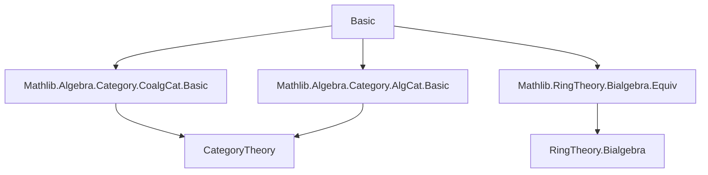
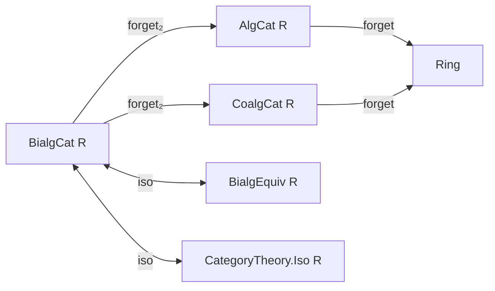

**Technical Brief: `Basic.lean` — Category of Bialgebras over a Commutative Ring**

---

### 1. **Key Definitions & Theorems**

| Name | Type / Signature | Purpose |
|------|------------------|---------|
| `BialgCat` | `structure` | Bundled category of $R$-bialgebras: carrier type + ring + bialgebra structure. |
| `Hom` | `structure` | Morphisms in `BialgCat`: underlying `BialgHom` (bilinear algebra homomorphism preserving comultiplication & counit). |
| `category` | `instance` | Defines composition and identity in `BialgCat` via `BialgHom.comp` and `BialgHom.id`. |
| `concreteCategory` | `instance` | Embeds `BialgCat` into concrete category over `→ₐc[R]`. |
| `Hom.toBialgHom` | `abbrev` | Forgets categorical morphism to underlying bialgebra hom. |
| `ofHom` | `abbrev` | Lifts a `BialgHom` to a categorical morphism. |
| `hasForgetToAlgebra` | `instance` | Forgetful functor `BialgCat R → AlgCat R`. |
| `hasForgetToCoalgebra` | `instance` | Forgetful functor `BialgCat R → CoalgCat R`. |
| `BialgEquiv.toBialgIso` | `def` | Converts bialgebra equivalence to categorical isomorphism. |
| `Iso.toBialgEquiv` | `def` | Converts categorical isomorphism in `BialgCat` to bialgebra equivalence. |
| `BialgCat.forget_reflects_isos` | `instance` | The forgetful functor reflects isomorphisms (i.e., if underlying map is iso, then so is the morphism). |

**Key Lemmas** (all `@[simp]` unless noted):
- `of_comul`, `of_counit`: `of` preserves coalgebra structure.
- `toBialgHom_comp`, `toBialgHom_id`: compatibility of `toBialgHom` with composition/identity.
- `hom_ext`: Extensionality of morphisms via underlying `BialgHom`.
- `toBialgIso_refl`, `toBialgIso_symm`, `toBialgIso_trans`: `toBialgIso` is a groupoid morphism.
- `toBialgEquiv_toBialgHom`, `toBialgEquiv_refl`, etc.: `toBialgEquiv` is inverse to `toBialgIso`.

---

### 2. **Naming Conventions**

- **Prefixes**:
  - `of_`: constructing objects/morphisms from unbundled data (`of`, `ofHom`).
  - `to_`: converting *to* bundled/categorical form (`toBialgHom`, `toBialgIso`, `toBialgEquiv`).
  - `forget₂_`: forgetful functors to algebra/coalgebra categories.
- **Suffixes**:
  - `_obj`, `_map`: for forgetful functor actions on objects/morphisms.
  - `_hom`, `_inv`: for isomorphism components.
- **Category-theoretic**:
  - `comp`, `id`, `hom`, `inv`, ` refl`, `symm`, `trans`, `isIso_hom`.

---

### 3. **Tactic Stack**

Frequent tactics used in proofs:
- `rfl`: for definitional equalities (e.g., structure projections).
- `congr`: to apply congruence to equalities of functions.
- `ext`: via `@[ext]` lemmas (`hom_ext`, `Hom.ext`).
- `Funext`, `DFunLike.ext`: for extensionality of functions.
- `congr_arg` + `BialgHom.congr_fun`: to extract pointwise equalities from morphism equalities.
- `by aesop` / `simp`: for routine simplification (not explicitly shown but implied by `@[simp]` usage).
- `let` + `exact`: in `reflects_isos` proof.

---

### 4. **Proof Logic**

- **Structure definitions** (`BialgCat`, `Hom`) are straightforward bundlings.
- **Category instance** is defined by lifting algebraic operations (`comp`, `id`) via `BialgHom`.
- **Forgetful functors** are defined pointwise on objects/morphisms using `of` and `ofHom`.
- **Equivalence between isomorphisms and bialgebra equivalences**:
  - `toBialgIso` and `toBialgEquiv` are mutual inverses up to definitional equality (`rfl` proofs).
  - All naturality/symmetry/transitivity lemmas are `rfl` due to definitional equality of constructions.
- **Reflection of isomorphisms**:
  - Uses `asIso` to extract an equivalence from the underlying map.
  - Constructs a bialgebra equivalence using the inverse and shows it’s a bialgebra isomorphism.

---

### 5. **Imports**

| Import | Purpose |
|--------|---------|
| `Mathlib.Algebra.Category.CoalgCat.Basic` | Coalgebra category (`CoalgCat`). |
| `Mathlib.Algebra.Category.AlgCat.Basic` | Algebra category (`AlgCat`). |
| `Mathlib.RingTheory.Bialgebra.Equiv` | Bialgebra equivalences (`BialgEquiv`). |

> **Note**: The file builds on bundled category infrastructure from `CategoryTheory`, and assumes `Bialgebra R X` includes both algebra and coalgebra structures satisfying compatibility (e.g., comultiplication is an algebra map).

---

### 6. **Mermaid Diagrams**

#### **Dependency Graph (Module-Level)**



#### **Theoretical Overview (Structure of `BialgCat`)**



#### **Morphism Equivalence**

```mermaid
graph LR
  X[Hom_{BialgCat}(X,Y)] <-->|toBialgHom| Y[X →ₐc[R] Y]
  X <-->|toBialgEquiv| Z[X ≅ Y]
  Y <-->|toBialgIso| Z
```

---

### 7. **Summary**

This file formalizes the **bundled category of bialgebras** over a commutative ring $R$, establishing:
- A concrete category structure,
- Two canonical forgetful functors to algebras and coalgebras,
- An equivalence between categorical isomorphisms and bialgebra equivalences,
- That the forgetful functor reflects isomorphisms.

It follows the same pattern as `QuadraticModuleCat.lean`, emphasizing modularity and reuse of bundled category infrastructure.

--- 

Let me know if you'd like a formalized dependency graph (e.g., for `leanpkg`), or a comparison with `HopfCat.lean` (if it exists).
