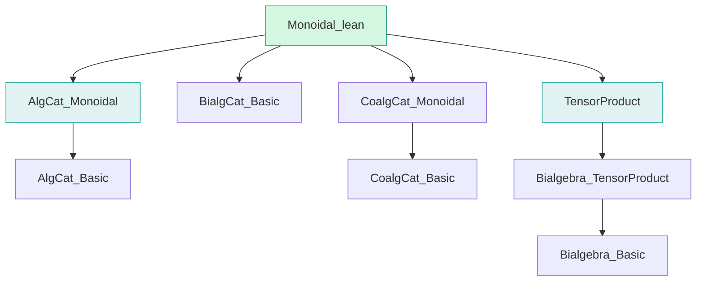

**Technical Brief: `Monoidal.lean` — Monoidal Structure on Bialgebra Category**

---

### 1. **Key Definitions & Theorems**

| Name | Type / Purpose |
|------|----------------|
| `instMonoidalCategoryStruct` | `MonoidalCategoryStruct.{u} (BialgCat R)` — defines the *preliminary monoidal data* (tensor object, morphisms, unitors, associator) on `BialgCat R`, using tensor products of bialgebras and bialgebra homs. |
| `MonoidalCategory.inducingFunctorData` | `Monoidal.InducingFunctorData (forget₂ (BialgCat R) (AlgCat R))` — provides the data needed to *induce* a monoidal structure on `BialgCat R` via the forgetful functor to algebras. |
| `instMonoidalCategory` | `MonoidalCategory (BialgCat R)` — the final monoidal category instance, constructed via `Monoidal.induced`. |
| `forget₂ (BialgCat R) (AlgCat R).Monoidal` | Instance showing the forgetful functor to algebras is *strictly monoidal* (via `Functor.CoreMonoidal.toMonoidal`). |
| `forget₂ (BialgCat R) (CoalgCat R).Monoidal` | Instance showing the forgetful functor to coalgebras is monoidal. |

**Core lemmas used implicitly** (from `TensorProduct.lean`):  
- `Bialgebra.TensorProduct.assoc`, `lid`, `rid` — bialgebra isomorphisms for associator, left/right unitors.  
- `Bialgebra.TensorProduct.map` — tensor product of bialgebra homs.

---

### 2. **Naming Conventions**

- **Prefixes / Suffixes**:
  - `inst*`: typeclass instances (`instMonoidalCategoryStruct`, `instMonoidalCategory`)
  - `of*`: coercion from underlying types to categorical objects (`of R`, `ofHom`)
  - `forget₂`: binary forgetful functor (from bialgebras to algebras or coalgebras)
  - `μIso`, `εIso`: monoidal functor structure maps (multiplication and unit isos)
  - `*_eq`: equality proofs for structure maps under forgetful functor (e.g., `associator_eq`, `leftUnitor_eq`)
  - `TensorProduct.*`: names inherited from `TensorProduct.lean` (e.g., `assoc`, `lid`, `rid`, `map`)

---

### 3. **Tactic Stack**

- `ext`: used repeatedly to prove extensionality of homs (especially `AlgCat.hom_ext`).
- `rfl`: used in `by ext; rfl` to prove definitional equalities.
- `simp_rw` / `simp` (implicit via `@[simps]` attribute): used to simplify projections of structures.
- `ring` (not used directly here, but likely in `TensorProduct.lean` for algebra laws).
- `aesop` (not used here, but common in related files for automation of algebraic reasoning).

---

### 4. **Proof Logic**

- **Strategy**: *Pullback via forgetful functor*.
  - Define monoidal structure on `BialgCat R` *by hand* on objects/morphisms (using tensor product constructions).
  - Show that the forgetful functor to `AlgCat R` *preserves* this structure up to coherent isomorphism (via `MonoidalCategory.inducingFunctorData`).
  - Apply `Monoidal.induced`, which lifts the monoidal structure from `AlgCat R` (already monoidal) along the forgetful functor.
  - Proofs of coherence axioms are *deferred* to `Monoidal.induced`, which assumes the source category (`AlgCat R`) is monoidal and the functor data satisfies the required equalities (verified in `inducingFunctorData`).

- **Equality proofs**:
  - Use `AlgCat.hom_ext` to reduce to underlying algebra hom equality.
  - Use `Algebra.TensorProduct.ext` to prove equality of algebra maps out of tensor product (by checking on simple tensors).
  - `by ext; rfl` suffices for definitional equalities (e.g., whiskering, unitors on underlying maps).

---

### 5. **Imports**

| Import | Role |
|--------|------|
| `Mathlib.Algebra.Category.AlgCat.Monoidal` | Provides monoidal structure on `AlgCat R`. |
| `Mathlib.Algebra.Category.BialgCat.Basic` | Basic definitions of bialgebra category. |
| `Mathlib.Algebra.Category.CoalgCat.Monoidal` | Monoidal structure on `CoalgCat R`. |
| `Mathlib.RingTheory.Bialgebra.TensorProduct` | Constructs tensor product of bialgebras and bialgebra homs, with associator/unitors. |

---

### 6. **Mermaid Diagrams**

#### **Dependency Graph (File-Level)**



#### **Conceptual Overview (Category-Theoretic)**

```mermaid
graph LR
  subgraph BialgCat
    BialgCat[BialgCat R]
    forgetA[forget₂ to AlgCat R]
    forgetC[forget₂ to CoalgCat R]
  end

  subgraph AlgCat
    AlgCat[AlgCat R]
    MonoidalAlg[MonoidalCategory]
  end

  subgraph CoalgCat
    CoalgCat[CoalgCat R]
    MonoidalCoalg[MonoidalCategory]
  end

  BialgCat -- forgetful --> AlgCat
  BialgCat -- forgetful --> CoalgCat
  AlgCat -- Monoidal --> MonoidalAlg
  CoalgCat -- Monoidal --> MonoidalCoalg

  BialgCat -.->|Monoidal via Monoidal.induced| MonoidalAlg
  BialgCat -.->|Monoidal (trivially)| MonoidalCoalg

  style BialgCat fill:#ffe0b2,stroke:#fb8c00
  style MonoidalAlg fill:#c8e6c9,stroke:#43a047
```

#### **Data Flow in `Monoidal.lean`**

```mermaid
flowchart LR
  A[Bialgebra.TensorProduct.assoc, lid, rid] -->|define| B[instMonoidalCategoryStruct]
  B -->|forgetful data| C[MonoidalCategory.inducingFunctorData]
  C -->|Monoidal.induced| D[instMonoidalCategory]

  D -->|forgetful functor| E[forget₂ (BialgCat R) (AlgCat R)]
  E -->|Monoidal instance| F[(forget₂).Monoidal]

  style A fill:#e3f2fd,stroke:#1e88e5
  style D fill:#e8f5e9,stroke:#43a047
```

---

### 7. **Summary**

This file constructs a *monoidal category structure* on `BialgCat R` by:
- Defining tensor product of bialgebras and bialgebra homs,
- Lifting the monoidal structure from `AlgCat R` via the forgetful functor,
- Verifying that the forgetful functors to both `AlgCat R` and `CoalgCat R` are monoidal.

It exemplifies a common pattern in `Mathlib`: *inducing structure along a forgetful functor* using `Monoidal.induced`, after verifying the necessary coherence data on the underlying category.
