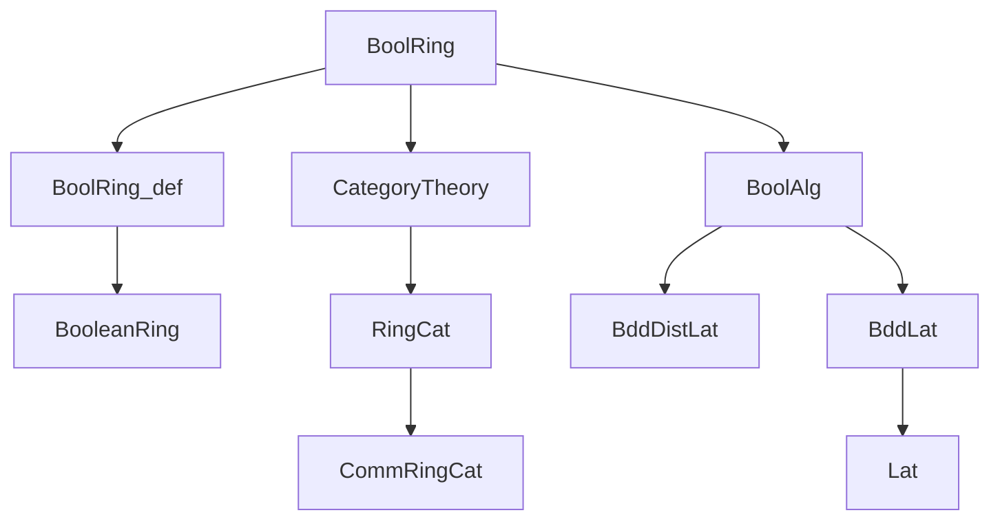
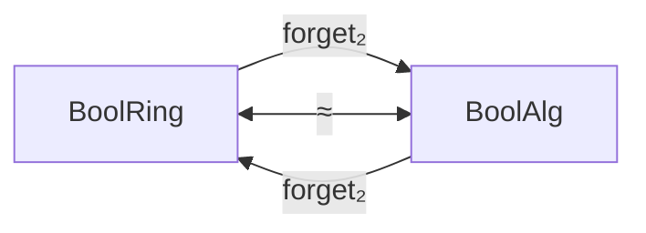

### Technical Brief: `BoolRing.lean`

---

#### **1. Key Definitions & Theorems**

| Name | Type / Signature | Purpose |
|------|------------------|---------|
| `BoolRing` | `Type u → Type u` (via `structure`) | Bundled Boolean rings: a type equipped with a `BooleanRing` instance. |
| `Hom` | `BoolRing → BoolRing → Type u` | Morphisms in `BoolRing`: ring homomorphisms `R →+* S`. |
| `instance : Category BoolRing` | `Category BoolRing` | Defines composition and identity for Boolean ring homomorphisms. |
| `instance : ConcreteCategory BoolRing (· →+* ·)` | `ConcreteCategory BoolRing (· →+* ·)` | Embeds `BoolRing` into concrete category over ring homs. |
| `Hom.hom` | `f : R ⟶ S ↦ f.hom' : R →+* S` | Projection from `BoolRing`-morphism to underlying ring hom. |
| `ofHom` | `(f : R →+* S) ↦ ⟨f⟩ : of R ⟶ of S` | Inclusion of ring homs into `BoolRing`-morphisms. |
| `Iso.mk` | `(e : α ≃+* β) ↦ α ≅ β` | Constructs an isomorphism in `BoolRing` from a ring isomorphism. |
| `hasForgetToCommRing` | `HasForget₂ BoolRing CommRingCat` | Forgetful functor to commutative rings (via `CommRingCat`). |
| `hasForgetToBoolAlg` | `HasForget₂ BoolRing BoolAlg` | Forgetful functor from Boolean rings to Boolean algebras. |
| `hasForgetToBoolRing` | `HasForget₂ BoolAlg BoolRing` | Forgetful functor from Boolean algebras to Boolean rings. |
| `boolRingCatEquivBoolAlg` | `BoolRing ≌ BoolAlg` | Equivalence (in fact, isomorphism) of categories between Boolean rings and Boolean algebras. |

---

#### **2. Naming Conventions**

- **Prefixes**:
  - `of_`: Bundling/unbundling (e.g., `of`, `ofHom`, `ofBoolRing`, `ofBoolAlg`).
  - `hom_`: Projection to underlying hom (e.g., `hom`, `hom'`, `hom_ext`).
  - `forget₂`: Forgetful functors between structured categories.
  - `as_`: Conversion between bundled structures (e.g., `asBoolRing`, `asBoolAlg`, `asBoolRingAsBoolAlg`).
- **Suffixes**:
  - `_mk`: Constructor for isomorphisms or morphisms (e.g., `Iso.mk`).
  - `_ext`: Extensionality lemmas (e.g., `hom_ext`).
  - `_to_`: Conversion or forgetful maps (e.g., `hasForgetToBoolRing`).

---

#### **3. Tactic Stack**

Frequently used tactics in proofs and definitions:

- `ext`: Extensionality (especially for `Hom`, `Iso`, ring homs).
- `rfl`: Reflexivity for definitional equalities (e.g., `coe_of`, `hom_ext`).
- `simps`: Automatically generate `simp` lemmas for projections (e.g., `@[simps]` on `Iso.mk`, `hasForgetToBoolAlg`, etc.).
- `exact`: Direct proof term application (e.g., in `Iso.mk` proofs).
- `inferInstanceAs`: To infer instances via typeclass resolution.
- `set_option backward.privateInPublic true`: Used to allow private fields in public definitions (for internal structure `mk`).

No heavy automation like `aesop`, `ring`, or `simp` is used in core definitions—proofs are mostly definitional or rely on `ext` + `rfl`.

---

#### **4. Proof Logic**

- **Structure definitions** are mostly definitional; proofs of properties (e.g., `Iso.mk`) reduce to:
  - `ext`: Reduce to equality of underlying ring homs.
  - `rfl`: Use definitional equality of components (e.g., `e.symm_apply_apply _ = _`).
- **Forgetful functors** are defined structurally; proofs of functoriality are implicit via `ConcreteCategory` or `HasForget₂`.
- **Equivalence proof** (`boolRingCatEquivBoolAlg`):
  - Uses `NatIso.ofComponents` with explicit natural isomorphisms.
  - Unit and counit isomorphisms are constructed via ring/boolean algebra equivalences (`RingEquiv.asBoolRingAsBoolAlg`, `OrderIso.asBoolAlgAsBoolRing`).
  - Naturality is verified by `rfl`, indicating definitional naturality.

---

#### **5. Imports**

| Import | Purpose |
|--------|---------|
| `Mathlib.Algebra.Category.Ring.Basic` | Basic category theory of rings (`RingCat`, `CommRingCat`, etc.). |
| `Mathlib.Algebra.Ring.BooleanRing` | Definition and basic properties of Boolean rings. |
| `Mathlib.Order.Category.BoolAlg` | Category of Boolean algebras (`BoolAlg`). |

These imports define the ambient categorical and algebraic structures.

---

#### **6. Mermaid Diagrams**

##### **Dependency Graph (Module-Level)**



##### **Category Equivalence Overview**



- `boolRingCatEquivBoolAlg` exhibits an *isomorphism* of categories:
  - `functor = forget₂ BoolRing BoolAlg`
  - `inverse = forget₂ BoolAlg BoolRing`
  - Unit and counit are definitional isomorphisms.

##### **Internal Structure of `BoolRing`**

```mermaid
graph TD
  BoolRing --> carrier
  BoolRing --> booleanRing
  booleanRing --> BooleanRing
  Hom --> hom'
  Hom --> mk
  Category BoolRing --> id
  Category BoolRing --> comp
  ConcreteCategory BoolRing --> hom
  ConcreteCategory BoolRing --> ofHom
```

---

#### **7. Notes & Observations**

- The file is minimal and clean: definitions are bundled, and morphisms are ring homs.
- The equivalence with `BoolAlg` is *definitional* in both directions (via `asBoolRing`/`asBoolAlg`), hence the equivalence is an isomorphism of categories.
- The use of `set_option backward.privateInPublic true` suggests internal use of private constructors (`mk`) in public definitions—likely for ergonomic bundling/unbundling.
- `initialize_simps_projections BoolRing (-booleanRing)` suppresses projection lemmas for the `booleanRing` field to avoid clutter.

--- 

Let me know if you'd like a formalized summary in Lean or a proof sketch of `boolRingCatEquivBoolAlg`.
