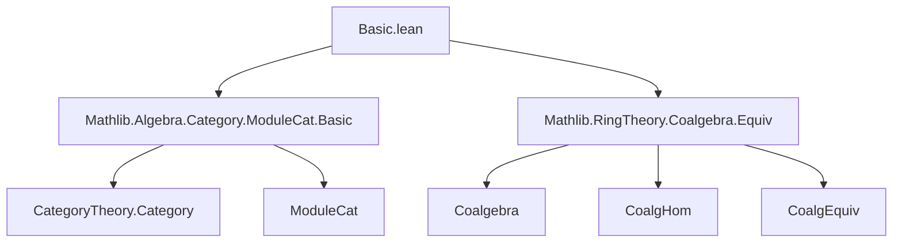
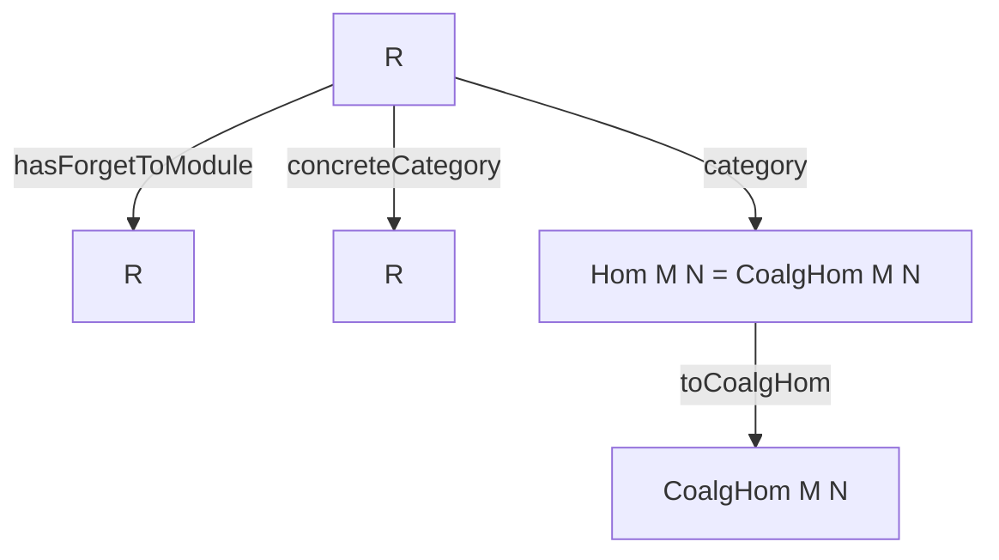

**Technical Brief: `Basic.lean` — Category of Coalgebras over a Commutative Ring**

---

### 1. **Key Definitions & Theorems**

| Name | Type / Structure | Purpose |
|------|------------------|---------|
| `CoalgCat R` | `Type (u+1)` (bundled category) | Category of coalgebras over a commutative ring `R`, bundled as a concrete category over `ModuleCat R`. |
| `CoalgCat.of R X` | `CoalgCat R` | Embeds an unbundled coalgebra `X` into `CoalgCat R`. |
| `CoalgCat.Hom V W` | `Type v` | Morphisms in `CoalgCat`, defined as `CoalgHom V W`. |
| `CoalgCat.category` | `Category (CoalgCat R)` | Defines identity and composition in `CoalgCat` via `CoalgHom.id` and `CoalgHom.comp`. |
| `CoalgCat.concreteCategory` | `ConcreteCategory (CoalgCat R) (· →ₗc[R] ·)` | Makes `CoalgCat R` a concrete category over linear maps over `R`. |
| `CoalgCat.hasForgetToModule` | `HasForget₂ (CoalgCat R) (ModuleCat R)` | Forgetful functor `CoalgCat R → ModuleCat R`. |
| `CoalgEquiv.toCoalgIso e` | `CoalgCat.of R X ≅ CoalgCat.of R Y` | Converts a coalgebra equivalence `e : X ≃ₗc[R] Y` to a categorical isomorphism. |
| `CategoryTheory.Iso.toCoalgEquiv i` | `X ≃ₗc[R] Y` | Converts a categorical isomorphism `i : X ≅ Y` in `CoalgCat R` to a coalgebra equivalence. |
| `CoalgCat.forget_reflects_isos` | `ReflectsIsomorphisms` | The forgetful functor reflects isomorphisms (i.e., if the underlying linear map is an iso, then the morphism is an iso in `CoalgCat`). |

**Theorems (key lemmas):**
- `of_comul`, `of_counit`: `of` preserves coalgebra structure maps.
- `toCoalgHom_comp`, `toCoalgHom_id`: Compatibility of `toCoalgHom` with composition and identities.
- `hom_ext`: Extensionality of morphisms via underlying coalgebra homomorphism.
- `toCoalgIso_refl`, `toCoalgIso_symm`, `toCoalgIso_trans`: `toCoalgIso` respects categorical structure.
- `toCoalgEquiv_toCoalgHom`, `toCoalgEquiv_refl`, etc.: `toCoalgEquiv` is inverse to `toCoalgIso`.

---

### 2. **Naming Conventions**

- **Prefixes:**
  - `of_`: Embed unbundled structure into bundled category (e.g., `of`, `ofHom`).
  - `to_`: Forgetful or conversion map (e.g., `toCoalgHom`, `toCoalgIso`, `toCoalgEquiv`).
  - `hom_`, `inst_`: Internal structure (e.g., `Hom`, `instCoalgebra`).
- **Suffixes:**
  - `_hom`, `_inv`: For components of isomorphisms (e.g., `hom_inv_id`, `inv_hom_id`).
  - `_id`, `_symm`, `_trans`: Categorical properties (e.g., `toCoalgIso_symm`, `toCoalgEquiv_trans`).
- **`inst_` prefix**: Instance fields (e.g., `instCoalgebra`).

---

### 3. **Tactic Stack**

Frequently used tactics in proofs:
- `rfl`: For definitional equalities (e.g., `of_comul`, `toCoalgHom_id`).
- `congr`: To apply extensionality lemmas (e.g., `Hom.ext`, `DFunLike.ext`).
- `Funext`, `congr_arg`, `congr_fun`: For functional extensionality and congruence reasoning.
- `simp` (via `@[simp]` attributes): To simplify using definitional equalities.
- `exact`, `intro`, `cases`, `refine`: Basic proof scripting.
- `by` + `let` + `exact`: For structured proofs (e.g., `reflects_isos` instance).

No heavy automation (`aesop`, `ring`, `linarith`) is used—proofs are mostly definitional or rely on `simp`-based simplification.

---

### 4. **Proof Logic**

- **Structure preservation**: Proofs about `of` rely on definitional equality of structure maps (`comul`, `counit`)—hence `rfl`.
- **Extensionality**: Morphism equality is reduced to equality of underlying coalgebra homomorphisms via `hom_ext`.
- **Isomorphism ↔ Equivalence**: The bidirectional translation between categorical isomorphisms and coalgebra equivalences is proven by:
  - Defining maps in both directions (`toCoalgIso`, `toCoalgEquiv`).
  - Verifying naturality and inverse properties via `hom_ext` and `DFunLike.ext`.
- **Forgetful functor properties**: Proofs about `forget₂` use `rfl` and `simp` to unfold definitions.

---

### 5. **Imports**

| Import | Purpose |
|--------|---------|
| `Mathlib.Algebra.Category.ModuleCat.Basic` | Provides `ModuleCat`, its category structure, and forgetful functors. |
| `Mathlib.RingTheory.Coalgebra.Equiv` | Provides unbundled coalgebra homs (`→ₗc`), equivalences (`≃ₗc`), and basic lemmas. |

---

### 6. **Mermaid Diagrams**

#### **Dependency Graph (Module Scope)**



#### **Overview of `CoalgCat` Construction**

```mermaid
graph LR
  unbundled_coalgebra[X : Type with Coalgebra R X]
  unbundled_coalgebra -->|of R X| bundled_coalgebra[CoalgCat R]

  unbundled_coalg_hom[f : X →ₗc[R] Y]
  unbundled_coalg_hom -->|ofHom f| bundled_hom[CoalgCat R ⟶]

  bundled_coalgebra -->|forget₂| module_cat[ModuleCat R]
  bundled_hom -->|forget₂| module_hom[ModuleCat R ⟶]

  bundled_iso[i : X ≅ Y]
  bundled_iso -->|toCoalgEquiv| unbundled_equiv[X ≃ₗc[R] Y]

  unbundled_equiv[e : X ≃ₗc[R] Y]
  unbundled_equiv -->|toCoalgIso| bundled_iso
```

#### **Categorical Structure**



---

### 7. **Summary**

This file constructs the **bundled category of coalgebras** over a fixed commutative ring `R`, mirroring the approach used for quadratic forms and modules. It:
- Defines `CoalgCat R` as a concrete category,
- Equips it with a forgetful functor to `ModuleCat R`,
- Establishes equivalence between categorical isomorphisms and coalgebra equivalences,
- Ensures the forgetful functor reflects isomorphisms.

The design is **modular and definitional**, relying on Lean’s typeclass inference and bundled structures for clarity and reuse.

--- 

*End of Technical Brief.*
