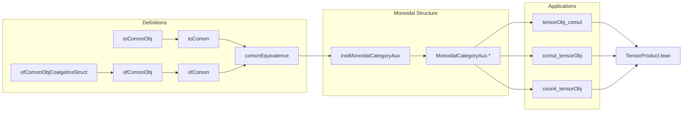

**Technical Brief: `ComonEquivalence.lean`**

---

### 1. KEY DEFINITIONS & THEOREMS

| Name | Type / Signature | Purpose |
|------|------------------|---------|
| `toComonObj` | `X : CoalgCat R → ComonObj (ModuleCat.of R X)` | Converts an $R$-coalgebra into a comonoid object in $R$-Mod by equipping its underlying module with comultiplication and counit from coalgebra structure. |
| `toComon` | `CoalgCat R ⥤ Comon (ModuleCat R)` | The forward direction of the equivalence: sends coalgebras to comonoids and coalgebra morphisms to comonoid morphisms. |
| `ofComonObjCoalgebraStruct` | `[ComonObj X] → CoalgebraStruct R X` | Constructs a coalgebra *structure* (not yet satisfying axioms) from a comonoid object. |
| `ofComonObj` | `ComonObj X → CoalgCat R` | Lifts a comonoid object to an $R$-coalgebra, using comonoid axioms to verify coalgebra axioms. |
| `ofComon` | `Comon (ModuleCat R) ⥤ CoalgCat R` | The backward direction of the equivalence: sends comonoids to coalgebras and comonoid morphisms to coalgebra morphisms. |
| `comonEquivalence` | `CoalgCat R ≌ Comon (ModuleCat R)` | The main theorem: an equivalence of categories between $R$-coalgebras and comonoids in $R$-Mod. |
| `instMonoidalCategoryAux` | `MonoidalCategory (CoalgCat R)` | Auxiliary monoidal structure on `CoalgCat R`, transported via `comonEquivalence` from the monoidal structure on `Comon (ModuleCat R)`. Used for definitional convenience in proofs. |
| `tensorObj_comul` | `Coalgebra.comul (K ⊗ L) = ...` | Describes the comultiplication on the tensor product of coalgebras in terms of the tensor product of comultiplications and the symmetry isomorphism. |
| `comul_tensorObj`, `counit_tensorObj`, etc. | Equalities of `comul`/`counit` on tensor objects | Verifies that the coalgebra structure on tensor products (induced via the equivalence) matches the standard one defined in `Coalgebra.TensorProduct`. |

---

### 2. NAMING CONVENTIONS

- **Prefixes**:
  - `toComon`, `ofComon`: Functors between the two categories.
  - `toComonObj`, `ofComonObj`: Object-level constructions.
  - `ofComonObjCoalgebraStruct`: Intermediate structure (before verifying axioms).
- **Suffixes**:
  - `_hom_toLinearMap`: Statements about underlying linear maps of morphisms.
  - `_tensorObj`: Properties about tensor products of objects.
  - `_tensorObj_tensorObj_left/right`: Associativity variants for tensor products.
- **General**:
  - `comul`, `counit`: Standard coalgebra operations.
  - `α_`, `λ_`, `ρ_`: Monoidal associator, left/right unitors.

---

### 3. TACTIC STACK

- `rfl`: Used heavily for definitional equalities (especially for linear maps).
- `simp` / `simp only`: Simplification using lemmas like `tensorμ_eq_tensorTensorTensorComm`, `ModuleCat.of_coe`, etc.
- `rw`: Rewriting using equalities from `comonEquivalence`, `toComon_obj`, etc.
- `ext`: Extensionality for tensor products and module homs.
- `ModuleCat.hom_ext`, `ModuleCat.hom_ext_iff.mp`: To lift equalities of module homs to equalities of coalgebra morphisms.
- `simpa using ...`: To discharge simple goals using known identities (e.g., coalgebra axioms).
- `dsimp`: Simplify definitional unfoldings.

---

### 4. PROOF LOGIC

- **Core strategy**: Use the equivalence `comonEquivalence` to transfer structure and properties between `CoalgCat R` and `Comon (ModuleCat R)`.
- **Object-level**: Show that coalgebra ↔ comonoid structures are inverse via explicit constructions (`toComonObj`, `ofComonObj`).
- **Morphism-level**: Show coalgebra morphisms ↔ comonoid morphisms via `ModuleCat.hom_ext_iff`.
- **Monoidal structure**: Transport the monoidal structure on `Comon (ModuleCat R)` (which is symmetric monoidal) along the equivalence to get `instMonoidalCategoryAux`.
- **Tensor product coalgebra**: Derive formulas for `comul` and `counit` on $K \otimes L$ by:
  - Unfolding definitions via `ofComonObjCoalgebraStruct_*`.
  - Simplifying using `tensorμ_eq_tensorTensorTensorComm`, `TensorProduct.comul_def`, and symmetry.
  - Matching against known definitions in `Coalgebra.TensorProduct`.

---

### 5. IMPORTS (Primary Dependencies)

| Module | Role |
|--------|------|
| `Mathlib.Algebra.Category.CoalgCat.Basic` | Base definitions of `CoalgCat`. |
| `Mathlib.Algebra.Category.ModuleCat.Monoidal.Symmetric` | Symmetric monoidal structure on `ModuleCat R`. |
| `Mathlib.CategoryTheory.Monoidal.Braided.Opposite` | Opposite monoidal categories, used in `Comon_`. |
| `Mathlib.CategoryTheory.Monoidal.Comon_` | Definition of `Comon` (comonoid objects) and its monoidal structure. |
| `Mathlib.LinearAlgebra.TensorProduct.Tower` | Tensor product associativity and symmetry isomorphisms. |
| `Mathlib.RingTheory.Coalgebra.TensorProduct` | Tensor product of coalgebras and its coalgebra structure. |
| `Mathlib.Tactic.SuppressCompilation` | For performance tuning in proofs. |

---

### 6. MERMAID DIAGRAMS

#### Dependency Graph (High-Level)

```mermaid
graph TD
  A[CommRing R] --> B[ModuleCat R]
  B --> C[MonoidalCategory (ModuleCat R)]
  C --> D[Comon (ModuleCat R)]
  A --> E[CoalgCat R]
  E --> F[instMonoidalCategoryAux]
  D --> G[MonoidalCategory (Comon (ModuleCat R))]
  F <--[transport via comonEquivalence]--> G
  E <--[comonEquivalence]--> D
  style E fill:#f9f,stroke:#333
  style D fill:#9cf,stroke:#333
```

#### Overview of `ComonEquivalence.lean`



---

### 7. THEORY CONTEXT

This file sits at the intersection of:
- **Coalgebra theory** (structured coalgebras over a commutative ring),
- **Category theory** (comonoid objects, monoidal categories, equivalences),
- **Tensor product formalism** (module tensor products, symmetry, associators).

It serves as a foundational bridge for:
- Defining coalgebra structures on tensor products,
- Transporting monoidal structure to `CoalgCat R`,
- Enabling future work on Hopf algebras, bialgebras, and quantum groups in Lean.

The equivalence `comonEquivalence` is a *categorical reformulation* of the classical fact that coalgebras over a commutative ring are precisely comonoids in the monoidal category of modules.

--- 

Let me know if you'd like a formalized summary in Lean syntax or a proof sketch of `comonEquivalence`.
