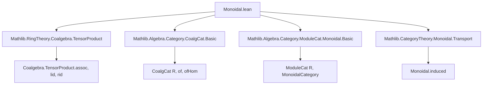
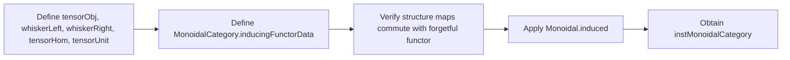
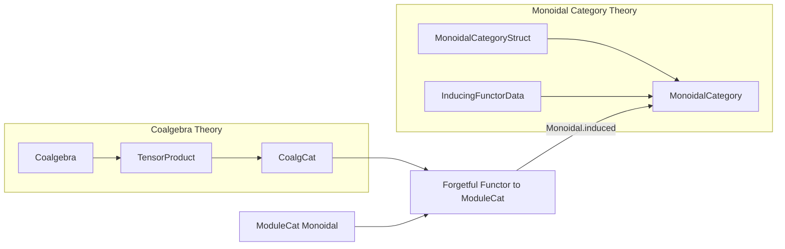

**Technical Brief: `Monoidal.lean` — Monoidal Structure on `R`-Coalgebras**

---

### 1. **Key Definitions & Theorems**

| Name | Type / Purpose |
|------|----------------|
| `instMonoidalCategoryStruct` | `MonoidalCategoryStruct.{u} (CoalgCat R)` — defines the *structure* (tensor object, morphisms, unitors, associator) on the category of coalgebras over a commutative ring `R`, using tensor products of coalgebras and module-level constructions. |
| `MonoidalCategory.inducingFunctorData` | `Monoidal.InducingFunctorData (forget₂ (CoalgCat R) (ModuleCat R))` — provides the data required to *induce* a monoidal structure on `CoalgCat R` via the forgetful functor to `ModuleCat R`. It verifies that the monoidal structure on coalgebras is compatible with that on modules. |
| `instMonoidalCategory` | `MonoidalCategory (CoalgCat R)` — the final *monoidal category instance* on `CoalgCat R`, obtained by applying `Monoidal.induced` to the above data. |

**Supporting constructions (from imports):**
- `Coalgebra.TensorProduct.assoc`, `lid`, `rid`: canonical coalgebra isomorphisms for associativity and unitors.
- `of`, `ofHom`, `ofIso`: embedding functors from module-level constructions to coalgebra-level ones.
- `Coalgebra.TensorProduct.map`: tensor product of coalgebra morphisms.

---

### 2. **Naming Conventions**

- **Prefixes:**
  - `inst_`: for typeclass instances (`instMonoidalCategoryStruct`, `instMonoidalCategory`)
  - `inducing_`: for data used in induction (`inducingFunctorData`)
  - `of_`: for coercion/embedding functors (`of`, `ofHom`, `ofIso`)
- **Suffixes:**
  - `_eq`: for proofs of equality of structure maps under forgetful functor (`associator_eq`, `leftUnitor_eq`, etc.)
- **Functional style:**
  - `whiskerLeft`, `whiskerRight`, `tensorHom`, `tensorObj`, `tensorUnit`: standard monoidal category structure fields.

---

### 3. **Tactic Stack**

- `ext`: used repeatedly to extend homomorphisms/coalgebra maps by extensionality (e.g., `ModuleCat.hom_ext`, `TensorProduct.ext`).
- `rfl`: used in `by ext; rfl` to conclude definitional equalities after extensionality.
- `simp_rw`: implied via `@[simps]` attribute on definitions to automatically generate simplification lemmas for structure maps.
- `by`-block tactics: mostly `ext` + `rfl` for definitional equalities; no heavy automation (e.g., `aesop`, `ring`, `linarith`) needed due to definitional compatibility.

---

### 4. **Proof Logic**

- **Strategy:** *Pullback via forgetful functor*.
  - Define monoidal structure on `CoalgCat R` *term-by-term* using module-level tensor product and coalgebra structure.
  - Show that the forgetful functor `forget₂ : CoalgCat R → ModuleCat R` is *monoidal-inducing*, i.e., the structure maps commute with those in `ModuleCat R` up to identity (definitional equality).
  - Apply `Monoidal.induced`, which constructs a monoidal category structure on the domain category when the forgetful functor is strictly monoidal (up to equality, not just isomorphism).
- **Key proof pattern:**
  - For each structure law (associativity, unit laws), reduce to the corresponding law in `ModuleCat R` using `ModuleCat.hom_ext` and `TensorProduct.ext`.
  - Then conclude via `rfl`, as the definitions are *strictly* compatible (no coherence isomorphisms needed beyond definitional equality).

---

### 5. **Imports**

| Import | Role |
|--------|------|
| `Mathlib.Algebra.Category.CoalgCat.Basic` | Defines `CoalgCat R`, its objects/morphisms, and basic constructions. |
| `Mathlib.Algebra.Category.ModuleCat.Monoidal.Basic` | Provides the monoidal structure on `ModuleCat R`. |
| `Mathlib.CategoryTheory.Monoidal.Transport` | Contains `Monoidal.induced`, the key transport theorem. |
| `Mathlib.RingTheory.Coalgebra.TensorProduct` | Defines tensor product of coalgebras, coalgebra maps, and the associator/unitors. |

---

### 8. **Mermaid Diagrams**

#### Dependency Graph (Top-Level)

#### Overview of File Logic Flow

#### Relationship to Theory Stack

--- 

This file exemplifies *structure transport* in Lean: building a monoidal category on a subcategory (coalgebras) by verifying compatibility with a known monoidal category (modules), using definitional equalities rather than coherence isomorphisms.
