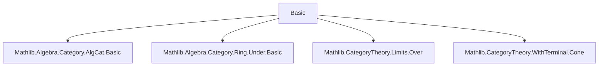

**Technical Brief: `Basic.lean` — Category of Commutative Algebras over a Commutative Ring**

---

### 1. **Key Definitions & Theorems**

| Name | Type / Signature | Purpose |
|------|------------------|---------|
| `CommAlgCat R` | `Type (u+1) → Type u → Type u` (universe-polymorphic) | Bundled category of commutative $R$-algebras and $R$-algebra morphisms. |
| `Hom A B` | `Type v` | Morphism set in `CommAlgCat R`, defined as `A →ₐ[R] B`. |
| `of R X` | `CommAlgCat R` | Embedding of a type `X` with `CommRing X` and `Algebra R X` into `CommAlgCat R`. |
| `ofHom f` | `of R X ⟶ of R Y` | Embedding of an $R$-algebra map `f : X →ₐ[R] Y` as a category morphism. |
| `algEquivOfIso i` | `A ≃ₐ[R] B` | Isomorphism → algebra equivalence (inverse direction of equivalence). |
| `isoMk e` | `of R X ≅ of R Y` | Algebra equivalence → isomorphism in `CommAlgCat R`. |
| `isoEquivAlgEquiv` | `(of R X ≅ of R Y) ≃ (X ≃ₐ[R] Y)` | Equivalence between isomorphisms and algebra equivalences. |
| `commAlgCatEquivUnder R` | `CommAlgCat R ≌ Under R` | Equivalence of categories between $R$-algebras and objects under $R$ in `CommRingCat`. |
| `forget₂_commRingCat` | `HasForget₂ (CommAlgCat R) CommRingCat` | Forgetful functor to commutative rings. |
| `forget₂_algCat` | `HasForget₂ (CommAlgCat R) (AlgCat R)` | Forgetful functor to $R$-algebras (unbundled). |
| `uliftFunctor R` | `CommAlgCat R ⥤ CommAlgCat R` | Universe lift functor (preserves structure up to equivalence). |
| `fullyFaithfulUliftFunctor R` | `(uliftFunctor R).FullyFaithful` | Proof that universe lift is fully faithful. |
| `HasColimits`, `HasLimits` | `Instance` | Existence of all small limits and colimits, via equivalence with `Under R`. |

---

### 2. **Naming Conventions**

- **Prefixes**:
  - `of_`: Embedding from unbundled typeclasses to bundled category (`of`, `ofHom`, `ofIso`).
  - `forget₂_`: Forgetful functors to base categories (`forget₂_commRingCat`, `forget₂_algCat`).
  - `isoMk`, `algEquivOfIso`: Bidirectional conversion between isomorphisms and algebra equivalences.
  - `hom_`: Projection from bundled morphism to underlying `AlgHom` (`hom`, `hom'`, `hom_ext`, `hom_id`, `hom_comp`).
  - `uliftFunctor`: Universe lifting.

- **Suffixes**:
  - `_obj`, `_map`: For functors on objects/morphisms.
  - `_apply`: For element-wise action (`id_apply`, `comp_apply`, `ofHom_apply`).
  - `_equiv`, `_iso`: For equivalences/isomorphisms (`isoEquivAlgEquiv`, `commAlgCatEquivUnder`).

- **`[simps]` annotations**: Used on `isoMk`, `algEquivOfIso`, `isoEquivAlgEquiv`, `commAlgCatEquivUnder` to generate simplification lemmas for components.

---

### 3. **Tactic Stack**

- **Core tactics**:
  - `simp` (heavily used, especially with `@[simp]` lemmas)
  - `rfl` (for definitional equalities)
  - `ext` + `Hom.ext` (for morphism extensionality)
  - `by simp` (in proofs like `left_inv`, `right_inv`, `reflects`)
  - `let` + `exact` (in `reflectsIsomorphisms_forget`)
  - `NatIso.ofComponents` (for constructing natural isomorphisms)

- **Category-theoretic automation**:
  - `Adjunction.has_limits_of_equivalence`, `Adjunction.has_colimits_of_equivalence`
  - `ConcreteCategory` infrastructure (`ofHom`, `hom`, etc.)

---

### 4. **Proof Logic**

- **Structure**:
  1. **Bundling**: Define `CommAlgCat` as a `ConcreteCategory` over `AlgHom`.
  2. **Morphism infrastructure**: Define identity, composition, extensionality, and `hom` projection.
  3. **Forgetful functors**: Construct `HasForget₂` instances to `CommRingCat` and `AlgCat`.
  4. **Isomorphism ↔ Algebra equivalence**: Prove bidirectional conversion and simp lemmas.
  5. **Universe lifting**: Define `uliftFunctor`, prove fully faithful.
  6. **Equivalence with under-category**: `commAlgCatEquivUnder`, then deduce (co)completeness.

- **Typical proof pattern**:
  - Use `ext` + `hom_ext` to reduce to underlying algebra maps.
  - Use `simp` with `@[simp]` lemmas (`hom_id`, `hom_comp`, `ofHom_id`, etc.).
  - Leverage `ConcreteCategory` interface for coercion and morphism extraction.

---

### 5. **Imports**

| Import | Purpose |
|--------|---------|
| `Mathlib.Algebra.Category.AlgCat.Basic` | Category of (unbundled) $R$-algebras (`AlgCat`). |
| `Mathlib.Algebra.Category.Ring.Under.Basic` | Under-category construction (`Under R`). |
| `Mathlib.CategoryTheory.Limits.Over` | Over-categories (used via `Under` equivalence). |
| `Mathlib.CategoryTheory.WithTerminal.Cone` | Cone/limit infrastructure. |

---

### 6. **Mermaid Diagrams**

#### **Dependency Graph (Module-Level)**



#### **Conceptual Overview of `CommAlgCat R`**

```mermaid
graph LR
  A[Type X with CommRing X & Algebra R X] --> of["of R X : CommAlgCat R"]
  f[X →ₐ[R] Y] --> ofHom["ofHom f : of R X ⟶ of R Y"]

  ofHom --> ConcreteCategory["ConcreteCategory structure"]
  ConcreteCategory --> Hom["Hom A B = A →ₐ[R] B"]
  Hom --> Category["Category (CommAlgCat R)"]

  forget2CR["forget₂ : CommAlgCat R → CommRingCat"]
  forget2AC["forget₂ : CommAlgCat R → AlgCat R"]

  forget2CR --> CommRingCat
  forget2AC --> AlgCat

  equivalence["commAlgCatEquivUnder R"]
  equivalence --> UnderR["Under R in CommRingCat"]

  equivalence --> Limits["HasLimits, HasColimits"]
```

#### **Equivalence with Under-Category**

```mermaid
graph LR
  CommAlgCatR["CommAlgCat R"] -- functor --> UnderR["Under R"]
  UnderR -- inverse --> CommAlgCatR

  functor.obj A == "R → A (as ring map)"
  functor.map f == "commutative triangle"
  inverse.obj (R ⇒ A) == "A as R-algebra"
  inverse.map f == "under-morphism → R-algebra map"
```

---

### 7. **Key Theoretical Insights**

- **Bundled vs unbundled**: `CommAlgCat R` is a *bundled* category, while `AlgCat R` and `CommRingCat` are used as targets of forgetful functors.
- **Isomorphisms = Algebra equivalences**: The category is *concrete* and *rigid* in the sense that isomorphisms correspond exactly to algebra isomorphisms (`isoMk` ↔ `algEquivOfIso`).
- **Limits/colimits via under-category**: Since `Under R` has all limits/colimits (as a slice of `CommRingCat`), and `CommAlgCat R ≌ Under R`, the latter inherits (co)completeness.
- **Universe handling**: Universe lifting is fully faithful, enabling universe polymorphism without loss of structure.

--- 

*End of Technical Brief.*
