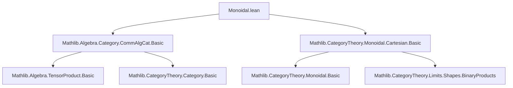

**Technical Brief: `Monoidal.lean` — Co-Cartesian Monoidal Structure on `CommAlgCat R`**

---

### 1. **Key Definitions & Theorems**

| Name | Type / Purpose |
|------|----------------|
| `binaryCofan A B` | `BinaryCofan A B` — Explicit cocone with vertex $A \otimes_R B$, inclusions $A \to A \otimes_R B$, $B \to A \otimes_R B$ via `includeLeft`, `includeRight`. |
| `binaryCofanIsColimit A B` | `IsColimit (binaryCofan A B)` — Proves the tensor product cocone is the colimit (i.e., pushout in `CommAlgCat`). |
| `isInitialSelf R` | `IsInitial (of R R)` — Shows $R$ (as an $R$-algebra) is initial in `CommAlgCat R`. |
| `MonoidalCategory.{u} R` instance | Constructs the monoidal structure on `CommAlgCat R` using tensor product: <br> • `tensorObj A B = A ⊗[R] B` <br> • `tensorUnit = R` <br> • associator, unitors from `assoc`, `lid`, `rid`. |
| `BraidedCategory` instance | Uses `comm R A B : A ⊗[R] B ≅ B ⊗[R] A` for braiding; verifies hexagon axioms trivially by extensionality. |
| `CartesianMonoidalCategory (CommAlgCat R)ᵒᵖ` instance | Shows that the *opposite* category $(\mathsf{CommAlg}_R)^\mathrm{op}$ is cartesian monoidal, with tensor product = categorical *product*, i.e., coproduct in $\mathsf{CommAlg}_R$ (tensor product). |
| `tensorProductIsBinaryProduct` | `BinaryCofan.IsColimit.op (binaryCofanIsColimit ...)` — Identifies tensor product in $\mathsf{CommAlg}_R$ with product in $(\mathsf{CommAlg}_R)^\mathrm{op}$. |

---

### 2. **Naming Conventions**

- **Prefixes**:
  - `binaryCofan_` — Cocone data for binary coproduct (tensor product).
  - `isInitial_` — Initial object constructions.
  - `whiskerLeft_`, `whiskerRight_`, `tensorHom_` — Monoidal structure components.
  - `associator_`, `braiding_` — Structural isomorphisms.
  - `fst_`, `snd_`, `toUnit_`, `lift_` — Cartesian structure in opposite category.

- **Suffixes**:
  - `_hom` — For hom-components of morphisms/isos (e.g., `associator_hom_hom`).
  - `_unop_hom` — When unfolding morphisms in the opposite category.
  - `_isColimit` / `_IsColimit` — Colimit witnesses.

- **Notable patterns**:
  - `ofHom _` — Embedding algebra homs into `CommAlgCat`.
  - `map f.hom g.hom` — Tensor map on homs.
  - `lift f.hom g.hom ...` — Universal property of tensor product.

---

### 3. **Tactic Stack**

- **`ext` / `ext1`** — Extensionality for homs, especially in `CommAlgCat` (via `hom_ext` or `subtype.ext`).
- **`simp` / `dsimp`** — Simplification using `@[simp]` lemmas (e.g., `coe_tensorUnit`, `tensorHom_hom`).
- **`rfl`** — Reflexivity for definitional equalities (e.g., `binaryCofan_pt`).
- **`exact` / `refine`** — Direct proof construction, especially in colimit uniqueness.
- **`congr`** — To extract equality of components from equality of pairs.
- **`Subtype.ext (Prod.ext ...)`** — For equality in dependent types (e.g., algebra homs).

---

### 4. **Proof Logic**

- **Monoidal structure**: Constructed *explicitly* via tensor product:
  - Define `tensorObj`, `tensorHom`, `whiskers`, `tensorUnit`.
  - Define structural isomorphisms (`associator`, `leftUnitor`, `rightUnitor`, `braiding`) using algebraic isos (`assoc`, `lid`, `rid`, `comm`).
  - Prove coherence axioms (naturality, hexagons) by `ext` + `rfl`, relying on definitional equality of underlying algebra maps.

- **Cartesian structure on opposite category**:
  - Use that coproduct in $\mathsf{CommAlg}_R$ is tensor product.
  - Show that $(\mathsf{CommAlg}_R)^\mathrm{op}$ has binary products (via `binaryCofanIsColimit.op`) and terminal object (`isInitialSelf.op`).
  - Verify universal properties (`fst_def`, `snd_def`, `lift_unop_hom`) by unfolding and simplifying tensor product inclusions.

- **Inductive/structural proof style**:
  - No induction needed — all proofs are *algebraic* and *extensional*.
  - Heavy use of `@[simp]` lemmas to reduce goals to definitional equalities.

---

### 5. **Imports & Dependencies**

| Import | Role |
|--------|------|
| `Mathlib.Algebra.Category.CommAlgCat.Basic` | Core definitions of `CommAlgCat`, algebra homs, tensor product universal property (`lift`, `includeLeft`, `includeRight`, `map`). |
| `Mathlib.CategoryTheory.Monoidal.Cartesian.Basic` | General theory of monoidal, braided, and cartesian monoidal categories (used for axioms and instances). |
| `Limits`, `TensorProduct`, `Opposite` | Needed for colimits, tensor product constructions, and opposite category machinery. |

---

### 6. **Mermaid Diagrams**

#### **Dependency Graph (Module-Level)**



#### **Overview of Theoretical Flow**

```mermaid
flowchart LR
  CommAlgCat[R-CommAlg, CommAlgCat R]
  TensorTensor[Tensor Product A ⊗_R B]
  Coprod[Binary Coproduct in CommAlgCat]
  Opposite[(CommAlgCat R)^op]

  CommAlgCat -- tensor product = coproduct --> TensorTensor
  TensorTensor -- universal property --> Coprod
  Coprod -- opposite --> Opposite
  Opposite -- products = coproducts --> CartesianMonoidal[Cartesian Monoidal Structure]
```

#### **Structure Hierarchy (Category-Theoretic)**

```mermaid
graph LR
  Monoidal[MonoidalCategory CommAlgCat R]
  Braided[BraidedCategory CommAlgCat R]
  Cartesian[CartesianMonoidalCategory (CommAlgCat R)^op]

  Monoidal -- braiding --> Braided
  Braided -- opposite + colimit→product --> Cartesian
```

---

### 7. **Summary**

This file constructs the **co-Cartesian monoidal structure** on $\mathsf{CommAlg}_R$ via the tensor product, and then lifts it to a **cartesian monoidal structure** on the opposite category $(\mathsf{CommAlg}_R)^\mathrm{op}$. It is a canonical example of how algebraic constructions (tensor product as coproduct) translate into categorical monoidal structures. The proofs are highly computational, leveraging the explicit description of tensor products and their universal property, with heavy reliance on extensionality principles and simplification.

--- 

Let me know if you'd like a formalized dependency graph (e.g., for `leanpkg`), or a visualization of the monoidal coherence diagrams.
