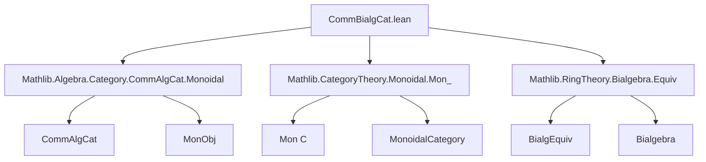

**Technical Brief: `CommBialgCat.lean`**

---

### 1. **Key Definitions & Theorems**

| Name | Type / Structure | Purpose |
|------|------------------|---------|
| `CommBialgCat R` | `Type (u ⊔ v + 1)` → `Type (u ⊔ v + 1)` | Bundled category of **commutative bialgebras** over a commutative ring `R`. Objects are types with `CommRing` and `Bialgebra R` instances. |
| `Hom A B` | `Type v` | Morphisms in `CommBialgCat R`: bundled `BialgHom`s (`→ₐc[R]`). |
| `of R X` | `CommBialgCat R` | Constructor turning an unbundled `R`-bialgebra `X` into a categorical object. |
| `ofHom f` | `of R X ⟶ of R Y` | Embeds unbundled bialgebra morphism `f : X →ₐc[R] Y` as a categorical morphism. |
| `forget : CommBialgCat R ⥤ Type v` | Forgetful functor | Forgets algebraic structure, returns underlying type. |
| `forget₂ : CommBialgCat R ⥤ CommAlgCat R` | Forgetful 2-functor | Forgets coalgebra structure, returns underlying *commutative algebra*. |
| `isoMk e` | `of R X ≅ of R Y` | Builds a categorical isomorphism from a bialgebra equivalence `e : X ≃ₐc[R] Y`. |
| `bialgEquivOfIso i` | `A ≃ₐc[R] B` | Extracts bialgebra equivalence from categorical isomorphism. |
| `isoEquivBialgEquiv` | `(of R X ≅ of R Y) ≃ (X ≃ₐc[R] Y)` | Equivalence between categorical isos and bialgebra equivalences. |
| `commBialgCatEquivComonCommAlgCat R` | `CommBialgCat R ≌ (Mon (CommAlgCat R)ᵒᵖ)ᵒᵖ` | Core theorem: **Commutative bialgebras over `R` ≅ Comonoids in `CommAlgCat R` (opposite)**. |
| `MonObj (op <| CommAlgCat.of R A)` | Instance | Constructs a monoid object in `CommAlgCat Rᵒᵖ` from a bialgebra `A`. |
| `IsCommMonObj` instance | Instance | Shows that cocommutative bialgebras give *commutative* monoid objects. |

---

### 2. **Naming Conventions**

- **Prefixes**:
  - `of_`: unbundled → bundled (e.g., `of`, `ofHom`)
  - `forget_`: forgetful functors (`forget`, `forget₂`)
  - `bialgEquivOf_`: categorical → unbundled (e.g., `bialgEquivOfIso`)
  - `isoMk`: unbundled iso/equiv → categorical iso
- **Suffixes**:
  - `_obj`, `_map`: for functors
  - `_hom`, `_app`: for natural transformations / components
  - `_op`, `_unop`: for opposite category manipulations
- **Morphisms**:
  - `hom'` (private field) → `hom` (projection)
  - `ofHom`, `Hom.hom`, `Hom.Simps.hom`

---

### 3. **Tactic Stack**

- `simp` / `dsimp`: heavily used for simplification of homs, applications, and projections.
- `ext`: extensionality for morphisms (via `@[ext]` on `Hom`).
- `congr`: for lifting equalities through `congr` (used in `Bialgebra.ofAlgHom` arguments).
- ` rfl`: many lemmas are definitional (`rfl` proofs).
- `by simp`: standard for simple applications (e.g., `id_apply`, `comp_apply`).
- `exact ...`: in `reflectsIsomorphisms_forget`, `ofAlgHom` arguments.
- `inferInstanceAs`: for typeclass inference in instance declarations.

---

### 4. **Proof Logic**

- **Definitional equality dominates**: Most lemmas (`rfl`) are definitional (e.g., `hom_id`, `hom_comp`, `ofHom_id`, `ofHom_comp`).
- **Extensionality**: Morphism extensionality via `hom_ext` (uses `Hom.ext`).
- **Equivalence proofs**: `isoEquivBialgEquiv` uses `rfl` for both directions (definitional inverse).
- **Functoriality**: Proofs of functor laws (e.g., `commBialgCatEquivComonCommAlgCat`) rely on:
  - `ext` for morphisms,
  - `congr` to lift monoid object laws (`one_mul`, `mul_assoc`, etc.) from coalgebra axioms,
  - `simp` for component simplifications.
- **Isomorphism reflection**: `reflectsIsomorphisms_forget` constructs a bialgebra equivalence from a forgetful-image isomorphism.

---

### 5. **Imports**

| Import | Purpose |
|--------|---------|
| `Mathlib.Algebra.Category.CommAlgCat.Monoidal` | Monoidal structure on `CommAlgCat`, monoid objects, `MonObj`, etc. |
| `Mathlib.CategoryTheory.Monoidal.Mon_` | General theory of monoids in monoidal categories (`Mon C`). |
| `Mathlib.RingTheory.Bialgebra.Equiv` | Bialgebra equivalences (`≃ₐc[R]`), `BialgEquiv`. |

---

### 6. **Mermaid Diagrams**

#### **Dependency Graph (Top-Level)**



#### **Conceptual Overview of `CommBialgCat R`**

```mermaid
graph LR
  A[CommRing R] --> B[CommBialgCat R]
  B --> C[Objects: A with Bialgebra R A]
  B --> D[Morphisms: A →ₐc[R] B]
  B --> E[Forgetful Functors]
  E --> F[forget : CommBialgCat R → Type]
  E --> G[forget₂ : CommBialgCat R → CommAlgCat R]
  B --> H[Equivalence: CommBialgCat R ≌ (Mon (CommAlgCat R)ᵒᵖ)ᵒᵖ]
```

#### **Equivalence with Comonoids**

```mermaid
graph LR
  CommBialgCat R -->|functor| Mon (CommAlgCat R)ᵒᵖ
  Mon (CommAlgCat R)ᵒᵖ -->|inverse| CommBialgCat R
  CommBialgCat R -.->|forget₂| CommAlgCat R
  Mon (CommAlgCat R)ᵒᵖ -.->|unop.X| CommAlgCat R
```

- **Intuition**: A bialgebra `A` gives an algebra object `CommAlgCat.of R A`, whose opposite is a *comonoid* in `CommAlgCat R`. Conversely, a comonoid in `CommAlgCat R` (opposite) gives a bialgebra via `unop.X.unop`.

---

### 7. **Notable Design Patterns**

- **ConcreteCategory**: `CommBialgCat R` is a concrete category over `· →ₐc[R] ·`.
- **Simp projections**: `initialize_simps_projections` used to optimize `@[simps]` behavior.
- **Opposite category tricks**: Heavy use of `op`, `unop`, and `congr` to lift structure across opposites.
- **Definitional equality**: Many lemmas are `rfl`, minimizing proof burden.

--- 

Let me know if you'd like a formalized summary in Lean or a theory-level explanation of the equivalence `CommBialgCat R ≌ (Mon (CommAlgCat R)ᵒᵖ)ᵒᵖ`.
