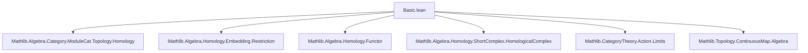

Here is the structured technical metadata extracted from `Basic.lean`:

---

### **1. Key Definitions & Theorems**

| Name | Type / Signature | Purpose |
|------|------------------|---------|
| `Iobj` | `Action (TopModuleCat R) G → Action (TopModuleCat R) G` | Constructs the representation $C(G, M)$ with diagonal $G$-action: $(g \cdot f)(x) = g \cdot f(g^{-1}x)$. |
| `I` | `Action (TopModuleCat R) G ⥤ Action (TopModuleCat R) G` | Functorial extension of `Iobj`; maps morphisms via precomposition. |
| `const` | `𝟭 _ ⟶ I R G` | Natural transformation sending $m \mapsto (g \mapsto m)$, the constant function. |
| `MultiInd.functor` | `ℕ → Action (TopModuleCat R) G ⥤ Action (TopModuleCat R) G` | Iterated application of `I`: $F_n(M) = C(G, C(G, \dots, C(G, M)))$ ($n$ times). |
| `MultiInd.d` | `∀ n, functor n ⟶ functor (n + 1)` | Differential defined inductively: $d_0 = \text{const}$, $d_{n+1} = \text{whiskerLeft}(F_{n+1}, \text{const}) - \text{whiskerRight}(d_n, I)$. |
| `MultiInd.complex` | `CochainComplex (Functors) ℕ` | The cochain complex of functors $F_\bullet$ with differentials $d_\bullet$. |
| `invariants` | `Action (TopModuleCat R) G ⥤ TopModuleCat R` | Takes $G$-invariant submodule: $M^G = \{x \in M \mid \forall g, \rho(g)x = x\}$. |
| `homogeneousCochains` | `Action (TopModuleCat R) G ⥤ CochainComplex (TopModuleCat R) ℕ` | Composes `complex` with `invariants` and shifts degree by 1 (to align indexing with standard cochain complexes). |
| `continuousCohomology` | `ℕ → Action (TopModuleCat R) G ⥤ TopModuleCat R` | $n$-th continuous cohomology functor: $H^n_{\text{cont}}(G, -) = H^n(\text{homogeneousCochains}(-))$. |
| `kerHomogeneousCochainsZeroEquiv` | Isomorphism of $R$-modules: $\ker(d^0) \cong M^G$ | Explicit equivalence showing degree-0 cochains with zero differential correspond to $G$-invariants. |
| `continuousCohomologyZeroIso` | Natural isomorphism: $(H^0_{\text{cont}}(G, -)) \cong (-)^G$ | Proves $H^0_{\text{cont}}(G, M) \cong M^G$. |

---

### **2. Naming Conventions**

- **Prefixes**:
  - `Iobj`, `I`: for the "induction" or "coinduction" functor $M \mapsto C(G, M)$.
  - `const`: constant function natural transformation.
  - `invariants`: $G$-fixed submodule.
  - `homogeneousCochains`: full cochain complex.
  - `continuousCohomology`: cohomology functors.
- **Suffixes**:
  - `obj`: object part of a functor.
  - `app`: component of a natural transformation at an object.
  - `hom`: underlying morphism in `TopModuleCat`.
  - `comm`: commutativity condition for $G$-equivariance.
- **Pattern**:
  - `d_n`, `d_zero`, `d_succ`, `d_comp_d`: differential-related lemmas.
  - `iso`, `equiv`: isomorphisms/equivalences in module categories.

---

### **3. Tactic Stack**

Frequently used tactics in proofs:
- `rfl`: definitional equalities.
- `ext`: extensionality for functions, linear maps, continuous maps.
- `simp` / `simp_rw`: simplification with definitional lemmas (e.g., `Iobj_ρ_apply`, `const_app`).
- `rw`: rewriting using naturality, equivariance, or functoriality.
- `induction`: structural induction on `ℕ` (especially for `d_comp_d`).
- `nth_rw`: targeted rewriting at specific positions.
- `sub_eq_zero`, `sub_zero`, `sub_comp`: algebraic simplifications in additive categories.
- `whiskerRight_comp`, `whiskerLeft_comp`: manipulation of natural transformations in functor categories.
- `cancel_epi`, `cancel_monic`: epimonic cancellation in preadditive categories.
- `congr`: congruence for function application (used heavily in verifying equivariance).
- `continuous_*`: continuity lemmas (`continuous_postcomp`, `continuous_precomp`, `continuous_induced_rng`, etc.).

---

### **4. Proof Logic**

- **Inductive structure**: Proofs about `d` and `complex` proceed by induction on $n$.
- **Naturality & equivariance**: Verified by `ext` + `simp` + `rw` using definitions of action and continuity.
- ** Functoriality**: Verified via `rfl` or `congr` for morphism parts.
- **Complex condition** (`d² = 0`): Proven by induction, using:
  - Additivity of hom-sets (`Preadditive.comp_sub`, `sub_comp`)
  - Functorial whiskering identities (`whiskerRight_comp`, `Functor.whiskerRight_zero`)
  - Inductive hypothesis (`ih`)
- **Isomorphisms**: Constructed explicitly via `equiv`, then verified as linear/continuous via `continuous_*` and module properties.

---

### **5. Imports**

| Module | Purpose |
|--------|---------|
| `Mathlib.Algebra.Category.ModuleCat.Topology.Homology` | Homology in topological module categories. |
| `Mathlib.Algebra.Homology.Embedding.Restriction` | Embedding of cochain complexes. |
| `Mathlib.Algebra.Homology.Functor` | Functoriality of homology. |
| `Mathlib.Algebra.Homology.ShortComplex.HomologicalComplex` | Homological algebra in short complexes. |
| `Mathlib.CategoryTheory.Action.Limits` | Limits in categories of group actions. |
| `Mathlib.Topology.ContinuousMap.Algebra` | Algebraic structure on $C(G, M)$ (continuous maps). |

---

### **6. Mermaid Diagrams**

#### **Dependency Graph (Module-Level)**



#### **Overview of Theory Flow**

```mermaid
graph LR
  X[Action (TopModuleCat R) G] --> Iobj[Iobj : M ↦ C(G, M)]
  Iobj --> I[I : functor]
  I --> const[const : id ⇒ I]
  const --> MultiInd.d[d : Fₙ ⇒ Fₙ₊₁]
  MultiInd.d --> MultiInd.complex[Complex of functors]
  MultiInd.complex --> invariants[invariants : (-)^G]
  invariants --> homogeneousCochains[homogeneousCochains]
  homogeneousCochains --> continuousCohomology[Hⁿ_cont(G, -)]
```

#### **Cochain Complex Structure (Pointwise)**

```mermaid
graph LR
  M[X] -->|d₀ = const| C1[C(G, X)]
  C1 -->|d₁ = const - C(d₀)| C2[C(G, C(G, X))]
  C2 -->|d₂| ⋯
  style M fill:#f9f,stroke:#333
  style C1 fill:#bbf,stroke:#333
  style C2 fill:#bbf,stroke:#333
```

---

Let me know if you'd like a formalized summary in Lean syntax or a high-level explanation of the cohomological construction.
