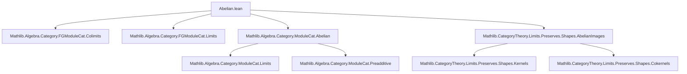

**Technical Brief: `Abelian.lean` — Formalization of `FGModuleCat K` as an Abelian Category**

---

### 1. **Key Definitions & Theorems**

| Name | Type / Signature | Purpose |
|------|------------------|---------|
| `isIso_coimageImageComparison` | `{X Y : FGModuleCat k} (f : X ⟶ Y) : IsIso (Abelian.coimageImageComparison f)` | Proves that the canonical comparison map from coimage to image is an isomorphism in `FGModuleCat k`. This is the key condition for abelianness. |
| `instance : Abelian (FGModuleCat k)` | `Abelian (FGModuleCat k)` | Concludes that the category of finitely generated modules over a Noetherian ring is abelian, via the criterion `Abelian.ofCoimageImageComparisonIsIso`. |

- **`Abelian.coimageImageComparison f`**: The canonical morphism $\operatorname{coim}(f) \to \operatorname{im}(f)$ in a preabelian category.
- **`Abelian.ofCoimageImageComparisonIsIso`**: A standard criterion: if every such comparison is an isomorphism, the category is abelian.

---

### 2. **Naming Conventions**

- **Prefixes**:
  - `isIso_`: Indicates a proof that a morphism is invertible.
  - `coimageImageComparison`: Standard categorical term for the canonical map $\operatorname{coim} f \to \operatorname{im} f$.
- **Suffixes**:
  - `_comparison`: Used for canonical comparison maps between constructions (e.g., coimage → image).
- **Module-specific**:
  - `forget₂`: Refers to the forgetful functor from `FGModuleCat k` to `ModuleCat k`.
  - `ι`: Denotes the embedding functor (right adjoint to forgetful), used in `fullyFaithfulι`.

---

### 3. **Tactic Stack**

| Tactic | Usage |
|--------|-------|
| `have` | Introduces intermediate lemmas (e.g., `have := ...`). |
| `symm` | Applies symmetry of isomorphism (to flip `IsIso` proof direction). |
| `of_isIso_fac_right` | From `CategoryTheory.Limits.Preserves.Shapes.AbelianImages`: proves isomorphism from factorization properties. |
| `fullyFaithfulι` | From `(ModuleCat.isFG k).fullyFaithfulι`: uses faithfulness/fullness of the inclusion of finitely generated modules. |
| `isIso_of_isIso_map` | From `Functor.FullyFaithful`: lifts isomorphisms along fully faithful functors. |

No heavy automation (`aesop`, `ring`, `simp`) is used—proof is categorical and structural.

---

### 4. **Proof Logic**

The proof proceeds as follows:

1. Let $f : X \to Y$ be a morphism in `FGModuleCat k`.
2. Consider the forgetful functor $U : \mathsf{FGModuleCat}\,k \to \mathsf{ModuleCat}\,k$, which is fully faithful when restricted to finitely generated modules (via `ModuleCat.isFG k`).
3. In `ModuleCat k`, the coimage–image comparison for $U(f)$ is an isomorphism because `ModuleCat k` is abelian (imported via `ModuleCat.Abelian`).
4. The preservation of coimages under $U$ (via `PreservesCoimage.hom_coimageImageComparison`) yields an isomorphism in `ModuleCat k`.
5. Pull this isomorphism back along the fully faithful embedding: since $U$ is fully faithful, an isomorphism in the image lifts to an isomorphism in the domain.
6. Conclude that the coimage–image comparison is an isomorphism in `FGModuleCat k`.
7. Apply `Abelian.ofCoimageImageComparisonIsIso` to deduce that `FGModuleCat k` is abelian.

---

### 5. **Imports**

| Import | Role |
|--------|------|
| `Mathlib.Algebra.Category.FGModuleCat.Colimits` | Provides colimits in `FGModuleCat k` (needed for preabelian structure). |
| `Mathlib.Algebra.Category.FGModuleCat.Limits` | Provides limits in `FGModuleCat k`. |
| `Mathlib.Algebra.Category.ModuleCat.Abelian` | States that `ModuleCat k` is abelian (for $k$ Noetherian). |
| `Mathlib.CategoryTheory.Limits.Preserves.Shapes.AbelianImages` | Supplies tools for comparing coimage/image preservation, especially `PreservesCoimage` and `of_isIso_fac_right`. |

---

### 6. **Assumptions & Universe Parameters**

- `k : Type u` is a `Ring` and `IsNoetherianRing`.
- Universe levels `v u` are declared (though `v` is unused—likely a leftover from template).
- `noncomputable section`: Required because `FGModuleCat k` involves quotients/colimits not definable computably in general.

---

### 7. **Mermaid Diagrams**

#### Dependency Graph (Top-Level Imports)



#### High-Level Proof Structure

```mermaid
flowchart LR
  A[f : X → Y in FGModuleCat k] --> B[Forgetful functor U : FGModuleCat k → ModuleCat k]
  B --> C[U(f) in ModuleCat k]
  C --> D[coim(U(f)) → im(U(f)) is iso (ModuleCat k abelian)]
  D --> E[PreservesCoimage gives coim(f) ↦ coim(U(f))]
  E --> F[Isomorphism lifts via fully_faithfulι]
  F --> G[coim(f) → im(f) iso in FGModuleCat k]
  G --> H[Abelian.ofCoimageImageComparisonIsIso]
  H --> I[FGModuleCat k is abelian]
```

---

### 8. **Summary**

This file establishes that the category of finitely generated modules over a Noetherian ring is abelian. The proof leverages:
- The abelianness of `ModuleCat k`,
- The fully faithful embedding of `FGModuleCat k` into `ModuleCat k`,
- Preservation of coimages under this embedding (via `PreservesCoimage`).

It is a clean categorical argument, minimal in tactics, and relies on high-level structure from `Mathlib`’s category theory library.

--- 

*End of Technical Brief.*
