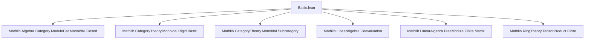
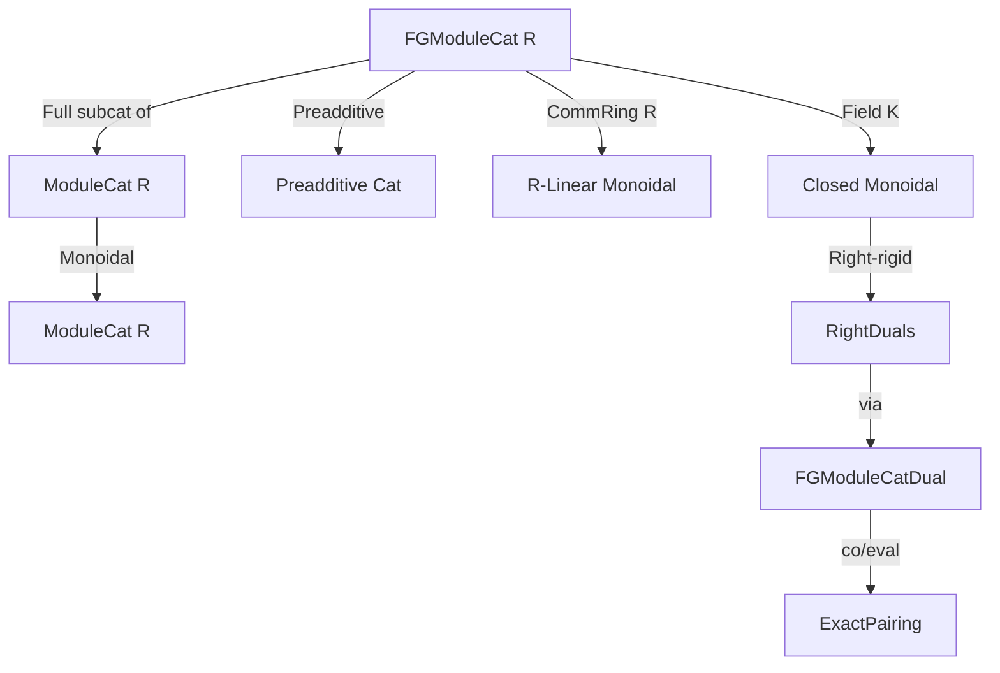
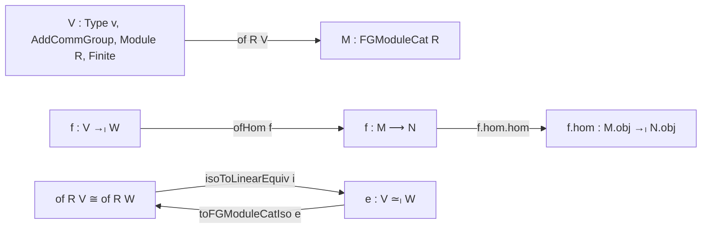

**Technical Brief: `Basic.lean` — Category of Finitely Generated Modules**

---

### 1. **Key Definitions & Theorems**

| Name | Type / Signature | Purpose |
|------|------------------|---------|
| `ModuleCat.isFG R` | `ObjectProperty (ModuleCat R)` | Predicate asserting that a module over `R` is finitely generated (`Module.Finite R V`). |
| `FGModuleCat R` | `Type (u+1)` | Full subcategory of `ModuleCat R` on finitely generated modules. |
| `FGModuleCat.carrier M` | `Type v` | Underlying type of object `M : FGModuleCat R`. Marked `@[coe]`. |
| `of R V` | `FGModuleCat R` | Embedding of an unbundled finitely generated module `V` into `FGModuleCat R`. |
| `ofHom f` | `of R V ⟶ of R W` | Embedding of a linear map `f : V →ₗ W` into the hom-space of `FGModuleCat R`. |
| `isoToLinearEquiv i` | `V ≃ₗ W` | Isomorphism in `FGModuleCat R` → linear equivalence of underlying modules. |
| `LinearEquiv.toFGModuleCatIso e` | `of R V ≅ of R W` | Linear equivalence → isomorphism in `FGModuleCat R`. |
| `ulift R` | `FGModuleCat R ⥤ FGModuleCat R` | Universe lifting functor; fully faithful. |
| `tensorUnit_obj`, `tensorObj_obj` | `@[simp]` lemmas | Compatibility of monoidal structure with forgetful functor. |
| `ihom_obj` | `ihom V .obj W = FGModuleCat.of K (V ⟶ W)` | Internal hom in closed monoidal structure over a field. |
| `FGModuleCatDual K V` | `FGModuleCat K` | Dual module object in `FGModuleCat K`, using `Module.Dual K V`. |
| `FGModuleCatCoevaluation K V` | `𝟙 ⟶ V ⊗ V*` | Coevaluation map (via `coevaluation K V`). |
| `FGModuleCatEvaluation K V` | `V* ⊗ V ⟶ 𝟙` | Evaluation (contraction) map (via `contractLeft K V`). |
| `exactPairing` | `ExactPairing V (FGModuleCatDual K V)` | Verifies rigidity axioms using co/evaluation. |
| `rightDual`, `rightRigidCategory` | Instances | Establishes `FGModuleCat K` as a right-rigid monoidal category. |

---

### 2. **Naming Conventions**

- **Predicates**: `isFG`, `isMonoidal`, `IsMonoidalClosed`, `HasRightDual`, `ExactPairing`.
- **Objects/Constructions**:
  - `of`, `ofHom`: embedding from unbundled to bundled.
  - `carrier`, `obj_carrier`: access underlying module.
  - `FGModuleCatDual`, `FGModuleCatCoevaluation`, `FGModuleCatEvaluation`: category-specific variants of standard constructions.
- **Isomorphisms**:
  - `isoToLinearEquiv`, `LinearEquiv.toFGModuleCatIso`: bidirectional translation between categorical and linear-algebraic isomorphisms.
- **Functoriality**:
  - `ulift`, `fullyFaithfulULift`: universe lifting and its properties.
- **Simp lemmas**:
  - `hom_hom_comp`, `hom_hom_id`, `tensorUnit_obj`, `tensorObj_obj`, `ihom_obj`, `FGModuleCatDual_obj`, `FGModuleCatEvaluation_apply'`, etc.

---

### 3. **Tactic Stack**

Frequent tactics used in proofs and instance synthesis:

| Tactic | Usage |
|--------|-------|
| `infer_instance` | To discharge typeclass goals (e.g., `Module.Finite`, `AddCommGroup`, `Module`). |
| `ext` / `ext x` | Extensionality for homs (especially after unfolding `hom.hom`). |
| `rfl` | For definitional equalities (e.g., `of_carrier`, `obj_carrier`). |
| `simp` / `simp_rw` | To normalize expressions using `@[simp]` lemmas. |
| `aesop` | Not explicitly used here, but likely in later files (not in this one). |
| `ring` | Not used in this file (commutative ring structure is not exploited here). |
| `change`, `unfold` | To adjust goal type for `infer_instance`. |
| `apply`, `exact` | In short proofs like `coevaluation_evaluation`. |

---

### 4. **Proof Logic**

- **Structure**: The file proceeds in three stages:
  1. **Ring case**: Define `FGModuleCat R` as a full subcategory; prove it inherits preadditive structure and is enriched over `R$-modules when $R$ is commutative.
  2. **Commutative ring case**: Show monoidal structure (tensor product preserves finite generation); verify linearity.
  3. **Field case**: Prove closed monoidal structure (internal homs are finite-dimensional); construct duals and verify rigidity via co/evaluation maps.

- **Typical proof pattern**:
  - Use `ConcreteCategory.ofHom` to lift linear maps.
  - Prove categorical properties by unfolding to `ModuleCat` and using `ModuleCat.hom_ext`.
  - For rigidity: verify the snake equations (`coevaluation_evaluation`, `evaluation_coevaluation`) by reducing to known linear algebra identities (`contractLeft_assoc_coevaluation`).

- **Induction**: Not used here — finite-dimensionality is handled via basis summation (e.g., `coevaluation_apply_one`).

---

### 5. **Imports**

| Import | Role |
|--------|------|
| `Mathlib.Algebra.Category.ModuleCat.Monoidal.Closed` | Monoidal closed structure on `ModuleCat`. |
| `Mathlib.CategoryTheory.Monoidal.Rigid.Basic` | Definitions of duals, rigidity, `ExactPairing`. |
| `Mathlib.CategoryTheory.Monoidal.Subcategory` | Tools for full subcategories with object properties. |
| `Mathlib.LinearAlgebra.Coevaluation` | Definition and properties of `coevaluation`. |
| `Mathlib.LinearAlgebra.FreeModule.Finite.Matrix` | Finite-dimensional linear algebra (bases, coordinates). |
| `Mathlib.RingTheory.TensorProduct.Finite` | Finite generation of tensor products. |

---

### 6. **Mermaid Diagrams**

#### **Dependency Graph (Top-Level Imports)**

#### **Module Structure Overview**

#### **Object/Arrow Embedding Flow**

---

### 7. **Future Work (as stated)**

- Prove `FGModuleCat R` is **abelian** when `R` is left-Noetherian.

---

### 8. **Summary**

This file formalizes the foundational categorical structure of finitely generated modules over a ring, culminating in the rigidity of finite-dimensional vector spaces over a field. It leverages Lean’s `ObjectProperty` and `FullSubcategory` machinery to define `FGModuleCat R`, then builds up monoidal, linear, closed, and rigid structures stepwise, with careful coherence via `@[simp]` lemmas and explicit lifting of linear maps. The field case is the most sophisticated, verifying the rigidity axioms using coevaluation and contraction maps from `LinearAlgebra`.
