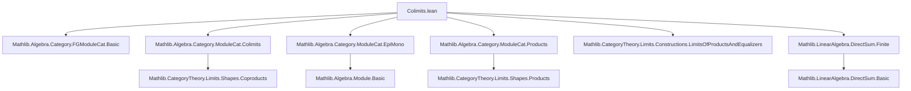
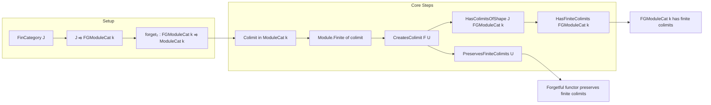

### Technical Brief: `Colimits.lean` — Finite Colimits in `FGModuleCat`

---

#### **1. Key Definitions & Theorems**

| Name | Type / Signature | Purpose |
|------|------------------|---------|
| `Module.Finite.equiv_iff` | `Module.Finite k M ↔ M ≃ₗ[k] N` for finite `N` | Relates finite generation to linear equivalence with a finite module. |
| `colimitQuotientCoproduct` | `colimitQuotientCoproduct F : (∐ F) ⟶ colimit F` | Canonical epimorphism from coproduct to colimit in `ModuleCat`. |
| `forget₂CreatesColimit` | `CreatesColimit F (forget₂ (FGModuleCat k) (ModuleCat k))` | Shows the forgetful functor creates colimits of diagrams indexed by finite categories. |
| `instance : CreatesColimitsOfShape J ...` | `CreatesColimitsOfShape J (forget₂ ...)` | Generalizes creation to all finite-shaped colimits. |
| `instance : HasColimitsOfShape J ...` | `HasColimitsOfShape J (FGModuleCat k)` | Concludes `FGModuleCat k` has all colimits of shape `J` (finite). |
| `instance : HasFiniteColimits ...` | `HasFiniteColimits (FGModuleCat k)` | Final conclusion: `FGModuleCat k` has all finite colimits. |
| `instance : PreservesFiniteColimits ...` | `PreservesFiniteColimits (forget₂ ...)` | The forgetful functor preserves finite colimits. |

---

#### **2. Naming Conventions**

- **Prefixes**:
  - `forget₂`: Standard for forgetful functors between module categories.
  - `colimitQuotient...`: For canonical maps from coproducts to colimits.
  - `createsColimit...`, `HasColimitsOfShape...`, `PreservesFiniteColimits...`: Standard `CategoryTheory.Limits` naming.

- **Suffixes**:
  - `of_surjective`: Used when finite generation is deduced via a surjection from a finite module.
  - `equiv_iff`: Used for equivalences between properties (e.g., finite generation ↔ linear equivalence to finite module).

- **No explicit suffixes like `is_`, `mul_`, `dist_`** — this file is categorical, not algebraic.

---

#### **3. Tactic Stack**

| Tactic | Frequency | Role |
|--------|-----------|------|
| `infer_instance` | Very high | Solves `Module.Finite`, `SmallCategory`, `FinCategory`, `HasColimitsOfShape`, etc. |
| `rw [...]` | Medium | Rewrites using `ModuleCat.isFG_iff`, `colimitQuotientCoproduct`, etc. |
| `change ...` | Low | Renames goals for clarity (e.g., `change Module.Finite k (F.obj j)`). |
| `classical` | Low | Used once to enable classical choice for equivalence of finite generation. |
| `exact` | Low | Final step in `Module.Finite.equiv_iff` proof. |

No heavy automation (`aesop`, `ring`, `simp_rw`) — proofs are mostly `infer_instance`-driven.

---

#### **4. Proof Logic**

- **Structure**:  
  1. **Finite coproducts of finite modules are finite**  
     - Use `Module.Finite.equiv_iff` + `coprodIsoDirectSum` + `finite_direct_sum`.
  2. **Colimits in `FGModuleCat` are finite**  
     - Use `Module.Finite.of_surjective` on `colimitQuotientCoproduct`, which is surjective (epic in `ModuleCat`).
  3. **Forgetful functor creates finite colimits**  
     - Show the colimit in `ModuleCat` is finite → lift it to `FGModuleCat`.
     - Use `createsColimitOfFullyFaithfulOfIso` with `Iso.refl`.
  4. **Transfer colimit existence**  
     - Apply `hasColimitsOfShape_of_hasColimitsOfShape_createsColimitsOfShape`.
  5. **Conclude finite colimits exist & are preserved**.

- **Induction?** None — all arguments are categorical and rely on universal properties and module-theoretic facts.

---

#### **5. Imports**

| Import | Purpose |
|--------|---------|
| `Mathlib.Algebra.Category.FGModuleCat.Basic` | Basic definitions of `FGModuleCat`, forgetful functors, finite generation. |
| `Mathlib.Algebra.Category.ModuleCat.Colimits` | Colimits in `ModuleCat`, including `colimitQuotientCoproduct`. |
| `Mathlib.Algebra.Category.ModuleCat.EpiMono` | Epimorphisms in `ModuleCat` = surjective linear maps. |
| `Mathlib.Algebra.Category.ModuleCat.Products` | Coproducts = direct sums; `coprodIsoDirectSum`. |
| `Mathlib.CategoryTheory.Limits.Constructions.LimitsOfProductsAndEqualizers` | Tools like `createsColimitOfFullyFaithfulOfIso`. |
| `Mathlib.LinearAlgebra.DirectSum.Finite` | Finite direct sums of finite modules are finite. |

---

#### **6. Mermaid Diagrams**

##### **Dependency Graph (Module-Level)**

##### **Overview of Theoretical Flow**

---

#### **7. Summary**

This file establishes that the category of **finitely generated modules over a ring `k`** (`FGModuleCat k`) has all finite colimits, and that the forgetful functor to `ModuleCat k` both **creates** and **preserves** them. The proof leverages:
- The fact that colimits in `ModuleCat` are quotients of coproducts,
- That finite coproducts of finite modules are finite,
- And categorical lifting principles (`createsColimitOfFullyFaithfulOfIso`).

It is a clean, modular application of `Mathlib`’s categorical and module-theoretic infrastructure — no heavy computation, all structural reasoning.

--- 

Let me know if you'd like a formalized summary in `lean` comment style or a dependency graph for the *proof terms* (not just imports).
