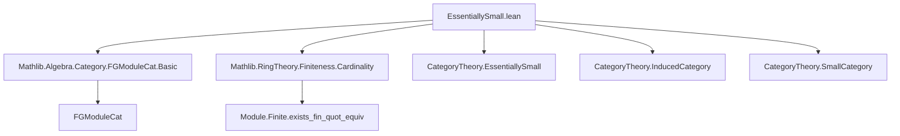

**Technical Brief: `EssentiallySmall.lean`**

---

### 1. **Key Definitions & Theorems**

| Name | Type / Signature | Purpose |
|------|------------------|---------|
| `FGModuleRepr R` | `Type u` | A *small* representation of finitely generated $R$-modules as quotients $R^n / S$, where $n : \mathbb{N}$ and $S \leq R^n$. |
| `repr (x : FGModuleRepr R)` | `Type u` | Underlying type of the module represented by `x`, defined as `(_ ⧸ x.S)`. |
| `ofFinite (M : FGModuleCat R)` | `FGModuleRepr R` | Non-canonical choice of a presentation of a finitely generated module $M$ as a quotient of $R^n$. Uses `Classical.choice` on existence of finite presentation. |
| `ofFiniteEquiv` | `ofFinite R M ≃ₗ[R] M` | Linear isomorphism between the concrete quotient model and the original module $M$. |
| `embed R` | `FGModuleRepr R ⥤ FGModuleCat R` | Faithful, full, essentially surjective functor embedding the small category into the large category of finitely generated modules. |
| `instance : EssentiallySmall (FGModuleCat R)` | `Prop` | Proves that `FGModuleCat R` is essentially small: it has a small category and an equivalence to it. |

---

### 2. **Naming Conventions**

- **Prefixes**:
  - `ofFinite`: indicates a *non-canonical* construction from a finite module.
  - `repr`: short for *representation*; used for the underlying module of a `FGModuleRepr`.
  - `embed`: standard embedding of the small model into the original category.
- **Suffixes**:
  - `Equiv`: linear equivalence (`≃ₗ[R]`).
  - `Iso`: categorical isomorphism (e.g., `.toFGModuleCatIso`).
- **Structure fields**:
  - `n`, `S`: standard notation for rank and kernel submodule.

---

### 3. **Tactic Stack**

Frequent tactics used in proofs and instance searches:

| Tactic | Usage |
|--------|-------|
| `unfold repr` | To simplify typeclass instances over `repr`. |
| `infer_instance` | To discharge `AddCommGroup`, `Module`, `Module.Finite` instances. |
| `Classical.choice` | To extract data from existential proofs (e.g., `Module.Finite.exists_fin_quot_equiv`). |
| `trans` | For composing equivalences/isomorphisms (e.g., `ULift.moduleEquiv.trans`). |
| `asEquivalence.symm` | To invert an equivalence (used in `EssentiallySmall` proof). |
| `essentiallySmall_of_fully_faithful` | To deduce essential smallness via a fully faithful functor with essentially surjective composition. |

No heavy automation like `aesop` or `ring` is used—proofs rely on algebraic structure and categorical lemmas from Mathlib.

---

### 4. **Proof Logic**

The proof proceeds in three main steps:

1. **Construct a small category `FGModuleRepr R`**:
   - Objects are pairs $(n, S)$, representing $R^n / S$.
   - Morphisms are induced from `FGModuleCat`, via `InducedCategory`.

2. **Define a functor `embed : FGModuleRepr R → FGModuleCat R`**:
   - On objects: sends $(n, S)$ to the quotient module $R^n / S$ viewed in `FGModuleCat`.
   - Show `embed` is an equivalence:
     - *Faithful/full*: via `fullyFaithfulInducedFunctor`.
     - *Essentially surjective*: for any $M$, use `ofFinite R M` and `ofFiniteEquiv`.

3. **Conclude essential smallness**:
   - Use `essentiallySmall_of_fully_faithful` on `FGModuleCat.ulift` composed with `embed`.
   - A secondary instance shows `FGModuleCat.ulift` itself is an equivalence (via `embed.obj (ofFinite R M)`).

Induction or case analysis is *not* used—proofs are constructive only up to choice (via `Classical.choice`) for `ofFinite`.

---

### 5. **Imports & Dependencies**

| Import | Purpose |
|--------|---------|
| `Mathlib.Algebra.Category.FGModuleCat.Basic` | Defines `FGModuleCat`, morphisms, and basic properties. |
| `Mathlib.RingTheory.Finiteness.Cardinality` | Provides `Module.Finite.exists_fin_quot_equiv`, the key existence lemma for finite presentations. |
| `CategoryTheory` (via `open`) | General categorical machinery: functors, natural transformations, equivalences, small categories. |

---

### 6. **Mermaid Diagrams**

#### **Dependency Graph (Module-Level)**



#### **Category-Theoretic Overview**

```mermaid
graph LR
  subgraph SmallModel
    X[FGModuleRepr R] -->|embed| Y[FGModuleCat R]
  end

  subgraph LargeModel
    Z[FGModuleCat R] -->|ulift| W[FGModuleCat.{max u v} R]
  end

  X -.->|equivalence| Y
  Y -->|ess. surj. + fully faithful| Z
  Z -->|equivalence| W
```

- `FGModuleRepr R` is a *small* category.
- `embed` is an equivalence of categories.
- `FGModuleCat R` is *essentially small* because it is equivalent to a small category.

---

### 7. **Summary**

This file constructs an explicit small model (`FGModuleRepr R`) for the category of finitely generated modules over a commutative ring $R$, proving that `FGModuleCat R` is essentially small. While `FGModuleRepr R` is concrete and useful for theoretical purposes, the comment notes that `CategoryTheory.SmallModel` is preferred for practical applications due to better interface support.

The proof leverages classical choice to pick finite presentations, and relies on categorical lemmas about induced functors and equivalences. No heavy automation is needed—proofs are mostly algebraic and categorical reasoning.
