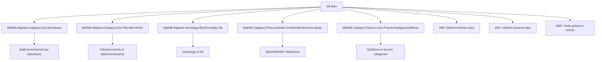
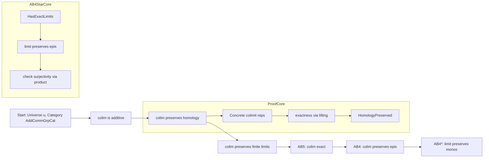

**Technical Brief: AB.lean — Grothendieck Axioms for `AddCommGrpCat`**

---

### 1. **Key Definitions & Theorems**

| Name | Type / Purpose |
|------|----------------|
| `colim.Additive` | Instance showing that filtered colimits in `AddCommGrpCat` are additive functors. |
| `colim.PreservesHomology` | Instance proving that filtered colimits in `AddCommGrpCat` preserve homology of short complexes. |
| `colim.PreservesFiniteLimits` | Instance showing filtered colimits preserve finite limits (via preservation of homology). |
| `HasFilteredColimits` | Instance asserting existence of filtered colimits in `AddCommGrpCat`. |
| `AB5` | Instance proving `AddCommGrpCat` satisfies Grothendieck’s AB5 axiom: filtered colimits are exact. |
| `AB4` | Instance proving AB4: colimits over discrete diagrams (i.e., products) preserve epimorphisms. Derived from AB5. |
| `AB4*` | Instance proving AB4*: limits over discrete diagrams (i.e., products) preserve monomorphisms. |
| `hasExactLimitsOfShape_of_preservesEpi` | Technical lemma used to prove AB4* by showing that the limit functor preserves epis (dual to AB4). |

---

### 2. **Naming Conventions**

- **Prefixes**:
  - `is_`, `has_`, `of_`, `preserves_`, `exact_`, `Abelian_`, `Additive_`, `_epi`, `mono_`, `epi_iff_`, `surjective_`
- **Suffixes**:
  - `_Cone`, `_limit`, `_colimit`, `_map`, `_obj`, `_app`, `_hom`, `_inv`, `_ι`, `_π`
- **Pattern**:
  - `ABn` for Grothendieck axioms (`AB5`, `AB4`, `AB4*`)
  - `preservesHomology_of_map_exact` — functional style: “preserves homology if it maps exact sequences to exact sequences”
  - `hasExactLimitsOfShape_of_preservesEpi` — “has exact limits of shape J if the limit functor preserves epis”

---

### 3. **Tactic Stack**

| Tactic | Usage Frequency | Purpose |
|--------|-----------------|---------|
| `simp` / `simp_rw` | Very High | Simplify hom-sets, limits, colimits, and concrete representations |
| `rcases` / `cases` | High | Extract witnesses from existential quantifiers (e.g., colimit representatives) |
| `rw` / `erw` | High | Rewrite using naturality, cone morphism properties, and iso commutativity |
| `exact` / `assumption` | Medium | Close trivial goals |
| `funext` | Medium | Extensionality for functions (e.g., in product limit constructions) |
| `apply` / `intro` | Medium | Intro + apply lemmas (e.g., `preservesFiniteLimits_of_preservesHomology`) |
| `aesop` | Low | Not used here — proof is mostly constructive and concrete |
| `let` / `have` | High | Introduce intermediate isomorphisms (e.g., `iX`, `iY`) and facts |

---

### 4. **Proof Logic**

- **Structure**:
  1. **Filtered colimits preserve homology**:
     - Use concrete description of colimits in `AddCommGrpCat`.
     - For an exact short complex `S`, lift elements through colimit representatives.
     - Use exactness at each stage and compatibility with transition maps to construct preimages.
  2. **Filtered colimits preserve finite limits**:
     - Apply `Functor.preservesFiniteLimits_of_preservesHomology`.
  3. **AB5**:
     - Use `AB5.ofShape` with `preservesFiniteLimits` and `HasFilteredColimits`.
  4. **AB4**:
     - Use `AB4.of_AB5` (AB5 ⇒ AB4).
  5. **AB4\***:
     - Prove that the limit functor over a discrete diagram (i.e., product) preserves monos.
     - Use duality: show it preserves epis (via `hasExactLimitsOfShape_of_preservesEpi`).
     - Reduce to checking surjectivity of product maps using concrete descriptions of limits as products.

- **Key Proof Techniques**:
  - **Concrete reasoning**: Elements of colimits/limits are represented via representatives in diagrams.
  - **Iso manipulation**: Use `Iso.trans`, `Iso.symm`, and `conePointUniqueUpToIso` to relate abstract limits/colimits to concrete constructions (e.g., `Pi.isoLimit`, `limit.isLimit`).
  - **Naturality & compatibility**: Critical for moving between diagram components and colimit/limit maps.

---

### 5. **Imports**

| Import | Role |
|--------|------|
| `Mathlib.Algebra.Category.Grp.Biproducts` | Biproducts in `Grp`/`AddCommGrpCat` |
| `Mathlib.Algebra.Category.Grp.FilteredColimits` | General filtered colimit properties in `Grp` |
| `Mathlib.Algebra.Homology.ShortComplex.Ab` | Homology of short complexes in `Ab` |
| `Mathlib.CategoryTheory.Abelian.GrothendieckAxioms.Basic` | Definitions of AB4, AB5, AB4* |
| `Mathlib.CategoryTheory.Limits.FunctorCategory.EpiMono` | Epis/monos in functor categories (used for AB4* proof) |

---

### 6. **Mermaid Diagrams**

#### **Dependency Graph (Top-Level)**

#### **Overview of AB.lean**

---

### 7. **Summary**

This file establishes foundational homological properties of the category of abelian groups (`AddCommGrpCat`), specifically verifying Grothendieck’s AB5, AB4, and AB4* axioms. The proofs rely heavily on concrete descriptions of limits and colimits in `AddCommGrpCat`, naturality of structure maps, and iso manipulation to bridge abstract categorical constructions with element-wise reasoning. The structure is modular: AB5 is proved directly, AB4 follows from AB5, and AB4* is proved via a dual argument using preservation of epis for limits.

--- 

Let me know if you'd like a formalized dependency graph (e.g., `.lean`-level imports) or a tactic-level proof trace.
