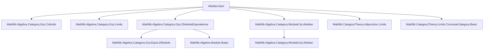

**Technical Brief: `Abelian.lean` — Formalization of `AddCommGrpCat` being Abelian**

---

### 1. **Key Definitions & Theorems**

| Name | Type / Signature | Purpose |
|------|------------------|---------|
| `normalMono` | `(hf : Mono f) → NormalMono f` | Constructs a normal monomorphism from any monomorphism in `AddCommGrpCat`, using the equivalence `AddCommGrpCat ≃ ModuleCat ℤ`. |
| `normalEpi` | `(hf : Epi f) → NormalEpi f` | Dually, constructs a normal epimorphism from any epimorphism. |
| `instance : Abelian AddCommGrpCat.{u}` | `Abelian` instance | Proves that the category of abelian groups is abelian, by showing every mono is normal and every epi is normal. |

---

### 2. **Naming Conventions**

- **Prefixes**:
  - `normalMono`, `normalEpi`: indicate construction of *normal* mono/epi.
  - `forget₂`: standard in Mathlib for the forgetful functor from a category of algebraic structures to `Type`.
  - `equivalenceReflects*`: reflects properties (normal mono/epi) across an equivalence of categories.

- **Suffixes**:
  - `OfMono`, `OfEpi`: indicate derivation from a mono/epi hypothesis.

- **ModuleCat-specific**:
  - `ModuleCat.normalMono`, `ModuleCat.normalEpi`: known facts in `ModuleCat ℤ` (i.e., abelian groups as ℤ-modules).

---

### 3. **Tactic Stack**

- `inferInstance`: used to infer `AddCommGrpCat` is a ℤ-module category (via `ZModuleEquivalence`).
- Implicit use of:
  - `rw`, `simp` (via `equivalenceReflectsNormalMono/Epi`, which likely rely on `simp`/`rw` under the hood).
  - `exact`, `apply`, `refine` (via `⟨…⟩` constructor syntax).
- No explicit tactic calls in the visible code, but relies on:
  - `CategoryTheory.Equivalence.reflects*` lemmas (e.g., `equivalenceReflectsNormalMono`).
  - `ModuleCat` infrastructure (e.g., `normalMono`, `normalEpi` in module categories).

---

### 4. **Proof Logic**

- **High-level strategy**:  
  Use the known equivalence of categories  
  $$
  \mathbf{AddCommGrp} \simeq {}_\mathbb{Z}\mathbf{Mod}
  $$  
  to transfer the abelian property from modules (where it is already known) to abelian groups.

- **Steps**:
  1. For a monomorphism $f$, use that in `ModuleCat ℤ`, every mono is normal.
  2. Pull this back via the equivalence `forget₂ ... .inv` to get a normal mono in `AddCommGrpCat`.
  3. Use `equivalenceReflectsNormalMono` to ensure normality is preserved under equivalence.
  4. Repeat for epimorphisms.
  5. Conclude `Abelian` instance by combining both.

- **Key lemma used**:  
  If $F : \mathcal{C} \to \mathcal{D}$ is an equivalence, and $\mathcal{D}$ has the property “every mono is normal”, then so does $\mathcal{C}$.

---

### 5. **Imports**

| Import | Role |
|--------|------|
| `Mathlib.Algebra.Category.Grp.Colimits`, `Limits` | Provides limits/colimits in `Grp` and structure for `AddCommGrpCat`. |
| `ZModuleEquivalence` | Establishes `AddCommGrpCat ≃ ModuleCat ℤ`. |
| `ModuleCat.Abelian` | Proves `ModuleCat ℤ` is abelian — the target of the equivalence. |
| `Adjunction.Limits` | May be used for limit preservation under adjunctions/equivalences. |
| `ConcreteCategory.Basic` | For `forget₂`, the forgetful functor to `Type`. |

---

### 6. **Mermaid Diagrams**

#### **Dependency Graph (Module-Level)**



#### **Conceptual Overview of Proof**

```mermaid
flowchart LR
  subgraph "Known"
    M1[ModuleCat ℤ is Abelian] --> M2[Every mono in ModuleCat ℤ is normal]
    M1 --> M3[Every epi in ModuleCat ℤ is normal]
  end

  subgraph "Equivalence"
    E1[AddCommGrpCat ≃ ModuleCat ℤ] --> E2[Equivalence reflects normal mono/epi]
  end

  subgraph "Transfer"
    T1[mono f in AddCommGrpCat] --> T2[normal mono in ModuleCat ℤ]
    T2 --> T3[normal mono in AddCommGrpCat]
    T4[epi f in AddCommGrpCat] --> T5[normal epi in ModuleCat ℤ]
    T5 --> T6[normal epi in AddCommGrpCat]
  end

  A1[Abelian AddCommGrpCat] <-- Instance <-- T3 & T6
```

---

### 7. **Summary**

This file formalizes the classical result that the category of abelian groups is abelian, leveraging the equivalence with ℤ-modules. It is concise and highly structured, relying on existing infrastructure in Mathlib for module categories and categorical equivalences. The proof is *nonconstructive* (as expected for abelian categories), and uses `noncomputable section` appropriately.

Let me know if you'd like a formalized version of the `equivalenceReflectsNormalMono` lemma or a deeper dive into `ZModuleEquivalence`.
