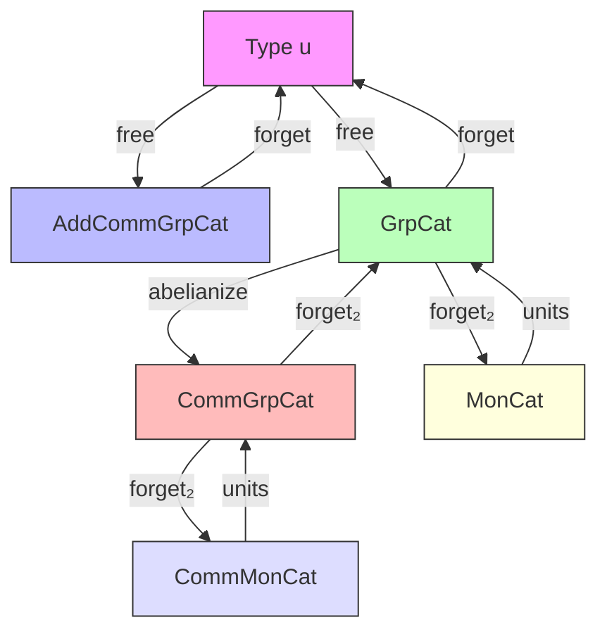
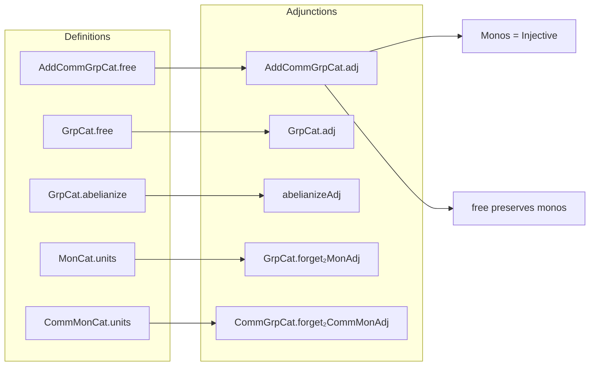

**Technical Brief: `Adjunctions.lean` (Mathlib4)**  
*Domain: Category Theory — Adjunctions in Algebraic Categories*

---

### 1. KEY DEFINITIONS & THEOREMS

| Name | Type / Signature | Purpose |
|------|------------------|---------|
| `AddCommGrpCat.free` | `Type u ⥤ AddCommGrpCat` | Free abelian group functor: sends type `X` to `FreeAbelianGroup X` |
| `GrpCat.free` | `Type u ⥤ GrpCat` | Free group functor: sends type `X` to `FreeGroup X` |
| `GrpCat.abelianize` | `GrpCat.{u} ⥤ CommGrpCat.{u}` | Abelianization functor: `G ↦ Gᵃᵇ` |
| `AddCommGrpCat.adj` | `free ⊣ forget AddCommGrpCat` | Proves `free` is left adjoint to forgetful functor `AddCommGrpCat → Type` |
| `GrpCat.adj` | `free ⊣ forget GrpCat` | Proves `free` is left adjoint to forgetful functor `GrpCat → Type` |
| `abelianizeAdj` | `abelianize ⊣ forget₂ CommGrpCat GrpCat` | Proves abelianization is left adjoint to inclusion `CommGrpCat ↪ GrpCat` |
| `MonCat.units` | `MonCat.{u} ⥤ GrpCat.{u}` | Units functor: sends monoid `R` to its group of units `Rˣ` |
| `GrpCat.forget₂MonAdj` | `forget₂ GrpCat MonCat ⊣ MonCat.units` | Adjunction between units and forgetful functors |
| `CommMonCat.units` | `CommMonCat.{u} ⥤ CommGrpCat.{u}` | Units functor for commutative monoids → abelian groups |
| `CommGrpCat.forget₂CommMonAdj` | `forget₂ CommGrpCat CommMonCat ⊣ CommMonCat.units` | Adjunction for commutative units |

*Notable corollary:*  
`mono_iff_injective` used to prove monomorphisms in `AddCommGrpCat` are injective homomorphisms.

---

### 2. NAMING CONVENTIONS

- **Functors**:  
  - `free`, `abelianize`, `units` — named after universal constructions.  
  - `forget`, `forget₂` — standard forgetful functors; `forget₂ C D` denotes inclusion `C ↪ D`.

- **Adjunctions**:  
  - `adj`, `abelianizeAdj`, `forget₂MonAdj`, `forget₂CommMonAdj` — suffix `Adj` indicates adjunction.  
  - `adj` is generic for free-forgetful; qualified names for others.

- **Instances**:  
  - `IsLeftAdjoint`, `IsRightAdjoint` — derived from adjunctions.

- **Homomorphism coercions**:  
  - `of`, `ofHom` — embedding from concrete category to abstract one.  
  - `map`, `lift`, `comp` — standard categorical operations.

- **Simp lemmas**:  
  - `free_obj_coe`, `free_map_coe` — coercion lemmas for underlying types/maps.

---

### 3. TACTIC STACK

| Tactic | Frequency | Role |
|--------|-----------|------|
| `ext` | High | Extensionality for homs (e.g., group/monoid/abelian group homs) |
| `simp` / `simpa` | High | Simplification using `simp` lemmas like `FreeAbelianGroup.lift_apply_of`, `Abelianization.lift_apply_of` |
| `rfl` | High | Reflexivity for definitional equalities (e.g., `free_map_coe`) |
| `aesop` | Medium | Automated proof search (used in `CommGrpCat.forget₂CommMonAdj`) |
| `intro` / `intros` | Medium | Introducing hypotheses in naturality/uniqueness proofs |
| `apply` / `apply Eq.symm` | Medium | Applying lemmas like `Abelianization.lift_unique` |
| `rwa` | Low | Rewriting with equivalences (e.g., `mono_iff_injective`) |
| `by_cases` | Low | Case analysis on `IsEmpty` (e.g., `by_cases! hX : IsEmpty X`) |

---

### 4. PROOF LOGIC

**General proof strategy**:
1. **Construct hom-set equivalence** (`homEquiv`) using universal properties:
   - `FreeAbelianGroup.lift`, `FreeGroup.lift`, `Abelianization.lift`
2. **Verify naturality**:
   - Use `ext` + `simp` + universal property lemmas (`lift_apply_of`, `lift_unique`, `lift_comp`)
3. **Instantiate `Adjunction.mkOfHomEquiv`** or `mk'` for unit/counit-based adjunctions.

**Example flow for `AddCommGrpCat.adj`**:
- Define `homEquiv` as composition:  
  $$
  \mathrm{Hom}_{\mathbf{AddCommGrp}}(F(X), A) \cong \mathrm{Hom}_{\mathbf{Type}}(X, UA) 
  $$
  via `FreeAbelianGroup.lift`.
- Prove naturality in `X` using `FreeAbelianGroup.lift_comp`.
- Conclude adjunction.

**Abelianization adjunction**:
- Chain three equivalences:
  $$
  \mathrm{Hom}_{\mathbf{Ab}}(G^{ab}, A) \cong \mathrm{Hom}_{\mathbf{Grp}}(G, A) \cong \mathrm{Hom}_{\mathbf{Grp}}(G, \iota(A))
  $$
  where $\iota : \mathbf{Ab} \hookrightarrow \mathbf{Grp}$.

**Units adjunctions**:
- Use `toUnits` (universal property of units) and `Units.map`.
- Construct unit/counit explicitly and verify triangle identities.

---

### 5. IMPORTS & DEPENDENCIES

| Module | Role |
|--------|------|
| `Mathlib.Algebra.Category.Grp.Preadditive` | Background on additive categories, abelian groups |
| `Mathlib.GroupTheory.FreeAbelianGroup` | `FreeAbelianGroup`, its universal property (`lift`) |
| `Mathlib.CategoryTheory.Adjunction.Limits` | General adjunction machinery (`mkOfHomEquiv`, `IsLeftAdjoint`) |
| `Mathlib.CategoryTheory.Limits.Types.Coproducts` | Used in monomorphism preservation proof (via initial objects) |

*Key dependencies*:  
- `FreeGroup`, `FreeAbelianGroup`, `Abelianization`, `Units`, `MonoidHom.toHomUnits`  
- `ConcreteCategory.homEquiv`, `mono_iff_injective`, `Functor.map_mono`

---

### 6. MERMAID DIAGRAMS

#### Dependency Graph (High-Level)

#### Overview of File Structure

---

### 7. DOMAIN-SPECIFIC INSIGHTS

- **Categorical abstraction**: All constructions are *functorial* and *natural*, leveraging universal properties.
- **Proof automation**: Lean’s `ext`, `simp`, and `aesop` reduce routine verification of naturality/triangle identities.
- **Universe polymorphism**: All functors/adjunctions are universe-polymorphic (`.{u}`), enabling uniform reasoning across levels.
- **Concrete vs abstract**: Heavy use of `of`, `ofHom`, and coercion lemmas (`*_coe`) bridges concrete algebra (groups as types with ops) and categorical abstraction.

---

### 8. RELEVANT EQUATIONS & IDENTITIES

- Free abelian group:  
  $$
  \mathrm{Hom}_{\mathbf{Ab}}(\mathbb{Z}^{(X)}, A) \cong \mathrm{Hom}_{\mathbf{Type}}(X, UA)
  $$
- Free group:  
  $$
  \mathrm{Hom}_{\mathbf{Grp}}(F(X), G) \cong \mathrm{Hom}_{\mathbf{Type}}(X, UG)
  $$
- Abelianization:  
  $$
  \mathrm{Hom}_{\mathbf{Ab}}(G^{ab}, A) \cong \mathrm{Hom}_{\mathbf{Grp}}(G, A)
  $$
- Units:  
  $$
  \mathrm{Hom}_{\mathbf{Grp}}(R^\times, G) \cong \mathrm{Hom}_{\mathbf{Mon}}(R, UG)
  $$

---

*End of Technical Brief*
