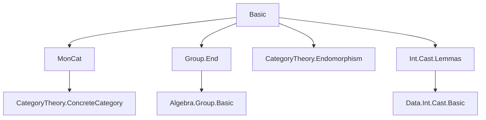
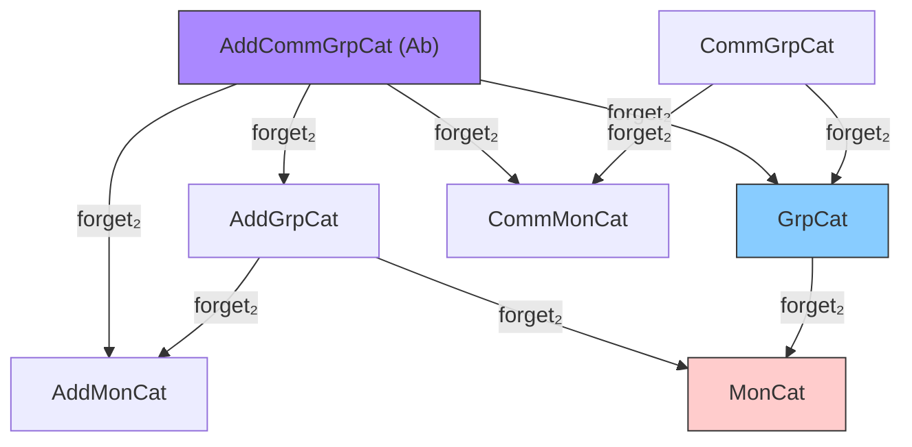
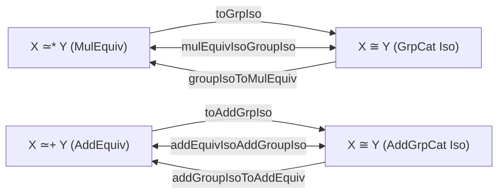

### Technical Brief: `Basic.lean` — Category-Theoretic Foundations for Groups and Additive Groups

---

#### **1. Key Definitions & Theorems**

| Name | Type / Structure | Purpose |
|------|------------------|---------|
| `AddGrpCat` | `Type (u + 1)` | Bundled category of additive groups and additive group homomorphisms |
| `GrpCat` | `Type (u + 1)` | Bundled category of groups and group homomorphisms |
| `AddCommGrpCat` | `Type (u + 1)` | Bundled category of additive commutative groups (i.e., $\mathbb{Z}$-modules) |
| `CommGrpCat` | `Type (u + 1)` | Bundled category of commutative (abelian) groups |
| `Ab` | `abbrev AddCommGrpCat` | Notational alias for `AddCommGrpCat`, for readability |
| `GrpCat.Hom`, `AddGrpCat.Hom`, etc. | `structure` | Morphism types: bundled monoid/group homomorphisms |
| `ofHom` | `abbrev` | Embeds unbundled homs (`→*`, `→+`) into categorical morphisms |
| `Hom.hom` | `abbrev` | Projects bundled morphism back to underlying function/homomorphism |
| `forget₂ GrpCat MonCat` | `HasForget₂` | Forgetful functor from groups to monoids |
| `fullyFaithfulForget₂ToMonCat` | `def` | Proves forgetful functor is fully faithful |
| `MulEquiv.toGrpIso`, `AddEquiv.toAddGrpIso`, etc. | `def` | Converts unbundled equivalences to categorical isomorphisms |
| `groupIsoToMulEquiv`, `commGroupIsoToMulEquiv`, etc. | `def` | Converts categorical isomorphisms back to unbundled equivalences |
| `mulEquivIsoGroupIso`, `addEquivIsoAddGroupIso`, etc. | `def` | Shows equivalence of unbundled and bundled isomorphisms |
| `asHom {G : AddCommGrpCat.{0}} (g : G)` | `def` | Universal property of $\mathbb{Z}$: sends $1 \mapsto g$ |
| `injective_of_mono` | `thm` | Monomorphisms in `AddCommGrpCat` are injective on underlying functions |
| `int_hom_ext` | `thm` | Homomorphisms from $\mathbb{Z}$ are determined by image of $1$ |
| `uliftFunctor` | `def` | Universe lifting functor for groups/abelian groups |
| `GrpCat.forget_reflects_isos`, `CommGrpCat.forget_reflects_isos` | `instance` | Forgetful functors reflect isomorphisms |

---

#### **2. Naming Conventions**

- **Prefixes**:
  - `forget₂`: forgetful functors between structured categories (`HasForget₂`)
  - `ofHom`, `of`: unbundled → bundled conversion
  - `hom`: projection from bundled morphism to underlying function/hom
  - `coe`: coercion (e.g., `coe_id`, `coe_comp`)
  - `asHom`: canonical morphism from $\mathbb{Z}$
  - `uliftFunctor`: universe lifting

- **Suffixes**:
  - `Aux`: workaround for universe unification issues (e.g., `GrpMaxAux`)
  - `Hom`: morphism type (e.g., `GrpCat.Hom`)
  - `str`: structure instance (e.g., `AddGrpCat.str`)

- **`to_additive` attribute**: used to generate additive analogues automatically (e.g., `GrpCat` → `AddGrpCat`, `→*` → `→+`)

- **`ext` attributes**: extensionality lemmas (e.g., `@[ext]`, `@[to_additive (attr := ext)]`)

- **`simps` attributes**: simplification lemmas for projections (e.g., `@[simps]`, `initialize_simps_projections`)

---

#### **3. Tactic Stack**

Frequently used tactics in proofs and definitions:

| Tactic | Usage |
|--------|-------|
| `rfl` | Definitional equalities (e.g., `coe_id`, `hom_comp`) |
| `simp` / `simp only` | Simplifying using `@[simp]` lemmas (e.g., `id_apply`, `comp_apply`) |
| `ext` | Extensionality (e.g., `hom_ext`, `int_hom_ext`) |
| `aesop` | Automated reasoning for simple goals (e.g., `map_mul'` in `isoPerm`) |
| `by rfl` / `by aesop` | Inline proofs in `def`/`instance` |
| `cat_disch` | Category-theoretic tactic for discharging diagrammatic goals |
| `simpa using` | Simplify using a hypothesis (e.g., `asHom_injective`) |
| `apply`, `intro`, `exact` | Basic proof scripting |
| `congr_fun` | Extensionality for functions (e.g., in `asHom_injective`) |

---

#### **4. Proof Logic**

- **Structure**: Most proofs follow a *concrete-category style*:
  1. Reduce to underlying functions via `hom` projection (`Hom.hom`).
  2. Use function extensionality (`ext`, `congr_fun`) to reduce to pointwise equality.
  3. Apply definitional simplifications (`simp [coe_id, coe_comp]`) to reduce to algebraic identities.
  4. Use `@[to_additive]` to mirror proofs for additive variants.

- **Key logical patterns**:
  - **Isomorphism ↔ Equivalence**: Show `X ≅ Y` ↔ `X ≃* Y` (or `AddEquiv`) via `toGrpIso` / `groupIsoToMulEquiv`.
  - **Monomorphisms ⇒ Injective**: In `AddCommGrpCat`, use representability by $\mathbb{Z}$ (`asHom`) and cancellation of monos.
  - **Fully Faithful Forgetful Functors**: Construct preimages via `ofHom`, verify bijectivity via `hom_ext`.
  - **Universe Lifting**: Use `ULift` equivalence to transport structure.

- **Induction**: Not used here (no inductive types involved); relies on extensionality and definitional equality.

---

#### **5. Imports**

| Module | Purpose |
|--------|---------|
| `Mathlib.Algebra.Category.MonCat.Basic` | Monoid category (`MonCat`) and forgetful functors |
| `Mathlib.Algebra.Group.End` | Endomorphism monoids/groups (used in `Aut`, `Iso`) |
| `Mathlib.CategoryTheory.Endomorphism` | Endomorphism objects and structure |
| `Mathlib.Data.Int.Cast.Lemmas` | Integer multiplication homomorphism (`zmultiplesHom`), used in `asHom` |

---

#### **8. Mermaid Diagrams**

##### **Dependency Graph (Module-Level)**

##### **Category-Theoretic Overview**

##### **Isomorphism Equivalence (Bundled ↔ Unbundled)**

---

### Summary

This file establishes the foundational categorical framework for groups, additive groups, and their commutative variants. It defines bundled categories (`GrpCat`, `AddGrpCat`, etc.), equips them with concrete category structures, constructs forgetful functors, and proves key properties (fully faithfulness, reflection of isos, monos ⇒ injective). The design leverages Lean’s `to_additive` mechanism and `ConcreteCategory` infrastructure to minimize duplication, while using `ofHom`/`Hom.hom` to bridge unbundled and bundled morphisms. The `asHom` construction encodes the universal property of $\mathbb{Z}$ in `AddCommGrpCat`, enabling categorical characterizations of injectivity and extensionality.
