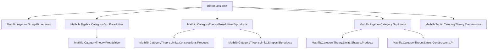
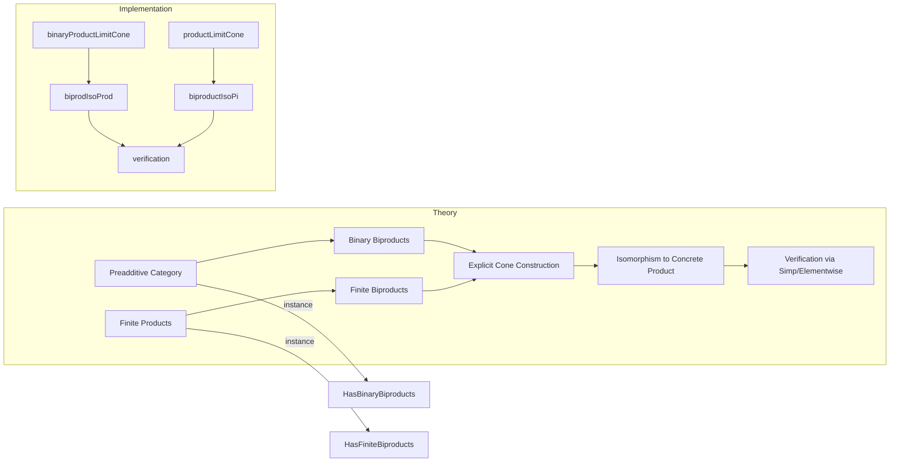

**Technical Brief: Biproducts in `AddCommGrpCat`**

---

### 1. KEY DEFINITIONS & THEOREMS

| Name | Type / Signature | Purpose |
|------|------------------|---------|
| `binaryProductLimitCone` | `G H : AddCommGrpCat → LimitCone (pair G H)` | Constructs an explicit limit cone for binary products using the Cartesian product of underlying types. |
| `biprodIsoProd` | `G H : AddCommGrpCat → (G ⊞ H) ≅ AddCommGrpCat.of (G × H)` | Shows the biproduct in `AddCommGrpCat` is isomorphic to the Cartesian product object. |
| `lift` | `s : Fan f → s.pt ⟶ AddCommGrpCat.of (∀ j, f j)` | Universal map from any cone over a family `f` to the product cone (dependent function space). |
| `productLimitCone` | `f : J → AddCommGrpCat → LimitCone (Discrete.functor f)` | Explicit limit cone for arbitrary (finite) products via dependent functions. |
| `biproductIsoPi` | `f : J → AddCommGrpCat → (⨁ f) ≅ AddCommGrpCat.of (∀ j, f j)` | Identifies the biproduct (categorical sum) with the dependent product object. |
| `instance HasBinaryBiproducts` | `HasBinaryBiproducts AddCommGrpCat` | Proves existence of binary biproducts via preadditivity + finite products. |
| `instance HasFiniteBiproducts` | `HasFiniteBiproducts AddCommGrpCat` | Extends to all finite biproducts. |

**Simp lemmas (elementwise):**
- `binaryProductLimitCone_cone_π_app_left/right`: Describe projections of the binary product cone.
- `biprodIsoProd_inv_comp_fst/snd`: Compatibility of the biproduct projection with the product projections under the iso.
- `biproductIsoPi_inv_comp_π`: Compatibility of biproduct projections with evaluation maps.

---

### 2. NAMING CONVENTIONS

- **Prefixes:**
  - `binaryProductLimitCone`, `productLimitCone`: Explicit limit cone constructions.
  - `biprodIsoProd`, `biproductIsoPi`: Isomorphisms identifying biproducts with concrete constructions.
  - `lift`: Universal morphism in limit universal property.
- **Suffixes:**
  - `_app_left/right`: Component of a natural transformation at a specific index.
  - `_inv_comp_*`: Composition with inverse of an iso, often used to relate constructions.
- **`ofHom`**: Embedding homomorphisms into `AddCommGrpCat` morphisms.
- **`of`**: Embedding types (e.g., `G × H`, `∀ j, f j`) into objects of `AddCommGrpCat`.

---

### 3. TACTIC STACK

- **`cat_disch`**: Category-theoretic tactic for discharging morphism equalities.
- **`rfl`**: Reflexivity for definitional equalities (especially in simp lemmas).
- **`ext`**: Extensionality for functions/morphisms (e.g., `ext x j`).
- **`simp only [...]`**: Simplification with explicit lemmas, avoiding over-simplification.
- **`by cat_disch`**: Used in `isLimit` construction to prove uniqueness of mediating morphism.

---

### 4. PROOF LOGIC

The proof strategy follows a standard categorical pattern:

1. **Existence via general theory**:
   - Use `HasBinaryBiproducts.of_hasBinaryProducts` and `HasFiniteBiproducts.of_hasFiniteProducts`, relying on `AddCommGrpCat` being preadditive and having all limits.

2. **Explicit constructions**:
   - For binary case: define cone over `pair G H` using `ofHom (AddMonoidHom.fst)` and `ofHom (AddMonoidHom.snd)`.
   - Show it’s a limit cone by constructing the unique mediating morphism via `ofHom (AddMonoidHom.prod l r)`.

3. **Iso verification**:
   - Use `IsLimit.conePointUniqueUpToIso` to get canonical isomorphisms between biproducts and explicit product constructions.
   - Prove commutativity of relevant triangles using `IsLimit.conePointUniqueUpToIso_inv_comp`.

4. **General finite case**:
   - Define `lift` and `productLimitCone` using dependent functions.
   - Verify limit cone axioms (`fac`, `uniq`) via extensionality and simplification.

---

### 5. IMPORTS (Primary Dependencies)

| Module | Role |
|--------|------|
| `Mathlib.Algebra.Group.Pi.Lemmas` | Basic lemmas on `Π`-types of groups, e.g., `Pi.evalAddMonoidHom`. |
| `Mathlib.Algebra.Category.Grp.Preadditive` | `AddCommGrpCat` is preadditive. |
| `Mathlib.CategoryTheory.Preadditive.Biproducts` | General theory of biproducts in preadditive categories. |
| `Mathlib.Algebra.Category.Grp.Limits` | Existence of limits in `AddCommGrpCat`. |
| `Mathlib.Tactic.CategoryTheory.Elementwise` | Tactics for elementwise reasoning in hom-sets. |

---

### 6. DEPENDENCY & OVERVIEW DIAGRAM

#### Mermaid: Module Dependency Graph

#### Mermaid: Theoretical Overview of `Biproducts.lean`

---

### 7. SUMMARY

This file establishes that the category of abelian groups (`AddCommGrpCat`) has finite biproducts, and constructs explicit descriptions of these biproducts as Cartesian products (binary case) and dependent function spaces (finite case). It bridges abstract categorical constructions (biproducts) with concrete algebraic objects, and verifies their equivalence via canonical isomorphisms. The proofs rely heavily on preadditivity, limit existence, and elementwise reasoning enabled by `elementwise` lemmas.
