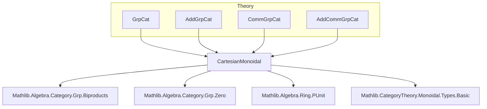
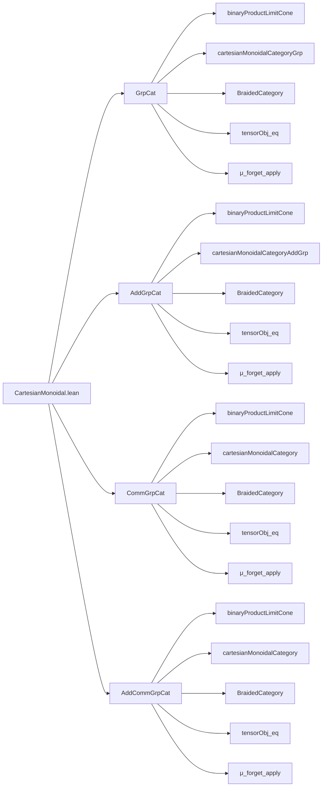

**Technical Brief: `CartesianMonoidal.lean`**

---

### 1. **Key Definitions & Theorems**

| Name | Type / Signature | Purpose |
|------|------------------|---------|
| `binaryProductLimitCone` | `GrpCat → GrpCat → LimitCone (pair G H)` | Constructs a limit cone for binary products in `GrpCat` using the product of underlying groups. |
| `cartesianMonoidalCategoryGrp` | `CartesianMonoidalCategory GrpCat.{u}` | Equips `GrpCat` with a Cartesian monoidal structure via chosen finite products. |
| `tensorObj_eq` | `(G ⊗ H) = of (G × H)` | Identifies the monoidal tensor with the categorical product (up to definitional equality). |
| `μ_forget_apply` | `Functor.LaxMonoidal.μ (forget C) G H (p, q) = (p, q)` | Shows that the structure morphism of the forgetful functor’s lax monoidal structure acts as identity on pairs. |
| `BraidedCategory` instances | `BraidedCategory GrpCat.{u}`, etc. | Derives braided structure from Cartesian monoidal structure (since Cartesian monoidal categories are automatically braided). |
| `cartesianMonoidalCategory` (in `AddCommGrpCat`) | `CartesianMonoidalCategory AddCommGrpCat.{u}` | Same as above for additive commutative groups. |
| `alias cartesianMonoidalCategoryAddCommGrp` | Deprecated alias for `cartesianMonoidalCategory` | Maintains backward compatibility. |

---

### 2. **Naming Conventions**

- **Prefixes**:
  - `binaryProductLimitCone`: Standard pattern for constructing limit cones from concrete constructions.
  - `cartesianMonoidalCategory*`: Uniform naming for Cartesian monoidal structures on various categories.
  - `tensorObj_eq`: Indicates definitional equality of tensor object and categorical product.
  - `μ_forget_apply`: `μ` denotes the lax monoidal structure map; `forget` indicates the forgetful functor.

- **Suffixes**:
  - `Grp`, `AddGrp`, `CommGrp`, `AddCommGrp`: Reflect the underlying algebraic structure (groups, additive groups, commutative, etc.).
  - `of`: Used to lift algebraic objects (e.g., `of G`) into the category.

- **`simps!` attribute**: Used on `binaryProductLimitCone` to automatically generate simplification lemmas for cone point and lift morphisms.

---

### 3. **Tactic Stack**

- **`cat_disch`**: Used to discharge category-theoretic goals (e.g., verifying cone commutativity or universal property).
- **`rfl`**: Used in proofs where definitional equality suffices (e.g., verifying projections commute).
- **`apply Prod.ext` + `congrFun`**: Used in `μ_forget_apply` to prove equality of pairs by extensionality and functoriality.
- **`by` + `cat_disch`**: Common pattern for short category-theoretic proofs.

---

### 4. **Proof Logic**

- **Structure**:
  1. Define a cone using projection morphisms (`fst`, `snd`).
  2. Show it is a limit cone by constructing the unique mediating morphism via `prod` (or `AddMonoidHom.prod`).
  3. Use `isLimit.mk` with proofs of uniqueness (via `rfl`) and commutativity (via `cat_disch`).
  4. Instantiate `CartesianMonoidalCategory` via `.ofChosenFiniteProducts`, providing:
     - A terminal object (using `isZero_of_subsingleton` on `of PUnit`).
     - A function assigning a limit cone to each pair (i.e., `binaryProductLimitCone`).
  5. Derive braided structure automatically from Cartesian monoidal structure.

- **Recurring pattern**:
  > *“Define product cone → prove it’s limiting → lift to Cartesian monoidal structure → derive braidedness.”*

---

### 5. **Imports**

| Import | Role |
|--------|------|
| `Mathlib.Algebra.Category.Grp.Biproducts` | Provides biproduct machinery (used implicitly for products in additive categories). |
| `Mathlib.Algebra.Category.Grp.Zero` | Provides zero objects and related lemmas (e.g., `isZero_of_subsingleton`). |
| `Mathlib.Algebra.Ring.PUnit` | Provides `PUnit` as a terminal additive monoid/group. |
| `Mathlib.CategoryTheory.Monoidal.Types.Basic` | Provides basic definitions for monoidal categories (e.g., `CartesianMonoidalCategory`, `BraidedCategory`). |

---

### 6. **Mermaid Diagrams**

#### **Dependency Graph (Module-Level)**

#### **Overview of File Structure**

---

### 7. **Summary**

This file establishes that the categories of groups (`GrpCat`), additive groups (`AddGrpCat`), commutative groups (`CommGrpCat`), and additive commutative groups (`AddCommGrpCat`) are all **Cartesian monoidal categories**, with tensor product given by the categorical product (i.e., direct product of groups) and unit object given by the trivial group `PUnit`. It further derives that these categories are **braided**, and provides explicit descriptions of the monoidal structure on the forgetful functors to `Type u`.

The proofs follow a uniform pattern: construct the product cone explicitly, verify it is limiting, and lift to a Cartesian monoidal structure. The use of `simps!`, `cat_disch`, and definitional equalities (`rfl`) reflects Lean’s emphasis on computational content and simplification in category theory.
