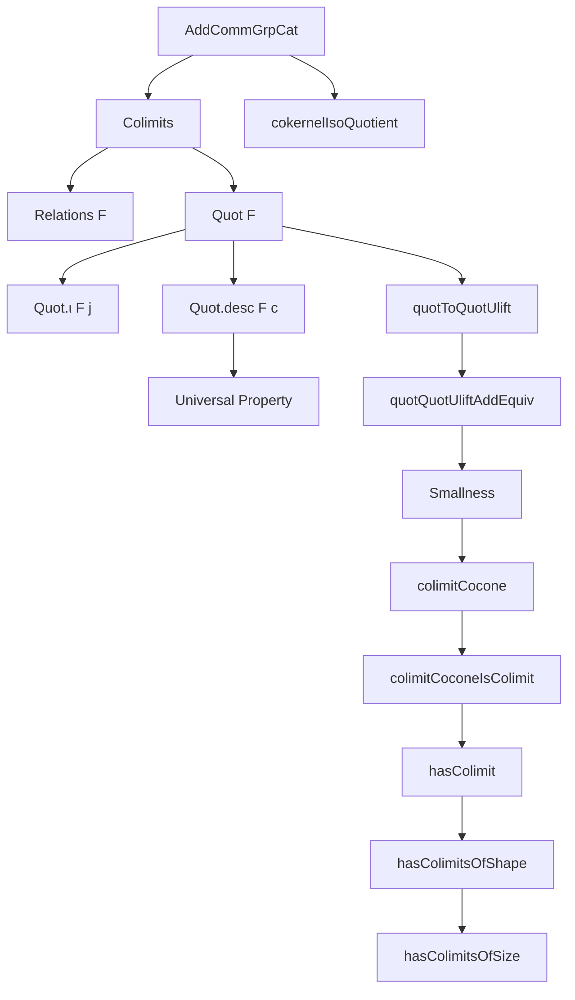
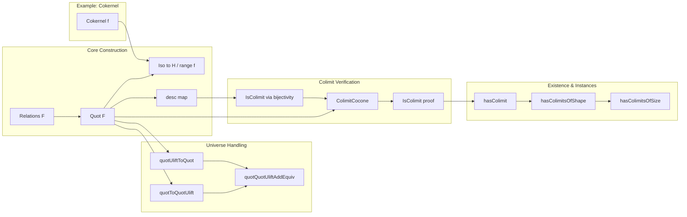

### Technical Brief: Colimits in `AddCommGrpCat`

---

#### **1. Key Definitions & Theorems**

| Name | Type / Signature | Purpose |
|------|------------------|---------|
| `Relations F` | `AddSubgroup (DFinsupp (fun j ↦ F.obj j))` | Generates relations encoding both the abelian group laws *within* each `F.obj j` and the naturality conditions imposed by morphisms in the diagram `F : J ⥤ AddCommGrpCat`. |
| `Quot F` | `Type (max u w)` | Candidate colimit object: quotient of the direct sum (`DFinsupp`) of all `F.obj j` by `Relations F`. |
| `Quot.ι F j` | `F.obj j →+ Quot F` | Canonical inclusion of each component `F.obj j` into the quotient. |
| `Quot.desc F c` | `Quot F →+ c.pt` | Universal additive map from the quotient to the apex of any cocone `c`, induced by the universal property of quotients and `DFinsupp.sum`. |
| `quotToQuotUlift F`, `quotUliftToQuot F` | `Quot F →+ Quot (F ⋙ uliftFunctor)`, vice versa | Construct additive maps between quotients over diagrams differing only by universe lifting; used to handle universe polymorphism. |
| `quotQuotUliftAddEquiv F` | `Quot F ≃+ Quot (F ⋙ uliftFunctor)` | Additive equivalence showing that universe lifting does not affect the colimit up to isomorphism. |
| `toCocone F f` | `Cocone F` | Converts an additive map `f : Quot F →+ A` into a cocone with apex `AddCommGrpCat.of A`. |
| `isColimit_of_bijective_desc F h` | `IsColimit c` | Criterion: if `Quot.desc F c` is bijective, then `c` is a colimit cocone. |
| `colimitCocone F` | `Cocone F` | Explicit colimit cocone, assuming `Quot F` is small (i.e., lives in the correct universe). |
| `colimitCoconeIsColimit F` | `IsColimit (colimitCocone F)` | Proof that `colimitCocone F` satisfies the universal property of a colimit. |
| `hasColimit_of_small_quot F h` | `HasColimit F` | Instantiates existence of colimits under smallness assumption. |
| `hasColimit [Small J] F` | `HasColimit F` | Main existence result: if indexing category `J` is small, then any diagram `F` has a colimit. |
| `hasColimitsOfShape J` | `HasColimitsOfShape J` | Instance: all diagrams of shape `J` have colimits, assuming `J` is small. |
| `hasColimitsOfSize` | `HasColimitsOfSize` | Global instance: `AddCommGrpCat` has all small colimits (parameterized by universe levels). |
| `cokernelIsoQuotient f` | `cokernel f ≅ AddCommGrpCat.of (H ⧸ range f)` | Shows categorical cokernel coincides with group-theoretic quotient. |

---

#### **2. Naming Conventions**

- **Prefixes**:
  - `Quot.`: Definitions and lemmas about the quotient construction.
  - `quotToQuotUlift`, `quotUliftToQuot`: Universe-shifting maps.
  - `colimitCocone`, `colimitCoconeIsColimit`: Construction and verification of colimit.
  - `hasColimit`, `hasColimitsOfShape`, `hasColimitsOfSize`: Existence instances.
  - `isColimit_of_...`: Criteria for verifying colimit-ness.

- **Suffixes**:
  - `_desc`: Universal morphism from the quotient.
  - `_ι`: Canonical inclusion maps.
  - `_quot`: Relating to quotient constructions.
  - `_iso_...`: Isomorphisms (e.g., `cokernelIsoQuotient`).

- **Other patterns**:
  - `ofHom`, `of`: Embedding additive groups into `AddCommGrpCat`.
  - `ulift`, `Shrink`: Universe manipulation tools.

---

#### **3. Tactic Stack**

Frequent tactics used in proofs:

| Tactic | Role |
|--------|------|
| `simp` / `simp only` | Simplify using definitional equalities, especially for `Quot.ι`, `Quot.desc`, `DFinsupp`, `QuotientAddGroup`. |
| `rw` / `erw` | Rewrite using lemmas (e.g., `Quot.ι_desc`, `quotToQuotUlift_ι`). `erw` used for higher-order matching. |
| `ext` | Extensionality for functions/morphisms (e.g., proving `f = g` by `ext x`). |
| `refine` / `exact` | Construct proofs term-by-term, often with `QuotientAddGroup.lift`, `addMonoidHom_ext`. |
| `change` | Adjust goal to match a known lemma’s form. |
| `conv` + `erw` | Localized rewriting in subterms (e.g., unfolding compositions). |
| `apply` / `apply_fun` | Apply lemmas or functors to goals. |
| `rfl` | Trivial reflexivity. |
| `cases` / `obtain` | Extract witnesses from existential hypotheses (e.g., `hx : x ∈ Relations`). |
| `aesop` (implied) | Not explicitly used, but `simp` + `rw` + `ext` suffice for most algebraic reasoning. |

---

#### **4. Proof Logic**

The logical flow follows a standard pattern for constructing colimits via generators and relations:

1. **Construction**:
   - Define `Relations F` as the `AddSubgroup` generated by:
     - Differences `single j' (F.map u a) - single j a` for each morphism `u : j → j'`.
     - (Implicitly) group axioms via `AddSubgroup.closure` over `DFinsupp`.

2. **Quotient Object**:
   - Define `Quot F := DFinsupp ⧸ Relations F`.
   - Equip it with an `AddCommGroup` structure via `QuotientAddGroup.Quotient.addCommGroup`.

3. **Universal Property**:
   - Define `Quot.ι j` as the composite of `DFinsupp.single` and quotient map.
   - For any cocone `c`, define `Quot.desc F c` using `QuotientAddGroup.lift`, verifying that relations map to zero using naturality of `c.ι`.

4. **Universe Handling**:
   - Show `Quot F ≃+ Quot (F ⋙ uliftFunctor)` via `quotQuotUliftAddEquiv`, ensuring consistency across universes.

5. **Smallness & Existence**:
   - Prove `Small (Quot F)` when `J` is small (via `small_of_surjective` and `QuotientAddGroup.mk'_surjective`).
   - Use `colimitCocone` (with `Shrink`) to get a colimit cocone in the correct universe.
   - Prove it is a colimit using `isColimit_of_bijective_desc`, relying on bijectivity of `Quot.desc` (via `Shrink.addEquiv.symm.bijective`).

6. **Cokernel Example**:
   - Show categorical cokernel in `AddCommGrpCat` matches group-theoretic quotient: `cokernel f ≅ H / range f`.

---

#### **5. Imports**

| Module | Purpose |
|--------|---------|
| `Mathlib.Algebra.Category.Grp.Preadditive` | Background on additive categories, preadditive structure. |
| `Mathlib.Algebra.Group.Shrink` | Universe-shifting equivalence `Shrink`. |
| `Mathlib.CategoryTheory.ConcreteCategory.Elementwise` | Elementwise reasoning in concrete categories. |
| `Mathlib.Data.DFinsupp.BigOperators`, `Small` | `DFinsupp` support for direct sums and smallness. |
| `Mathlib.GroupTheory.QuotientGroup.Defs` | Quotient group constructions, `QuotientAddGroup`. |

---

#### **8. Mermaid Diagrams**

##### **Dependency Graph (High-Level)**

##### **Overview of File Structure**

---

This file formalizes a foundational result in homological algebra: **the category of additive commutative groups is cocomplete**, with explicit constructions using `DFinsupp` and quotients. It demonstrates careful handling of universe polymorphism and categorical universal properties, aligning with Lean’s formalization philosophy of concrete constructions backed by abstract theory.
