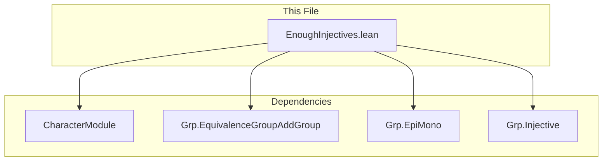

**Technical Brief: `EnoughInjectives.lean`**

---

### 1. KEY DEFINITIONS & THEOREMS

| Name | Type / Signature | Purpose |
|------|------------------|---------|
| `enoughInjectives` (in `AddCommGrpCat`) | `EnoughInjectives AddCommGrpCat.{u}` | Constructs an injective presentation of any abelian group `A` via the canonical map into a product of copies of `ℚ/ℤ`. |
| `enoughInjectives` (in `CommGrpCat`) | `EnoughInjectives CommGrpCat.{u}` | Derives the same result for multiplicative abelian groups via categorical equivalence with additive ones. |
| `CharacterModule A_` | Type `u → Type u` (universe-polymorphic) | The module of characters `A → ℚ/ℤ`, used as the injective cogenerator. |
| `injective_of_divisible _` | `IsInjective (Divisible D) → Injective D` | Shows that divisible objects in `AddCommGrpCat` are injective. |
| `ofHom ⟨⟨fun a i ↦ ULift.up (i a), ...⟩, ...⟩` | `A ⟶ ∏_{i : (CharacterModule A) → ULift (AddCircle 1)} i` | The canonical monomorphism embedding `A` into a product of injectives. |
| `mono_iff_injective _` | `(f : A ⟶ B).Mono ↔ Function.Injective f` | Relates categorical monomorphisms to injective functions in `AddCommGrpCat`. |
| `injective_iff_map_eq_zero _` | `(f : A ⟶ B).Injective ↔ ∀ a, f a = 0 → a = 0` | Characterizes injectivity via kernel triviality. |
| `eq_zero_of_character_apply _` | `∀ c, c a = 0 → a = 0` | Uses separating property of characters to conclude `a = 0`. |
| `commGroupaddCommGroupEquivalence` | `CommGrpCat ≌ AddCommGrpCat` | Categorical equivalence between multiplicative and additive abelian groups. |
| `EnoughInjectives.of_equivalence _` | Transfers `EnoughInjectives` along an equivalence of categories. | Used to lift injective presentations from additive to multiplicative setting. |

---

### 2. NAMING CONVENTIONS

- **Prefixes**:
  - `enoughInjectives`: Indicates construction of injective presentations.
  - `injective_of_`: Derives injectivity from structural properties (e.g., divisibility).
  - `mono_iff_`: Equates categorical monos with set-theoretic injectivity.
  - `eq_zero_of_`: Concludes zero from vanishing under all characters.

- **Suffixes**:
  - `_iff_`: Logical equivalences (e.g., `mono_iff_injective`).
  - `_apply`: Refers to evaluation of functions/characters (e.g., `character_apply`).
  - `_up` / `_down`: For `ULift` coercion.

- **Notable abbreviations**:
  - `A_`: Generic object in `AddCommGrpCat`.
  - `J := of <| (CharacterModule A_) → ULift ...`: Indexing set for product, constructed via `of` (embedding type into category).

---

### 3. TACTIC STACK

| Tactic | Usage |
|--------|-------|
| `aesop` | Used twice in `ofHom` to discharge proof obligations about homomorphism structure and preservation of addition. |
| `congr_arg`, `congr_fun` | To manipulate equalities of functions and their applications. |
| `eq_zero_of_character_apply` | Core lemma invoked to prove kernel triviality. |
| `mono_iff_injective`, `injective_iff_map_eq_zero` | Bridge between categorical and set-theoretic notions. |
| `of_equivalence` | Applies categorical equivalence to transfer properties. |

No heavy automation like `simp`, `ring`, or `linarith` appears—proofs rely on structural properties and categorical lemmas.

---

### 4. PROOF LOGIC

The proof proceeds in two stages:

1. **Additive case (`AddCommGrpCat`)**:
   - For any object `A`, define the indexing set `J` as the type of characters `A → ℚ/ℤ`, lifted to avoid universe issues.
   - Construct the canonical map `i : A → ∏_{j ∈ J} ℚ/ℤ`, `i(a)(c) = c(a)`.
   - Show:
     - The codomain is injective: `injective_of_divisible _` (since `ℚ/ℤ` is divisible).
     - `i` is a monomorphism: via `mono_iff_injective`, reduce to injectivity, then use `eq_zero_of_character_apply` (characters separate points).
   - Conclude `EnoughInjectives` by packaging this as a `Nonempty` witness.

2. **Multiplicative case (`CommGrpCat`)**:
   - Use the equivalence `CommGrpCat ≌ AddCommGrpCat`.
   - Apply `EnoughInjectives.of_equivalence` to transfer the injective presentation.

---

### 5. IMPORTS & DEPENDENCIES

| Module | Role |
|--------|------|
| `Mathlib.Algebra.Module.CharacterModule` | Defines `CharacterModule A := A → ℚ/ℤ`, the injective cogenerator. |
| `Mathlib.Algebra.Category.Grp.EquivalenceGroupAddGroup` | Provides `commGroupaddCommGroupEquivalence`. |
| `Mathlib.Algebra.Category.Grp.EpiMono` | Supplies `mono_iff_injective` and related lemmas. |
| `Mathlib.Algebra.Category.Grp.Injective` | Contains `injective_of_divisible`, `EnoughInjectives` typeclass, and related theory. |

> **Note**: The file explicitly avoids importing `Injective.lean` directly to prevent circular dependencies.

---

### 6. MERMAID DIAGRAMS

#### Dependency Graph (Module-Level)



#### Overview of Theory Flow

```mermaid
flowchart LR
  A[Abelian Group A] -->|Define| B[Character Module A]
  B -->|Index set J| C[∏_{c ∈ J} ℚ/ℤ]
  C -->|Injective| D[EnoughInjectives]
  A -->|Canonical map i(a)(c) = c(a)| C
  C -->|Divisible ⇒ Injective| D
  A -->|Mono iff injective| E[i is mono]
  E --> D

  F[CommGrpCat] -->|Equivalence| G[AddCommGrpCat]
  G -->|EnoughInjectives| D
  F -->|Transfer| D
```

---

### 7. CATEGORY-THEORETIC SIGNIFICANCE

- **Injective cogenerator**: `ℚ/ℤ` serves as a cogenerator in `AddCommGrpCat`, enabling representation of objects via embeddings into injectives.
- **Constructive flavor**: The presentation is explicit: `A ↪ ∏_{c ∈ A^*} ℚ/ℤ`, where `A^* = Hom(A, ℚ/ℤ)`.
- **Universe polymorphism**: All constructions are universe-polymorphic (`u`), ensuring applicability in higher universes.

--- 

Let me know if you'd like a formalized summary in Lean syntax or a proof sketch in natural deduction style.
