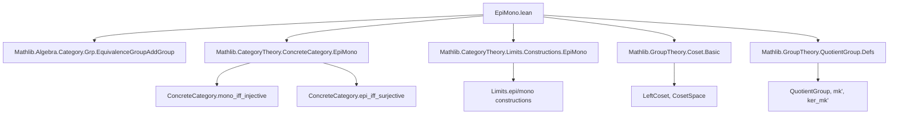
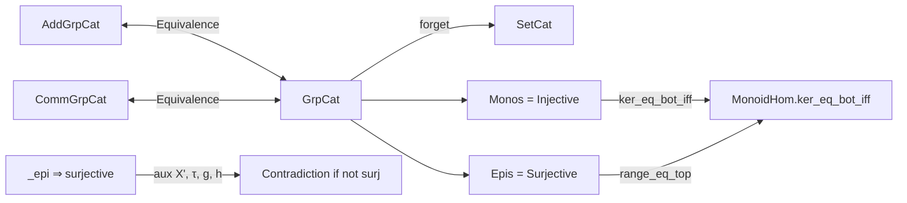

**Technical Brief: `EpiMono.lean` — Monomorphisms and Epimorphisms in `Grp`, `AddGrp`, and `CommGrp`**

---

### 1. **Key Definitions & Theorems**

| Name | Type / Signature | Purpose |
|------|------------------|---------|
| `ker_eq_bot_of_cancel` | `∀ f : A →* B, (∀ u v : f.ker →* A, f ∘ u = f ∘ v → u = v) → f.ker = ⊥` | Shows that if a monoid homomorphism is left-cancellable over its kernel, then its kernel is trivial. |
| `range_eq_top_of_cancel` | `∀ f : A →* B, (∀ u v : B →* B ⧸ f.range, u ∘ f = v ∘ f → u = v) → f.range = ⊤` | Dually, shows surjectivity via cancellation in the quotient. |
| `ker_eq_bot_of_mono` | `[Mono f] → f.hom.ker = ⊥` | Monomorphisms in `GrpCat` have trivial kernel. |
| `mono_iff_ker_eq_bot` | `Mono f ↔ f.hom.ker = ⊥` | Characterization of monos in `GrpCat` via kernel. |
| `mono_iff_injective` | `Mono f ↔ Function.Injective f` | Monos in `GrpCat` are exactly injective group homomorphisms. |
| `surjective_of_epi` | `[Epi f] → Function.Surjective f` | Epimorphisms in `GrpCat` are surjective. |
| `epi_iff_surjective` | `Epi f ↔ Function.Surjective f` | Full characterization of epis in `GrpCat`. |
| `epi_iff_range_eq_top` | `Epi f ↔ f.hom.range = ⊤` | Epis correspond to full-range homomorphisms. |
| `g`, `h`, `τ`, `X'` | Defined in `SurjectiveOfEpiAuxs` | Technical construction to prove epimorphisms are surjective via permutation-based counterexample when not surjective. |
| `agree` | `f.hom.range = {x | h x = g x}` | Core lemma linking the range of `f` to equality of two constructed homomorphisms. |
| `comp_eq` | `f ≫ g = f ≫ h` | Shows that if `f` is epi, then `g = h`. |
| `g_ne_h` | `x ∉ f.hom.range → g ≠ h` | Contrapositive: non-surjectivity yields `g ≠ h`, contradicting epi. |
| `forget_grp_preserves_mono/epi` | Instances | The forgetful functor from `GrpCat` preserves monos/epis. |
| Analogues for `AddGrpCat`, `CommGrpCat` | `epi_iff_surjective`, `mono_iff_injective`, etc. | Extend results to additive and commutative groups via equivalence with `Grp`. |

---

### 2. **Naming Conventions**

- **Prefixes**:
  - `ker_`, `range_`: relate to kernel/range of homomorphisms.
  - `mono_`, `epi_`: monomorphism/epimorphism properties.
  - `forget_..._preserves_...`: properties of forgetful functors.
  - `of_...`: e.g., `ofHom`, `of_epi`, `of_mono` — often used to lift categorical notions to hom-level.

- **Suffixes**:
  - `_eq_bot`, `_eq_top`: trivial kernel (`⊥`) or full range (`⊤`).
  - `_iff_...`: biconditional characterizations.
  - `_of_...`: e.g., `surjective_of_epi`, `ker_eq_bot_of_mono` — implication direction.

- **Auxiliary names**:
  - `SurjectiveOfEpiAuxs`: namespace for auxiliary constructions in epi→surjective proof.
  - `X'`, `τ`, `g`, `h`: internal notation for permutation-based argument.

---

### 3. **Tactic Stack**

Frequently used tactics in this file:

| Tactic | Usage |
|--------|-------|
| `rwa` | Rewrite + assumption (e.g., `rwa [GrpCat.epi_iff_surjective]`) |
| `ext` | Extensionality (for functions, sets, subgroups) |
| `simp` / `simp only` | Simplification with lemmas (especially `MonoidHom.coe_*`, `Function.comp_apply`, `leftCoset_*`, `one_smul`, etc.) |
| `congr` / `congr_arg` | Congruence for equality of functions/homs |
| `rw` | Rewriting using equivalences or definitions |
| `by_contradiction` / `by_contra!` | Proof by contradiction (used in `surjective_of_epi`) |
| `nth_rw` | N-th rewrite (e.g., `nth_rw 2 [...]`) |
| `exact`, `refine`, `convert` | Proof construction |
| `dsimp`, `change` | Simplify or change goal to syntactically equal form |
| `cat_disch` | From `CategoryTheory.ConcreteCategory.EpiMono`, discharge categorical hypotheses |

---

### 4. **Proof Logic**

The core logical flow for **epimorphisms ⇒ surjectivity** is:

1. **Assume** `f : A → B` is epi but **not surjective**.
2. Construct:
   - `X' = Set.range(f) \backslash B` (cosets) + `∞` (point at infinity).
   - Action of `B` on `X'` by left multiplication on cosets.
   - Permutation `τ = swap(f.range, ∞)`.
   - Two homomorphisms `g, h : B →* Perm(X')`, where `h = τ ∘ g ∘ τ⁻¹`.
3. Show:
   - `f ≫ g = f ≫ h` (since `f` is epi ⇒ `g = h`).
   - But if `f` is not surjective, pick `b ∉ f.range`, then `g b ≠ h b` (at coset `f.range`), contradiction.
4. Conclude: `f` must be surjective.

For **monomorphisms ⇒ injectivity**, the logic is simpler:

- Use `ker_eq_bot_of_mono` + `MonoidHom.ker_eq_bot_iff f.hom` to get injectivity.

Analogous arguments for additive/commutative groups use the equivalence `Grp ≃ AddGrp` and `CommGrp`.

---

### 5. **Imports**

| Import | Role |
|--------|------|
| `Mathlib.Algebra.Category.Grp.EquivalenceGroupAddGroup` | Equivalence between `Grp` and `AddGrp`. |
| `Mathlib.CategoryTheory.ConcreteCategory.EpiMono` | General categorical facts about monos/epis in concrete categories. |
| `Mathlib.CategoryTheory.Limits.Constructions.EpiMono` | Additional epi/mono constructions. |
| `Mathlib.GroupTheory.Coset.Basic` | Left cosets, coset space, quotient structure. |
| `Mathlib.GroupTheory.QuotientGroup.Defs` | Quotient groups, natural maps, kernel of quotient map. |

---

### 6. **Mermaid Diagrams**

#### **Dependency Graph (Top-Level)**

#### **Overview of Theory Flow**

---

### 7. **Summary**

This file establishes foundational categorical properties of `Grp`, `AddGrp`, and `CommGrp`:  
- **Monomorphisms = injective homomorphisms**  
- **Epimorphisms = surjective homomorphisms**  

The proof for epimorphisms is nontrivial and uses a clever permutation-based construction (`X'`, `τ`, `g`, `h`) to derive a contradiction from non-surjectivity. The additive and commutative cases follow via categorical equivalences. The file also confirms that the forgetful functors preserve monos and epis.

This is a standard result in categorical algebra, but the Lean formalization is notable for its careful handling of quotient groups, coset actions, and permutation groups — all in a constructive setting with classical choice for decidability.
