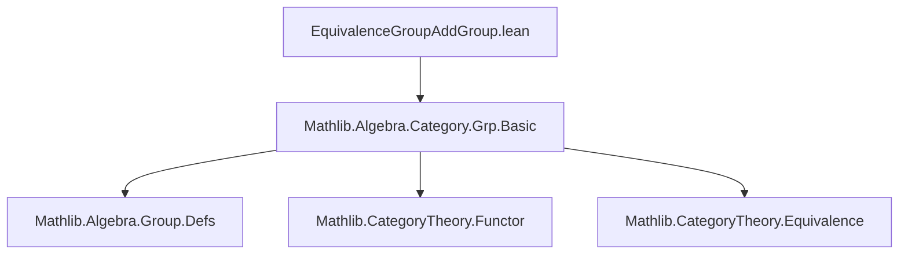
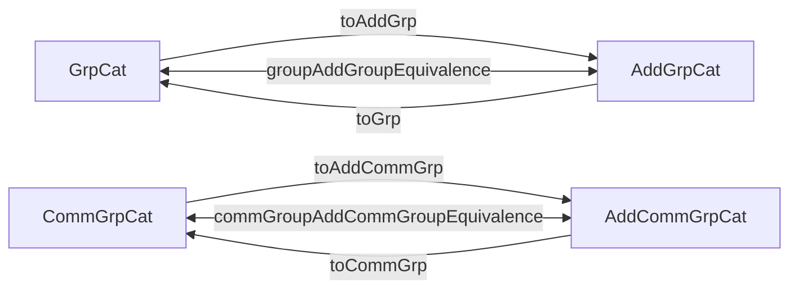

**Technical Brief: `EquivalenceGroupAddGroup.lean`**

---

### 1. **Key Definitions & Theorems**

| Name | Type | Purpose |
|------|------|---------|
| `GrpCat.toAddGrp` | `GrpCat ⥤ AddGrpCat` | Functor sending a group object `X` to its additive version `Additive X`, and a group homomorphism `f` to its additive counterpart `f.toAdditive`. |
| `AddGrpCat.toGrp` | `AddGrpCat ⥤ GrpCat` | Functor sending an additive group object `X` to its multiplicative version `Multiplicative X`, and an additive homomorphism `f` to `f.toMultiplicative`. |
| `CommGrpCat.toAddCommGrp` | `CommGrpCat ⥤ AddCommGrpCat` | Same as `toAddGrp`, but restricted to commutative groups. |
| `AddCommGrpCat.toCommGrp` | `AddCommGrpCat ⥤ CommGrpCat` | Same as `toGrp`, but restricted to commutative additive groups. |
| `groupAddGroupEquivalence` | `GrpCat ≌ AddGrpCat` | Category equivalence between groups and additive groups, implemented via `toAddGrp` and `toGrp` with trivial unit/counit isos. |
| `commGroupAddCommGroupEquivalence` | `CommGrpCat ≌ AddCommGrpCat` | Category equivalence between commutative groups and commutative additive groups. |

All equivalences are *strict* in the sense that the unit and counit are identity isomorphisms (`Iso.refl`), reflecting that `Additive` and `Multiplicative` are inverse constructions on the nose.

---

### 2. **Naming Conventions**

- **Functor names**: `toAddGrp`, `toGrp`, `toAddCommGrp`, `toCommGrp` — follow pattern `[source]to[Target]`.
- **Equivalence names**: `groupAddGroupEquivalence`, `commGroupAddCommGroupEquivalence` — descriptive compound names indicating source and target categories.
- **`of` / `ofHom`**: Used to construct objects/morphisms in the concrete category embeddings (`GrpCat.of`, `AddGrpCat.of`, etc.).
- **`.hom` projection**: Used to extract the underlying function from a morphism in these concrete categories.
- **`.toAdditive` / `.toMultiplicative`**: Standard coercion/transport functions between `Additive` and `Multiplicative` wrappers.

---

### 3. **Tactic Stack**

- **`@[simps]`**: Used to automatically generate simplification lemmas for the structure fields (e.g., `obj`, `map`).
- **No explicit proof tactics** appear in the definitions — all proofs are deferred to `simps`-generated lemmas or rely on definitional equalities (e.g., `Iso.refl _`).
- Implicit reliance on:
  - `CategoryTheory` infrastructure (`Category`, `Functor`, `NatIso`, `Iso`, `Equivalence`)
  - `Additive`/`Multiplicative` machinery from `Mathlib.Algebra.Group.Defs` and `Mathlib.Algebra.Category.Grp.Basic`

---

### 4. **Proof Logic**

- **No manual proofs** are written in this file.
- The equivalences are *definitionally* invertible:
  - `Additive (Multiplicative X) ≡ X` and `Multiplicative (Additive X) ≡ X` hold definitionally in Lean’s `Additive`/`Multiplicative` implementation.
  - Hence, `unitIso` and `counitIso` are set to `Iso.refl _`, requiring no further justification.
- The correctness of the functors (`toAddGrp`, `toGrp`, etc.) is guaranteed by:
  - `toAdditive`/`toMultiplicative` preserving identities and composition (handled internally by `ofHom`).
  - `AddGrpCat.of`/`GrpCat.of` embedding into concrete categories.

---

### 5. **Imports**

- `Mathlib.Algebra.Category.Grp.Basic`: Provides:
  - `GrpCat`, `AddGrpCat`, `CommGrpCat`, `AddCommGrpCat`
  - `of`, `ofHom`, `hom`, and category structure
  - `Additive`, `Multiplicative` type wrappers and their homomorphism instances

No other imports are used — the file is self-contained within the category-theoretic group framework.

---

### 6. **Mermaid Diagrams**

#### **Dependency Graph (Module-Level)**



#### **Category Equivalence Overview**



#### **Object-Level Transformation**

```mermaid
graph LR
  X : GrpCat -- "Additive X" --> Additive X : AddGrpCat
  Y : AddGrpCat -- "Multiplicative Y" --> Multiplicative Y : GrpCat
  X <-->|def. iso| Additive X
  Y <-->|def. iso| Multiplicative Y
```

> **Note**: All isomorphisms above are definitional (`≡`), not just up to natural isomorphism.

--- 

This file exemplifies *definitional* categorical equivalences enabled by Lean’s `Additive`/`Multiplicative` duality, requiring no nontrivial proof terms beyond structural coherence.
