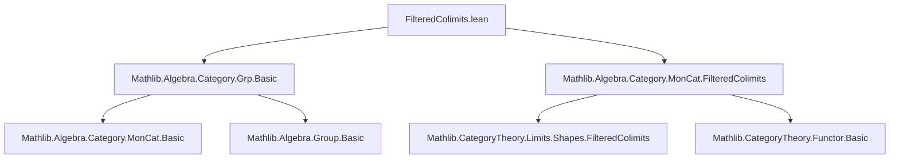
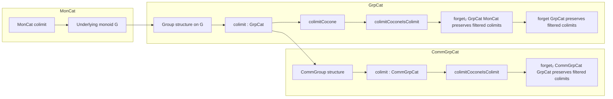
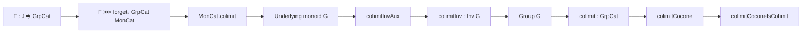

### Technical Brief: `FilteredColimits.lean`

---

#### **1. Key Definitions & Theorems**

| Name | Type / Signature | Purpose |
|------|------------------|---------|
| `G.{v, u} F` | `MonCat` | Colimit of `F ⋙ forget₂ GrpCat MonCat` in `MonCat`; underlying monoid of the colimit group. |
| `G.mk` | `(Σ j, F.obj j) → G F` | Canonical projection into the colimit (as a quotient). |
| `G.mk_eq` | `(h : ∃ k, f, g, F.map f x.2 = F.map g y.2) → G.mk x = G.mk y` | Equality criterion in the colimit via filtered diagram coherence. |
| `colimit_one_eq` | `colimit one = G.mk ⟨j, 1⟩` | Identity element in colimit is represented by any component’s identity. |
| `colimit_mul_mk_eq` | `G.mk x * G.mk y = G.mk ⟨k, F.map f x.2 * F.map g y.2⟩` | Multiplication in colimit via common extension in filtered index category. |
| `colimitInvAux` | `(Σ j, F.obj j) → G F` | Pre-inversion map on representatives: `x ↦ ⟨x.1, x.2⁻¹⟩`. |
| `colimitInvAux_eq_of_rel` | `x ~ y ⇒ colimitInvAux x = colimitInvAux y` | Well-definedness of inversion on the quotient. |
| `colimitInv` | `Inv (G F)` | Instance defining inversion on the colimit monoid. |
| `colimit_inv_mk_eq` | `(G.mk x)⁻¹ = G.mk ⟨x.1, x.2⁻¹⟩` | Inverse of a representative in the colimit. |
| `colimitGroup` | `Group (G F)` | Group structure on the colimit monoid. |
| `colimit` | `GrpCat` | The colimit object in `GrpCat`, bundled as a group. |
| `colimitCocone` | `Cocone F` | Canonical cocone over diagram `F` with apex `colimit F`. |
| `colimitCoconeIsColimit` | `IsColimit (colimitCocone F)` | Proves the cocone is universal — i.e., colimit in `GrpCat`. |
| `forget₂Mon_preservesFilteredColimits` | `PreservesFilteredColimits (forget₂ GrpCat MonCat)` | Forgetful functor `GrpCat → MonCat` preserves filtered colimits. |
| `forget_preservesFilteredColimits` | `PreservesFilteredColimits (forget GrpCat)` | Forgetful functor `GrpCat → Type` preserves filtered colimits. |
| `colimitCommGroup` | `CommGroup (G F)` | Commutativity of group operation in colimit of commutative groups. |
| `colimitCommGrpCat` | `CommGrpCat` | Colimit object in `CommGrpCat`. |
| `forget₂Group_preservesFilteredColimits` | `PreservesFilteredColimits (forget₂ CommGrpCat GrpCat)` | Forgetful `CommGrpCat → GrpCat` preserves filtered colimits. |

> **Note**: All definitions and theorems have `to_additive` variants for additive groups (`AddGrpCat`, `AddCommGrpCat`, etc.), omitted here for brevity.

---

#### **2. Naming Conventions**

- **Prefixes**:
  - `colimit_`: operations/properties of the colimit object (e.g., `colimit_inv_mk_eq`, `colimit_one_eq`).
  - `G.mk`: canonical map from diagram elements to colimit.
  - `forget₂_..._preservesFilteredColimits`: preservation lemmas for forgetful functors.
- **Suffixes**:
  - `Aux`: auxiliary constructions before quotienting or lifting (e.g., `colimitInvAux`).
  - `eq`: equality lemmas (e.g., `G.mk_eq`, `colimit_inv_mk_eq`).
- **Structure naming**:
  - `colimitGroup`, `colimitCommGroup`: typeclass instances.
  - `colimit`, `colimitCocone`: bundled categorical objects.

---

#### **3. Tactic Stack**

Frequent tactics used in proofs:

| Tactic | Usage |
|--------|-------|
| `simp` | Simplifying using `colimit_inv_mk_eq`, `colimit_mul_mk_eq'`, `colimit_one_eq`. |
| `refine` / `exact` | Constructing terms via universal properties or quotient induction. |
| `obtain ⟨k, f, g, hfg⟩` | Extracting data from filteredness (existence of common cocone point). |
| `rw [map_inv, map_mul]` | Rewriting using functoriality of `F`. |
| `inv_inj` | Injectivity of inversion in groups. |
| `Quot.inductionOn`, `Quot.lift` | Working with quotient types (colimit as quotient of sum). |
| `simpa using ...` | Finishing proofs by simplifying a target using a given equality. |
| `isColimitOfReflects` | Proving colimit preservation via reflection of colimits by forgetful functor. |

---

#### **4. Proof Logic**

The logical flow follows a standard pattern for algebraic colimits:

1. **Construct underlying monoid**:
   - Define `G := colimit` in `MonCat` via `MonCat.FilteredColimits.colimit`.
2. **Lift algebraic structure**:
   - Define inversion on representatives (`colimitInvAux`).
   - Prove it respects the colimit equivalence relation (`colimitInvAux_eq_of_rel`).
   - Lift to quotient via `Quot.lift` → `colimitInv : Inv (G F)`.
3. **Verify group axioms**:
   - Use `Quot.inductionOn` to reduce to representatives.
   - Apply `colimit_mul_mk_eq`, `colimit_one_eq`, and `colimit_inv_mk_eq`.
4. **Bundling & universality**:
   - Define `colimit : GrpCat` and `colimitCocone`.
   - Show `colimitCoconeIsColimit` using `isColimitOfReflects` and known result for `MonCat`.
5. **Preservation lemmas**:
   - Use composition of functors and reflection of colimits.
6. **Commutative case**:
   - Lift commutativity from monoid colimit (`colimitCommMonoid`) to group colimit.

Induction is over the quotient structure; filteredness supplies the common extension `k` needed to define operations.

---

#### **5. Imports**

| Import | Purpose |
|--------|---------|
| `Mathlib.Algebra.Category.Grp.Basic` | Basic definitions: `GrpCat`, `CommGrpCat`, `AddGrpCat`, etc. |
| `Mathlib.Algebra.Category.MonCat.FilteredColimits` | Construction of filtered colimits in `MonCat`; foundational for lifting to groups. |

> **Note**: The file builds on `MonCat.FilteredColimits`, extending the monoid colimit to a group/commutative group colimit.

---

#### **6. Mermaid Diagrams**

##### **Dependency Graph (Module-Level)**

##### **Overview of Theory Flow**

##### **Colimit Construction Pipeline**

---

This file formalizes a foundational result in categorical algebra: **filtered colimits in algebraic categories are computed as filtered colimits in `Type`**, equipped with pointwise algebraic structure. It exemplifies the general principle that *algebraic forgetful functors preserve filtered colimits*, crucial for homological algebra and topos theory.
