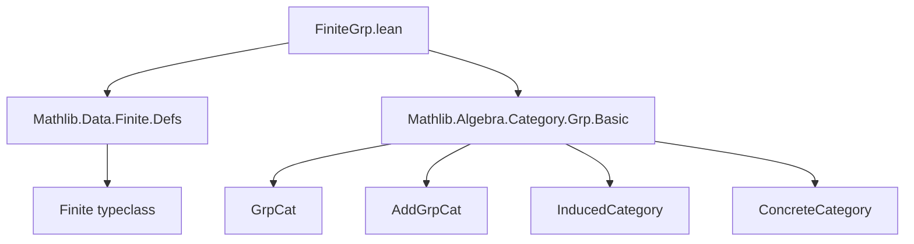

**Technical Brief: `FiniteGrp.lean`**

---

### 1. **Key Definitions & Theorems**

| Name | Type / Structure | Purpose |
|------|------------------|---------|
| `FiniteGrp` | `Type u → Type u` (structure) | Represents the category of finite groups; bundles a group (`toGrp : GrpCat`) with a proof of finiteness (`[Finite toGrp]`). |
| `FiniteAddGrp` | `Type u → Type u` (structure) | Additive counterpart of `FiniteGrp`; bundles an additive group with finiteness. |
| `of` | `Π {u}, (G : Type u) → [Group G] → [Finite G] → FiniteGrp.{u}` | Constructor: builds a `FiniteGrp` from a type with finite group structure. |
| `ofHom` | `Π {X Y : Type u} [Group X] [Finite X] [Group Y] [Finite Y] (f : X →* Y), of X ⟶ of Y` | Lifts a group homomorphism between finite groups to a morphism in `FiniteGrp`. |
| `ofHom_apply` | `∀ f x, ofHom f x = f x` | Verifies that `ofHom` acts pointwise as the underlying function. |
| `CoeSort` instance | `CoeSort FiniteGrp (Type u)` | Enables coercion: `G : FiniteGrp` can be used as a type `G`. |
| `Category` instance | `Category FiniteGrp` | Equips `FiniteGrp` with a categorical structure via `InducedCategory`. |
| `ConcreteCategory` instance | `ConcreteCategory FiniteGrp (· →* ·)` | Shows `FiniteGrp` is concretely represented by group homomorphisms. |
| `Group` / `Finite` instances | `(G : FiniteGrp) → Group G`, `(G : FiniteGrp) → Finite G` | Extracts algebraic structure and finiteness from a `FiniteGrp`. |

> **Note**: All definitions and lemmas come with `[to_additive]` attributes, enabling automatic generation of additive versions (e.g., for `FiniteAddGrp`).

---

### 2. **Naming Conventions**

- **Prefixes**:
  - `of_`: for constructors and lifts from type-theoretic data to categorical objects/morphisms.
  - `isFinite`: used in the structure field to name the finiteness proof.
- **Suffixes**:
  - `_Grp`: standard suffix for group-related structures (`FiniteGrp`, `GrpCat`).
  - `_AddGrp`: additive analogues (`FiniteAddGrp`, `AddGrpCat`).
- **Morphisms**:
  - `ofHom`: indicates a morphism induced from a homomorphism of underlying groups.

---

### 3. **Tactic Stack**

The file uses minimal tactic automation, relying on:
- `rfl` (in `ofHom_apply`)
- `inferInstanceAs` (for instance synthesis)
- `to_additive` attribute (for automatic additive translation)
- `@[pp_with_univ]` attribute (for pretty-printing with universe levels)

No heavy automation (e.g., `aesop`, `ring`, `simp`) is used—proofs are mostly definitional or rely on type class inference.

---

### 4. **Proof Logic**

- **No nontrivial proofs** are present in this file; all lemmas (`ofHom_apply`) are definitional (`rfl`).
- The structure and instances are built via:
  - **Induced category construction**: `Category FiniteGrp := inferInstanceAs (Category (InducedCategory _ FiniteGrp.toGrp))`
  - **Type class inference**: `Group G := inferInstanceAs (Group G.toGrp)`
- Logical flow is *declarative*: definitions are layered on top of existing `GrpCat`/`AddGrpCat` infrastructure.

---

### 5. **Imports**

| Import | Role |
|--------|------|
| `Mathlib.Data.Finite.Defs` | Provides `Finite` typeclass and basic finiteness facts. |
| `Mathlib.Algebra.Category.Grp.Basic` | Defines `GrpCat`, `AddGrpCat`, and basic categorical constructions (e.g., `InducedCategory`, `ConcreteCategory`). |

> **Scope**: This module sits at the interface between *finite set theory* and *category theory of groups*, forming the foundation for finite group theory in the Lean category theory ecosystem.

---

### 8. **Mermaid Diagrams**

#### **Dependency Graph**


#### **Overview of `FiniteGrp` Theory**
```mermaid
graph LR
  subgraph "Underlying Theory"
    GrpCat[GrpCat] -->|objects| Groups[Groups]
    AddGrpCat[AddGrpCat] -->|objects| AddGroups[Additive Groups]
  end

  subgraph "FiniteGrp Module"
    FiniteGrp[FiniteGrp] -->|toGrp| GrpCat
    FiniteAddGrp[FiniteAddGrp] -->|toAddGrp| AddGrpCat
    FiniteGrp -->|instances| Category
    FiniteGrp -->|instances| ConcreteCategory
    of[of] -->|constructs| FiniteGrp
    ofHom[ofHom] -->|lifts| Homomorphisms
  end

  subgraph "Categorical Structure"
    Category -->|objects| FiniteGrp
    ConcreteCategory -->|hom| →*
  end
```

> **Interpretation**: `FiniteGrp` is a *full subcategory* of `GrpCat` (via `toGrp`) consisting of finite groups, constructed via `InducedCategory`. Morphisms are inherited from `GrpCat`, and the category is concretely represented by group homomorphisms.

--- 

✅ **Summary**: This file formalizes the category of finite groups as a concrete subcategory of `GrpCat`, leveraging Lean’s type class inference and `InducedCategory` machinery. It is foundational for higher-level finite group theory (e.g., group actions, Sylow theorems) in the `Mathlib` ecosystem.
