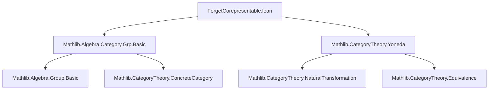

**Technical Brief: Forgetful Functor is Corepresentable (ForgetCorepresentable.lean)**

---

### 1. Key Definitions & Theorems

| Name | Type | Purpose |
|------|------|---------|
| `uliftZMultiplesHom G` | `G ≃ (ULift.{u} ℤ →+ G)` | Equivalence between elements of an additive group `G` and additive homomorphisms from `ULift ℤ` to `G`. |
| `uliftZPowersHom G` | `G ≃ (ULift.{u} (Multiplicative ℤ) →* G)` | Equivalence between elements of a group `G` and group homomorphisms from `ULift (Multiplicative ℤ)` to `G`. |
| `GrpCat.coyonedaObjIsoForget` | `coyoneda.obj (op (of (ULift.{u} (Multiplicative ℤ)))) ≅ forget GrpCat.{u}` | Shows the forgetful functor on groups is corepresentable by `ULift (Multiplicative ℤ)`. |
| `CommGrpCat.coyonedaObjIsoForget` | `coyoneda.obj (op (of (ULift.{u} (Multiplicative ℤ)))) ≅ forget CommGrpCat.{u}` | Same as above for *commutative* groups. |
| `AddGrpCat.coyonedaObjIsoForget` | `coyoneda.obj (op (of (ULift.{u} ℤ))) ≅ forget AddGrpCat.{u}` | Corepresentability for (not necessarily abelian) additive groups. |
| `AddCommGrpCat.coyonedaObjIsoForget` | `coyoneda.obj (op (of (ULift.{u} ℤ))) ≅ forget AddCommGrpCat.{u}` | Corepresentability for abelian additive groups. |
| `GrpCat.forget_isCorepresentable` | `IsCorepresentable (forget GrpCat.{u})` | Instance witnessing that the forgetful functor is corepresentable. |
| `CommGrpCat.forget_isCorepresentable`, `AddGrpCat.forget_isCorepresentable`, `AddCommGrpCat.forget_isCorepresentable` | Similar | Analogous instances for other categories. |

---

### 2. Naming Conventions

- **Prefixes**:
  - `uliftZ*`: Universe-lifted versions of standard homomorphism equivalences (`zmultiplesHom`, `zpowersHom`).
  - `*Cat.coyonedaObjIsoForget`: Corepresentability isomorphisms for forgetful functors.
  - `*Cat.forget_isCorepresentable`: Instance declarations for corepresentability.

- **Suffixes**:
  - `Hom`: For hom-set equivalences.
  - `IsoForget`: For isomorphisms between coyoneda objects and forgetful functors.

- **Structure**:
  - `ULift.{u} ℤ` and `ULift.{u} (Multiplicative ℤ)` are used as representing objects for additive and multiplicative groups respectively.
  - `op (of X)` is used to embed objects into the opposite category for coyoneda.

---

### 3. Tactic Stack

- `simp` / `simp!`: Used in `@[simps!]` attributes to generate projection lemmas.
- `trans`: Used to compose equivalences/homomorphism equivalences.
- `AddEquiv.ulift.symm.addMonoidHomCongrLeftEquiv`, `MulEquiv.ulift.symm.monoidHomCongrLeftEquiv`: Tactics for constructing equivalences via `ulift`.
- `NatIso.ofComponents`: Constructs natural isomorphisms from componentwise isomorphisms.
- `ConcreteCategory.homEquiv`: Standard equivalence `Hom(C, M) ≃ M.carrier` in concrete categories.

No heavy automation (e.g., `aesop`, `ring`, `linarith`) appears—proofs are mostly structural and rely on existing equivalences.

---

### 4. Proof Logic

- **Core idea**: Use the universal property of ℤ as the free (additive) group on one generator.
- For any group `G`, homomorphisms `ULift ℤ → G` correspond bijectively to elements of `G`, via:
  - `zmultiplesHom` / `zpowersHom` (standard ℤ-universal property),
  - composed with `ulift`-based equivalences to adjust universes.
- Then, for each category (`GrpCat`, `CommGrpCat`, etc.), define a natural isomorphism:
  - Component at `M` is `Hom(ULift ℤ, M) ≅ M.carrier`, via `homEquiv` + `uliftZ*Hom`.
- Finally, wrap the natural isomorphism into an instance of `IsCorepresentable`.

Induction or case analysis is not used—proofs are direct constructions.

---

### 5. Imports

- `Mathlib.Algebra.Category.Grp.Basic`: Provides `GrpCat`, `AddGrpCat`, `CommGrpCat`, `AddCommGrpCat`, and their forgetful functors.
- `Mathlib.CategoryTheory.Yoneda`: Provides `coyoneda`, `IsCorepresentable`, and related machinery.

---

### 6. Mermaid Diagrams

#### Dependency Graph (Module-Level)



#### Theoretical Overview

```mermaid
graph LR
  Z[ℤ] -->|Free Group| G[Groups]
  Z -->|Free Additive Group| A[Additive Groups]
  ULiftZ[ULift ℤ] -->|Representing Object| ForgetForget[Forgetful Functor]
  ULiftMultZ[ULift (Multiplicative ℤ)] -->|Representing Object| ForgetForget
  HomULiftZ[G ≃ Hom(ULift ℤ, -)] -->|Yoneda Lemma| Coyoneda[coyoneda.obj(op(ULift ℤ)) ≅ forget]
  HomULiftMultZ[G ≃ Hom(ULift (Multiplicative ℤ), -)] -->|Yoneda Lemma| Coyoneda
```

#### Proof Structure (Per Category)

```mermaid
graph TD
  Start[Given Category C ∈ {GrpCat, CommGrpCat, AddGrpCat, AddCommGrpCat}] --> Def[Define representing object R]
  Def --> Equiv[Construct equivalence G ≃ Hom(R, G)]
  Equiv --> NatIso[Build natural isomorphism coyoneda(op R) ≅ forget C]
  NatIso --> Inst[Declare instance IsCorepresentable forget C]
```

--- 

Let me know if you'd like a formalized summary in Lean or a high-level explanation for teaching purposes.
