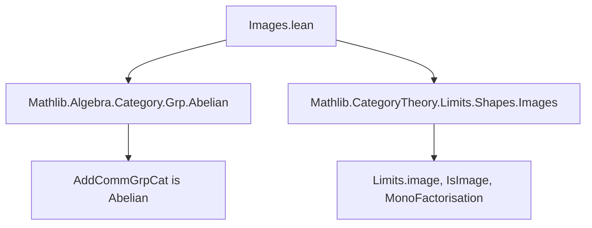
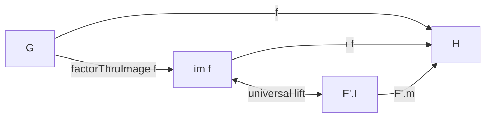

**Technical Brief: `Images.lean` — Categorical Images in `AddCommGrpCat`**

---

### 1. **Key Definitions & Theorems**

| Name | Type / Signature | Purpose |
|------|------------------|---------|
| `image` | `G ⟶ H → AddCommGrpCat` | Constructs the categorical image as the additive subgroup `range f.hom` bundled as an object in `AddCommGrpCat`. |
| `image.ι` | `image f ⟶ H` | The monomorphism (inclusion) of the image into the codomain. |
| `factorThruImage` | `G ⟶ image f` | The corestriction of `f` through its image. |
| `image.fac` | `factorThruImage f ≫ image.ι f = f` | Factorization identity: `f` factors as `G → im f → H`. |
| `image.lift` | `MonoFactorisation f → image f ⟶ F'.I` | Universal morphism from the image to any other mono-factorization of `f`. |
| `image.lift_fac` | `image.lift F' ≫ F'.m = image.ι f` | Compatibility of the universal lift with the mono-factorization. |
| `monoFactorisation` | `MonoFactorisation f` | The canonical mono-factorization of `f` via its image. |
| `isImage` | `IsImage (monoFactorisation f)` | Proves that the canonical factorization satisfies the universal property of a categorical image. |
| `imageIsoRange` | `Limits.image f ≅ AddCommGrpCat.of f.hom.range` | Shows the categorical image coincides with the set-theoretic range (up to isomorphism). |

---

### 2. **Naming Conventions**

- **Prefixes**:
  - `image.`: for definitions and properties tied to the image construction.
  - `factorThruImage`: corestriction to image.
  - `lift`: universal property morphism.
- **Suffixes**:
  - `.ι`: standard for the “inclusion” or “structure map” of a subobject (here, mono).
  - `.fac`: for factorization identities.
- **General pattern**: `image.*`, `factorThruImage`, `lift`, `fac`, `ι`.

---

### 3. **Tactic Stack**

Frequently used tactics in proofs:

| Tactic | Role |
|--------|------|
| `ext` | Extensionality for morphisms in `AddCommGrpCat` (via `Subtype.ext`). |
| `rfl` | Reflexivity for definitional equalities (e.g., on elements). |
| `rw [...]` | Rewriting using `image.fac`, `F'.fac`, or `Classical.indefiniteDescription`. |
| `apply injective_of_mono` | To prove equality in domain of mono by mapping forward. |
| `haveI := ...` | To introduce instance assumptions (e.g., `F'.m_mono`). |
| `change ... = _` | To align goal with known lemmas. |
| `rw [map_zero]`, `rw [map_add]` | Using homomorphism properties. |

No heavy automation (e.g., `aesop`, `ring`, `simp`) is used beyond `simp`-friendly `image.fac`.

---

### 4. **Proof Logic**

- **Structure**: Constructive, element-wise reasoning lifted to the categorical level.
- **Typical flow**:
  1. Define image object as `of (range f.hom)`.
  2. Define inclusion `ι` and corestriction `factorThruImage`.
  3. Prove factorization (`image.fac`) and monicity of `ι`.
  4. For universal property:
     - Use `Classical.indefiniteDescription` to pick preimages (noncomputable).
     - Prove lift is a well-defined group homomorphism using mono-injectivity.
     - Verify commutativity (`image.lift_fac`).
  5. Conclude `isImage` and uniqueness up to iso (`imageIsoRange`).

- **Key logical tool**: Classical choice (`Classical.indefiniteDescription`) to define lift on representatives.

---

### 5. **Imports**

| Import | Purpose |
|--------|---------|
| `Mathlib.Algebra.Category.Grp.Abelian` | Establishes `AddCommGrpCat` is abelian (hence has all images, etc.). |
| `Mathlib.CategoryTheory.Limits.Shapes.Images` | Provides `Limits.image`, `IsImage`, `MonoFactorisation`, and related API. |

> Note: The file *does not* register instances because abelianness already guarantees existence/uniqueness of images.

---

### 6. **Mermaid Diagrams**

#### A. **Dependency Graph (Module Level)**



#### B. **Categorical Image Construction Overview**



- `f = factorThruImage f ≫ ι f`
- For any mono factorization `G --e--> I --m--> H`, there exists unique `im f --lift--> I` s.t. `lift ≫ m = ι f`.

#### C. **Isomorphism between Categorical & Set-Theoretic Image**

```mermaid
graph LR
  Limits.image f -->|iso| AddCommGrpCat.of f.hom.range
```

- `imageIsoRange` witnesses that the abstract categorical image (via limit construction) agrees with the concrete range subgroup.

---

### 7. **Summary**

This file explicitly constructs categorical images in `AddCommGrpCat`, verifying the universal property and showing agreement with the group-theoretic range. Though `AddCommGrpCat` is abelian (hence images exist abstractly), the file provides a concrete, constructive realization—useful for downstream reasoning and interoperability with algebraic constructions. The proofs rely on classical choice and element-wise verification, lifted to the categorical level via `ConcreteCategory` machinery.
