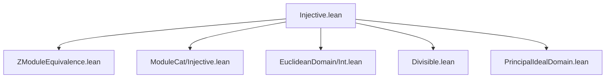
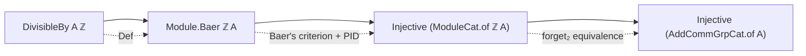
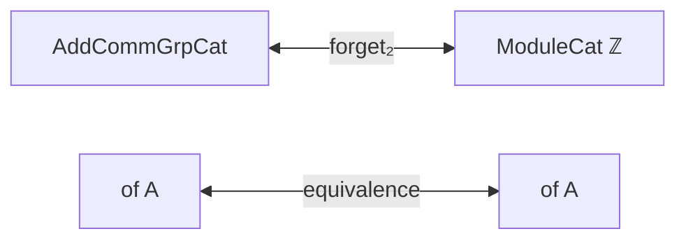

**Technical Brief: `Injective.lean`**

---

### 1. **Key Definitions & Theorems**

| Name | Type / Signature | Purpose |
|------|------------------|---------|
| `Module.Baer.of_divisible` | `[DivisibleBy A ℤ] → Module.Baer ℤ A` | Shows that a $\mathbb{Z}$-module $A$ satisfying divisibility (i.e., for all $a \in A$, $m \in \mathbb{Z} \setminus \{0\}$, $\exists b \in A$, $m \cdot b = a$) satisfies Baer’s criterion for injectivity over $\mathbb{Z}$. |
| `injective_as_module_iff` | `Injective (ModuleCat.of ℤ A) ↔ Injective (AddCommGrpCat.of A)` | Establishes equivalence between injectivity of $A$ as a $\mathbb{Z}$-module and as an object in the category of abelian groups (`AddCommGrpCat`). |
| `injective_of_divisible` | `[DivisibleBy A ℤ] → Injective (AddCommGrpCat.of A)` | Main result: any divisible abelian group is injective in `AddCommGrpCat`. |

---

### 2. **Naming Conventions**

- **Prefixes**:
  - `of_`: Converts between concrete structures and categorical objects (`ModuleCat.of`, `AddCommGrpCat.of`).
  - `forget₂`: Refers to forgetful functors between categories (e.g., from $\mathbb{Z}$-Mod to Ab).
- **Suffixes**:
  - `_iff`: Biconditional equivalences.
  - `_smul_mk`, `_singleton`: Used in constructions involving module actions and singleton-generated submodules.
- **Descriptive compound names**:
  - `injective_as_module_iff`, `injective_of_divisible`, `of_divisible`: Clearly encode assumptions and conclusions.

---

### 3. **Tactic Stack**

Frequent tactics used in proofs:

- `rcases`: To decompose existential or conjunction hypotheses.
- `rw`: Rewriting using equalities (especially module axioms, submodule properties).
- `subst`: Substituting equal terms after `rcases`.
- `exact`, `refine`: To construct proofs term-by-term.
- `symm`: To reverse equalities.
- `map_zero`, `map_zsmul`: Simplification lemmas for linear maps and scalar multiplication.
- `SetLike.mk_smul_mk`: Rewriting scalar multiplication in submodule embeddings.
- `eq_or_ne`: Case analysis on whether a term is zero or not.

No heavy automation (e.g., `aesop`, `linarith`) is used—proofs are mostly constructive and rely on algebraic manipulation.

---

### 4. **Proof Logic**

- **Structure of `Module.Baer.of_divisible`**:
  1. Use `IsPrincipalIdealRing.principal` to reduce any ideal $I \subseteq \mathbb{Z}$ to $I = (m)$.
  2. Split on $m = 0$ or $m \ne 0$:
     - If $m = 0$: trivial extension by zero.
     - If $m \ne 0$: construct extension using divisibility: pick $b$ such that $m \cdot b = g(m)$, then define map $n \cdot m \mapsto n \cdot b$.
  3. Verify well-definedness and extension property via `rw` and algebraic identities.

- **Structure of `injective_of_divisible`**:
  1. Use `injective_as_module_iff` to reduce injectivity in `AddCommGrpCat` to injectivity in `ModuleCat ℤ`.
  2. Apply `Module.injective_object_of_injective_module` with `Module.Baer.of_divisible A.injective`.
  3. Conclude via equivalence of injectivity across the two categories.

---

### 5. **Imports**

| Import | Role |
|--------|------|
| `Mathlib.Algebra.Category.Grp.ZModuleEquivalence` | Connects `AddCommGrpCat` and `ModuleCat ℤ` (via equivalence of abelian groups and $\mathbb{Z}$-modules). |
| `Mathlib.Algebra.Category.ModuleCat.Injective` | Provides `Module.injective_object_of_injective_module`, linking Baer’s criterion to categorical injectivity. |
| `Mathlib.Algebra.EuclideanDomain.Int` | Ensures $\mathbb{Z}$ is a PID (used for principal ideal generation). |
| `Mathlib.GroupTheory.Divisible` | Defines divisible groups and `DivisibleBy`. |
| `Mathlib.RingTheory.PrincipalIdealDomain` | Supplies `IsPrincipalIdealRing` instance for $\mathbb{Z}$. |

---

### 6. **Mermaid Diagrams**

#### Dependency Graph (File-Level)

#### Theoretical Flow Overview

#### Categorical Equivalence Context

---

### Summary

This file formalizes the classical result: **a divisible abelian group is injective in the category of abelian groups**. It leverages:
- The equivalence between abelian groups and $\mathbb{Z}$-modules,
- Baer’s criterion for injective modules,
- The fact that $\mathbb{Z}$ is a PID (so all ideals are principal).

The proof is constructive and highly algebraic, with minimal reliance on automation.
