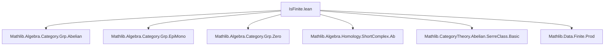
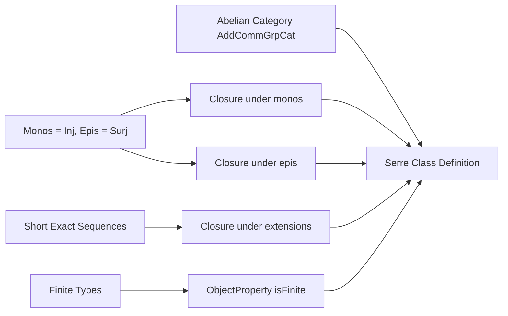

**Technical Brief: `IsFinite.lean`**

---

### 1. **Key Definitions & Theorems**

| Name | Type | Purpose |
|------|------|---------|
| `isFinite` | `ObjectProperty AddCommGrpCat.{u}` | Defines the class of finite objects (i.e., finite underlying types) in the category of abelian groups (`AddCommGrpCat`). |
| `prop_isFinite_iff` | `isFinite M ↔ Finite M` | Equivalence stating that `isFinite M` holds iff the underlying type of `M` is finite. |
| `isFinite.IsSerreClass` | Instance | Proves that `isFinite` satisfies the three axioms of a Serre class in an abelian category: (i) contains zero, (ii) closed under monomorphisms, (iii) closed under epimorphisms, and (iv) closed under extensions (via short exact sequences). |

The core theorem is implicitly:  
**Theorem**: *The class of finite abelian groups forms a Serre class in the abelian category `AddCommGrpCat`.*

---

### 2. **Naming Conventions**

- **Prefixes**:
  - `isFinite`: predicate naming convention for object properties.
  - `prop_`: prefix for lemmas connecting a predicate (e.g., `isFinite`) to its underlying logical property (`Finite`).
- **Suffixes**:
  - `_iff`: for equivalences (`prop_isFinite_iff`).
  - `_of_`: for implications derived from structural properties (`of_mono`, `of_epi`, `of_surjective`, `of_injective`).
- **Variable names**:
  - `M`, `N`: objects (abelian groups).
  - `f`, `g`: morphisms.
  - `S`: a short exact sequence (of type `ShortComplex Ab`).
  - `hS`, `h₁`, `h₃`: hypotheses about exactness or finiteness.

---

### 3. **Tactic Stack**

Frequently used tactics in proofs:

- `rw`: rewriting using equivalences/lemmas (e.g., `AddCommGrpCat.mono_iff_injective`, `epi_iff_surjective`).
- `simp only [...]`: simplification with explicit lemmas, especially to move between `isFinite` and `Finite`.
- `exact`: after simplifying goal to match a hypothesis.
- `obtain ⟨x, hx⟩`: destructuring existential quantifiers or products.
- `have hφ := ...`: introducing intermediate lemmas (e.g., constructing a surjective map).
- `infer_instance`: for typeclass resolution (e.g., proving `Finite` via `PUnit`).
- `by` (implicit): tactic blocks for structured proof scripts.

No heavy automation (e.g., `aesop`, `ring`, `linarith`) is used—proofs rely on algebraic reasoning and properties of finite types.

---

### 4. **Proof Logic**

The proof follows a standard Serre class verification pattern:

1. **Zero object**: Construct the zero object (`.of PUnit`) and show it’s finite.
2. **Closed under monomorphisms**: Use injectivity of monos in `AddCommGrpCat` and `Finite.of_injective`.
3. **Closed under epimorphisms**: Use surjectivity of epis and `Finite.of_surjective`.
4. **Closed under extensions** (short exact sequences):
   - Given a short exact sequence $0 \to M_1 \xrightarrow{f} M \xrightarrow{g} M_3 \to 0$ with $M_1$, $M_3$ finite,
   - Construct a surjection $(x_1, x_3) \mapsto f(x_1) + s(x_3)$, where $s$ is a right inverse of $g$ (guaranteed by surjectivity),
   - Show this map is surjective onto $M$, hence $M$ is finite.

The key algebraic insight is the explicit construction of a surjection from $M_1 \times M_3$ to $M$, using a section $s$ of $g$.

---

### 5. **Imports**

| Import | Role |
|--------|------|
| `Mathlib.Algebra.Category.Grp.Abelian` | Establishes `AddCommGrpCat` is abelian. |
| `Mathlib.Algebra.Category.Grp.EpiMono` | Provides characterizations of monos/epis as injective/surjective maps. |
| `Mathlib.Algebra.Category.Grp.Zero` | Defines zero object and zero morphisms. |
| `Mathlib.Algebra.Homology.ShortComplex.Ab` | Provides `ShortComplex` and exactness conditions in `Ab`. |
| `Mathlib.CategoryTheory.Abelian.SerreClass.Basic` | Defines Serre classes and their axioms. |
| `Mathlib.Data.Finite.Prod` | Provides `Finite` product lemmas (used implicitly in surjectivity proofs). |

---

### 6. **Mermaid Diagrams**

#### Dependency Graph (Module-Level)



#### Theoretical Overview (Conceptual Flow)



#### Proof Structure (Extension Case)

```mermaid
flowchart LR
  H1[Finite M₁] -->|ShortExact| Goal[Finite M]
  H3[Finite M₃] -->|ShortExact| Goal
  S[g surjective] -->|obtain s: g∘s = id| Section[s: M₃ → M]
  Section -->|construct φ: M₁×M₃ → M| SurjMap[φ(x₁,x₃)=f(x₁)+s(x₃)]
  SurjMap -->|Finite.of_surjective| Goal
```

---

### 7. **Mathematical Context**

- **Category**: `AddCommGrpCat.{u}` = category of abelian groups in universe `u`.
- **Serre class**: A class $\mathcal{S}$ of objects such that for any short exact sequence $0 \to A \to B \to C \to 0$, $B \in \mathcal{S}$ iff $A, C \in \mathcal{S}$.
- **Result**: The class of finite abelian groups is a Serre class — foundational for localization theory, torsion theories, and derived category constructions.

--- 

Let me know if you'd like a formalization-level dependency graph (e.g., via `leanproject graph`) or a comparison with other Serre classes (e.g., torsion, nilpotent).
