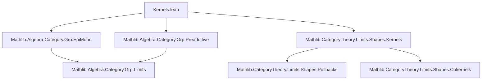

**Technical Brief: `Kernels.lean` (Additive Commutative Group Category)**  
*Domain: Category Theory in Lean 4 (Mathlib), specifically concrete (co)kernels in `AddCommGrpCat`*

---

### 1. **Key Definitions & Theorems**

| Name | Type | Purpose |
|------|------|---------|
| `kernelCone` | `f : G ⟶ H → KernelFork f` | Constructs a kernel *fork* using the concrete kernel subgroup `f.hom.ker` embedded via `of : AddCommGrpCat → Type u`. |
| `kernelIsLimit` | `IsLimit (kernelCone f)` | Proves that the kernel cone is terminal in the category of cones over `f`, i.e., the concrete kernel is categorical kernel. |
| `cokernelCocone` | `f : G ⟶ H → CokernelCofork f` | Constructs a cokernel *cofork* using the quotient group `H ⧸ f.hom.range`. |
| `cokernelIsColimit` | `IsColimit (cokernelCocone f)` | Proves that the cokernel cofork is initial in the category of coforks under `f`, i.e., the concrete cokernel is categorical cokernel. |

---

### 2. **Naming Conventions**

- **Prefixes**:
  - `kernel*`, `cokernel*`: Indicates (co)kernel-related constructions.
  - `of*`: Embedding from concrete objects (e.g., subgroups, quotients) into `AddCommGrpCat`.
  - `mk'`: Standard for constructing morphisms in quotient categories (here, `QuotientAddGroup.mk'`).
- **Suffixes**:
  - `IsLimit`, `IsColimit`: Verifies universal properties (terminal/initial).
  - `Cone`, `Cocone`: Denotes (co)cone structures.
- **Morphisms**:
  - `ι`, `π`: Standard for inclusion (kernel) and projection (cokernel).
  - `subtype`, `mk'`, `lift`, `codRestrict`: Concrete homomorphism constructors.

---

### 3. **Tactic Stack**

Frequent tactics used in proofs:

| Tactic | Role |
|--------|------|
| `rfl` | Reflexivity for definitional equalities (e.g., in uniqueness parts). |
| `ext` | Extensionality for functions/subtypes (e.g., `Subtype.ext_iff`). |
| `simp_rw` / `simp` | Simplification using definitional equalities and lemmas (e.g., `mem_ker`, `eq_zero_iff`). |
| `congr_arg` | Congruence for function application (used to lift equalities through functors). |
| `exact`, `intro`, `apply`, `have`, `by rfl` | Basic proof scripting. |
| `cancel_epi` | Cancellation law for epimorphisms (used in cokernel uniqueness). |
| `epi_iff_surjective` | Characterization of epimorphisms in `AddCommGrpCat` (surjective homomorphisms). |
| `mem_ker.mpr`, `range_le_ker_iff` | Homological algebra lemmas for kernel/range inclusion. |

---

### 4. **Proof Logic**

- **Kernel proof (`kernelIsLimit`)**:
  1. Construct a morphism from any other cone `s` to the kernel cone via `codRestrict` (using `mem_ker` to ensure image lands in kernel).
  2. Show uniqueness by applying `ext` and using `ConcreteCategory.congr_hom` to reduce to element-wise equality.

- **Cokernel proof (`cokernelIsColimit`)**:
  1. Use the universal property of quotient groups (`lift`) to build the mediating morphism.
  2. Show the mediating morphism is unique by:
     - Proving the cokernel projection is epi (via surjectivity: `mk'_surjective`).
     - Using `cancel_epi` to deduce equality of morphisms from equality after post-composition.

- **General flow**:  
  `Induction/element-chasing → universal property construction → uniqueness via extensionality or epimorphism cancellation`.

---

### 5. **Imports**

| Import | Purpose |
|--------|---------|
| `Mathlib.Algebra.Category.Grp.EpiMono` | Epimorphisms/monomorphisms in `Grp`/`AddCommGrpCat`. |
| `Mathlib.Algebra.Category.Grp.Preadditive` | Preadditive structure of `AddCommGrpCat`. |
| `Mathlib.CategoryTheory.Limits.Shapes.Kernels` | General categorical kernel/cokernel definitions. |

---

### 6. **Mermaid Diagrams**

#### **Dependency Graph (Module Level)**



#### **Overview of Theory Flow**

```mermaid
flowchart LR
  subgraph Concrete
    A1[Concrete kernel: ker(f)] --> A2[Subgroup of G]
    A3[Concrete cokernel: coker(f)] --> A4[Quotient H / im(f)]
  end

  subgraph Categorical
    B1[KernelFork f] --> B2[IsLimit kernelCone f]
    B3[CokernelCofork f] --> B4[IsColimit cokernelCocone f]
  end

  subgraph Embedding
    A2 -->|of| B1
    A4 -->|of| B3
  end

  A1 -.->|constructs| B1
  A3 -.->|constructs| B3
  B2 -.->|proves| "Concrete = Categorical"
  B4 -.->|proves| "Concrete = Categorical"
```

---

### 7. **Key Lemmas Used (Implicit)**

- `mem_ker`: $x \in \ker f \iff f(x) = 0$
- `eq_zero_iff`: Characterization of zero in quotient groups.
- `range_le_ker_iff`: $ \operatorname{im}(f) \subseteq \ker(g) \iff g \circ f = 0 $
- `mk'_surjective`: Surjectivity of quotient projection.
- `epi_iff_surjective`: In `AddCommGrpCat`, $f$ is epi ⇔ $f$ is surjective.

---

### 8. **Summary**

This file establishes the *concrete* (kernel as subgroup, cokernel as quotient) and *categorical* (universal properties) notions of (co)kernels coincide in the category of abelian groups (`AddCommGrpCat`). It leverages:
- `of : AddCommGrpCat → Type u` to embed algebraic constructions,
- `QuotientAddGroup.lift` for cokernel universality,
- `codRestrict` and `subtype` for kernel universality.

The proofs are standard but carefully formalized to respect the interplay between concrete algebra and category-theoretic limits/colimits.
