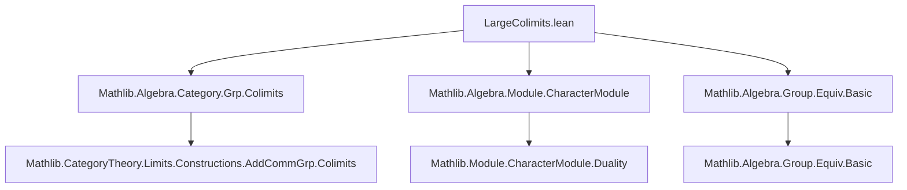
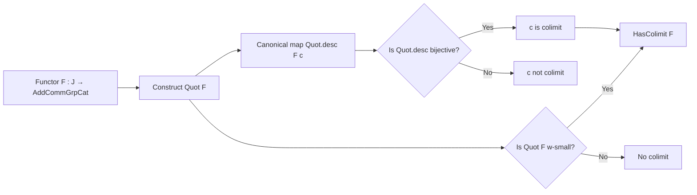

**Technical Brief: `LargeColimits.lean`**

---

### 1. Key Definitions & Theorems

| Name | Type / Signature | Purpose |
|------|------------------|---------|
| `Quot F` | `Colimits.Quot F : AddCommGrpCat.{w}` | Construction of the candidate colimit object: quotient of the direct sum $\bigoplus_{j : J} F(j)$ by the relations induced by morphisms in $J$. |
| `Quot.desc F c` | `Quot.desc F c : Quot F ⟶ c.pt` | The canonical morphism from the quotient object to the cocone vertex; used to test whether the cocone is a colimit. |
| `isColimit_iff_bijective_desc` | `Nonempty (IsColimit c) ↔ Function.Bijective (Quot.desc F c)` | Core equivalence: a cocone $c$ is a colimit iff the canonical map from `Quot F` to its vertex is bijective. |
| `hasColimit_iff_small_quot` | `HasColimit F ↔ Small.{w} (Quot F)` | Main existence criterion: $F$ has a colimit iff `Quot F` is $w$-small (i.e., $w$-indexed colimits of representables exist). |

---

### 2. Naming Conventions

- **Prefixes**:
  - `Quot.`: for constructions related to the quotient object (e.g., `Quot.desc`, `Quot.ι`, `Quot.map_ι`).
  - `isColimit_`: for lemmas characterizing colimit cocones.
  - `hasColimit_`: for existence criteria.
- **Suffixes**:
  - `_desc`: for maps factoring through the quotient.
  - `_iff_`: for biconditional characterizations.
- **Module-level**:
  - `AddCommGrpCat`: category of additive commutative groups (as a concrete category).
  - `Colimits`: namespace for colimit-related constructions.

---

### 3. Tactic Stack

- `aesop`: used implicitly via `rw` and `ext` in many proofs.
- `ext`: for extensionality arguments (e.g., `ext x`, `ext` on homs).
- `rw`: heavy use for rewriting definitions (e.g., `Quot.ι_desc`, `hc.fac`, `AddEquiv.apply_symm_apply`).
- `dsimp`: simplification of definitions, especially in cocone constructions.
- `change`: to align goal types before applying lemmas.
- `refine`: for structured proof construction with holes.
- `set`: to introduce local definitions (e.g., `c'` in the surjectivity proof).
- `apply`, `use`, `exact`: standard proof scripting.

---

### 4. Proof Logic

- **Structure of `isColimit_iff_bijective_desc`**:
  - Proves equivalence by:
    1. From `IsColimit c`, deduce bijectivity of `Quot.desc F c`:
       - Uses duality via `CharacterModule.dual_bijective_iff_bijective`.
       - Injectivity: via `ofHom_injective` and `hc.hom_ext`.
       - Surjectivity: constructs a test cocone `c'` using `AddCircle` and `ULift`, then uses `hc.desc` to produce a preimage.
    2. From bijectivity, construct `IsColimit c` via `isColimit_of_bijective_desc`.

- **Structure of `hasColimit_iff_small_quot`**:
  - Forward direction: uses the bijective desc from the colimit cocone, then pulls back an equivalence from `Quot F` to a small type.
  - Reverse direction: uses `hasColimit_of_small_quot`, a previously established lemma.

- **Inductive/structural pattern**: No explicit induction; relies on universal properties and concrete constructions in `AddCommGrpCat`.

---

### 5. Imports

| Import | Role |
|--------|------|
| `Mathlib.Algebra.Category.Grp.Colimits` | Provides general colimit constructions in `Grp`/`AddCommGrpCat`, including `Quot`. |
| `Mathlib.Algebra.Module.CharacterModule` | Supplies duality tools: `CharacterModule.dual_bijective_iff_bijective`. |
| `Mathlib.Algebra.Group.Equiv.Basic` | Provides `AddEquiv.ulift`, `toAddMonoidHom`, etc., for equivalence manipulations. |

---

### 6. Mermaid Diagrams

#### Dependency Graph (Module-Level)

#### Overview of Theory Flow

---

### 7. Summary

This file establishes a **concrete criterion** for the existence of colimits in `AddCommGrpCat`: a diagram $F$ has a colimit iff its *quotient construction* `Quot F` is $w$-small. The key insight is that bijectivity of the canonical map `Quot.desc F c` characterizes colimit cocones, leveraging duality via the character module. The proofs are constructive and rely heavily on the concrete nature of `AddCommGrpCat` as a category of abelian groups with group homomorphisms.
