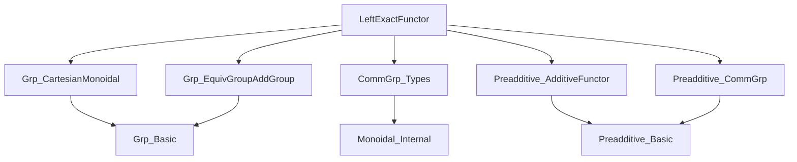
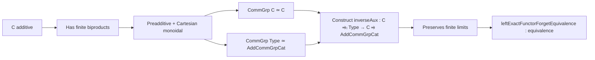

### Technical Brief: `LeftExactFunctor.lean`

---

#### **1. Key Definitions & Theorems**

| Name | Type / Signature | Purpose |
|------|------------------|---------|
| `inverseAux` | `(C ⥤ₗ Type v) ⥤ C ⥤ AddCommGrpCat.{v}` | Constructs a left-exact functor `C → AddCommGrpCat` from a left-exact `F : C → Type v`, using `CommGrp`-internalization and equivalences. |
| `inverse` | `(C ⥤ₗ Type v) ⥤ (C ⥤ₗ AddCommGrpCat.{v})` | Lifts `inverseAux` to the subcategory of left-exact functors via `ObjectProperty.lift`. |
| `unitIsoAux` | `commGrpTypeEquivalenceCommGrp.inverse.obj (AddCommGrpCat.toCommGrp.obj (F.obj X)) ≅ (F ⋙ forget).mapCommGrp.obj (Preadditive.commGrpEquivalence.functor.obj X)` | Shows that reconstructing the group structure from the underlying set recovers the original one (up to iso), crucial for the unit of the equivalence. |
| `unitIso` | `𝟭 (C ⥤ₗ AddCommGrpCat) ≅ (forget) ⋙ inverse` | Natural isomorphism implementing the unit of the equivalence. |
| `leftExactFunctorForgetEquivalence` | `(C ⥤ₗ AddCommGrpCat.{v}) ≌ (C ⥤ₗ Type v)` | Main theorem: the forgetful functor from left-exact `C → AddCommGrpCat` to left-exact `C → Type` is an equivalence when `C` is additive. |

---

#### **2. Naming Conventions**

- **Prefixes**:
  - `inverseAux`, `unitIsoAux`: auxiliary constructions for the main equivalence.
  - `leftExactFunctorForgetEquivalence`: main equivalence name.
  - `toCommGrp`, `toAddCommGrp`: coercion functors between categories of groups and additive groups.
- **Suffixes**:
  - `Iso`: natural isomorphisms (`unitIso`, `counitIso`).
  - `Functor`: functors (`commGrpTypeEquivalenceCommGrp.functor`, `commGroupAddCommGroupEquivalence.functor`).
  - `of`: constructors or lifts (`inverse`, `unitIso`).
- **Pattern**: `XIso` for isomorphisms, `XFunctor` for functors, `XAux` for intermediate lemmas.

---

#### **3. Tactic Stack**

Frequent tactics used in proofs:
- `erw`: rewriting with definitional equality (e.g., `erw [Functor.mapCommGrp_obj_grp_mul]`).
- `cat_disch`: category-theoretic simplification/discharge tactic (likely custom or from `CategoryTheory`).
- `simp only [...]`: selective simplification, often with `[-...]` to avoid unwanted unfolding.
- `dsimp [-...]`: definitional simplification with exclusions.
- `infer_instance`: typeclass inference.
- `have : ... := inferInstanceAs ...`: local instance introduction.
- `refine ...`: goal-directed construction (e.g., in `unitIsoAux`).
- `cat_disch`: likely a custom tactic for closing commutative diagram goals.

---

#### **4. Proof Logic**

- **Structure**:
  1. **Construction of `inverseAux`**: Uses:
     - `Functor.mapCommGrpFunctor`: lifts `F : C → Type` to `CommGrp C → CommGrp Type`.
     - `Preadditive.commGrpEquivalence.functor`: identifies `C ≃ CommGrp C` (since `C` is additive).
     - `commGrpTypeEquivalenceCommGrp.functor ⋙ commGroupAddCommGroupEquivalence.functor`: identifies `CommGrp Type ≃ AddCommGrpCat`.
  2. **Preservation of finite limits**: Proven via `preservesLimitsOfShape_of_reflects_of_preserves`, using that `forget AddCommGrpCat` reflects finite limits.
  3. **Unit isomorphism**:
     - Constructed componentwise using:
       - `commGroupAddCommGroupEquivalence.counitIso`
       - `commGrpTypeEquivalenceCommGrp.counitIso`
       - `unitIsoAux`: shows compatibility of group structures under reconstruction.
     - Assembled via `InducedCategory.isoMk` and `NatIso.ofComponents`.
  4. **Equivalence proof**:
     - `functor`: whiskering by `forget : AddCommGrpCat → Type`.
     - `inverse`: as above.
     - `unitIso`: as constructed.
     - `counitIso := Iso.refl _`: trivial because the construction is quasi-inverse by design.

- **Key logical flow**:
  > *Induction-free, diagrammatic reasoning*: rely on universal properties (finite limits, biproducts), monoidal structure (Cartesian/Braided), and equivalences of internal group objects.

---

#### **5. Imports**

| Module | Role |
|--------|------|
| `Mathlib.Algebra.Category.Grp.CartesianMonoidal` | `Grp` is Cartesian monoidal; used for `CommGrp` structure. |
| `Mathlib.Algebra.Category.Grp.EquivalenceGroupAddGroup` | Equivalence between groups and additive groups. |
| `Mathlib.CategoryTheory.Monoidal.Internal.Types.CommGrp_` | Internal `CommGrp` in a Cartesian monoidal category. |
| `Mathlib.CategoryTheory.Preadditive.AdditiveFunctor` | Preadditive categories and additive functors. |
| `Mathlib.CategoryTheory.Preadditive.CommGrp_` | `CommGrp C` for preadditive `C`. |

---

#### **6. Mermaid Diagrams**

##### **Dependency Graph (Module Level)**



##### **Theoretical Overview (This File)**



##### **Equivalence Diagram (Main Theorem)**

```mermaid
graph LR
  C ⥤ₗ AddCommGrpCat -- forget --> C ⥤ₗ Type
  C ⥤ₗ Type -- inverse --> C ⥤ₗ AddCommGrpCat
  C ⥤ₗ AddCommGrpCat -- unitIso --> inverse ∘ forget
  C ⥤ₗ Type -- counitIso --> forget ∘ inverse
```

---

#### **7. Summary**

This file establishes a foundational equivalence in homological algebra: for an additive category $C$, the category of left-exact functors $C \to \mathbf{AddCommGrp}$ is equivalent to the category of left-exact functors $C \to \mathbf{Type}$. The proof leverages:
- Internal group objects (`CommGrp C`) and their equivalence to $C$ (when $C$ is additive),
- The equivalence between internal commutative groups in $\mathbf{Type}$ and discrete additive groups,
- Careful verification that the reconstructed group structure matches the original via explicit isomorphisms.

It is a key step toward developing homological algebra in general toposes or homotopy type theory, where group objects may not be concrete.

--- 

*End of Technical Brief.*
