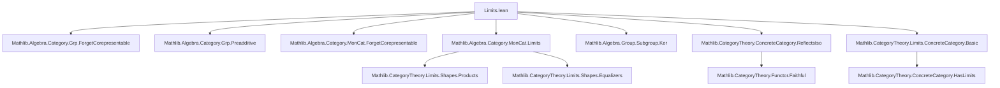
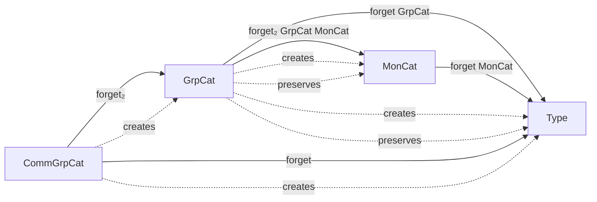

### Technical Brief: `Limits.lean` — Limits in Categories of Groups and Related Structures

---

#### **1. Key Definitions & Theorems**

| Name | Type / Signature | Purpose |
|------|------------------|---------|
| `sectionsSubgroup F` | `Subgroup (∀ j, F.obj j)` | Constructs the subgroup of natural transformations (sections) of a functor $F : J \to \mathbf{Grp}$; used to define the limit object’s underlying group. |
| `sectionsπMonoidHom j` | `(F ⋙ forget GrpCat).sections →* F.obj j` | Projection from global sections to a component — monoid homomorphism (group homomorphism by coercion). |
| `limitCone F` | `Cone F` | A concrete choice of limit cone in $\mathbf{Grp}$, built via lifting the limit cone in $\mathbf{Type}$ (or $\mathbf{Mon}$). |
| `limitConeIsLimit F` | `IsLimit (limitCone F)` | Proves the chosen cone is a limit cone. |
| `hasLimit F` | `HasLimit F` | Instantiates existence of limits for any small-indexed functor into $\mathbf{Grp}$. |
| `hasLimit_iff_small_sections F` | `HasLimit F ↔ Small (F ⋙ forget GrpCat).sections` | Characterizes existence of limits in terms of smallness of the section space. |
| `GrpCat.forget_createsLimit F` | `CreatesLimit F (forget GrpCat)` | Shows the forgetful functor $\mathbf{Grp} \to \mathbf{Type}$ creates limits. |
| `GrpCat.forget_preservesLimits` | `PreservesLimits (forget GrpCat)` | Shows the forgetful functor preserves all limits. |
| `CommGrpCat.limitCommGroup` | `[Small sections] → CommGroup (limit pt)` | Equips the limit of a diagram of *commutative* groups with a commutative group structure. |
| `kernelIsoKer f` | `kernel f ≅ AddCommGrpCat.of f.hom.ker` | Identifies the categorical kernel in $\mathbf{AddCommGrp}$ with the usual kernel subgroup. |
| `kernelIsoKerOver f` | `Over.mk (kernel.ι f) ≅ Over.mk (AddSubgroup.subtype f.hom.ker)` | Refines the above to an isomorphism in the over-category. |

---

#### **2. Naming Conventions**

- **Prefixes**:
  - `sections_`: for constructions involving natural transformations / global sections.
  - `limitCone`, `limitConeIsLimit`: for canonical limit cone and its universal property.
  - `hasLimit`, `hasLimitsOfShape`, `hasLimitsOfSize`, `hasLimits`: for existence of limits.
  - `forget_`, `forget₂_`: for forgetful functors (e.g., `forget GrpCat`, `forget₂ GrpCat MonCat`).
  - `createsLimit`, `preservesLimit`: for functorial behavior w.r.t. limits.
  - `kernelIsoKer`, `kernelIsoKerOver`: for concrete identification of kernels.

- **Suffixes**:
  - `_MonoidHom`, `_Hom`: for morphism components (e.g., `sectionsπMonoidHom`).
  - `_OfShape`, `_OfSize`: for shape- or universe-level bounded limit existence.
  - `_Aux`: auxiliary lemmas for performance (e.g., `forget₂CommMon_preservesLimitsAux`).

- **Category-specific**:
  - `GrpCat`, `CommGrpCat`, `AddCommGrpCat`: namespaces for respective categories.
  - `of`, `ofHom`: constructors for objects/morphisms from underlying types/homs.

---

#### **3. Tactic Stack**

Frequent tactics used in proofs:

| Tactic | Usage |
|--------|-------|
| `infer_instance` | To synthesize group/commutative group/smallness instances. |
| `simp` / `dsimp` | Simplifying hom-sets, projections, naturality, and section definitions. |
| `ext` | Extensionality for functions, subtypes, morphisms (especially in $\mathbf{Grp}$, $\mathbf{AddGrp}$). |
| `congr_arg` | To lift equality of homs to equality of underlying functions. |
| `rw [← lemma]` | Rewriting using equivalences (e.g., `hasLimit_iff_small_sections`). |
| `apply IsLimit.uniqueUpToIso` | To show uniqueness of cones up to iso. |
| `apply IsLimit.ofFaithful` | To transfer limit-ness along faithful functors. |
| `exact` / `refine` | For constructing morphisms and cones. |
| `cases` / `rcases` | For destructuring subtype elements (e.g., `⟨x, mem⟩`). |
| `aesop` (implied) | Likely used implicitly in `simp`-based automation (not explicit here, but standard in Mathlib). |

---

#### **4. Proof Logic**

The logical flow across most limit existence proofs follows this pattern:

1. **Smallness Check**: Show that the space of sections `(F ⋙ forget C).sections` is small (e.g., via `Concrete.small_sections_of_hasLimit` or assumption).
2. **Lift Limit from Base Category**:
   - Use the forgetful functor $U : \mathbf{Grp} \to \mathbf{Mon}$ or $U : \mathbf{Grp} \to \mathbf{Type}$.
   - Construct a cone in $\mathbf{Grp}$ by lifting the limit cone in $\mathbf{Mon}$ or $\mathbf{Type}$.
   - Equip the limit object with the required algebraic structure (group, commutative group, etc.).
3. **Verify Universal Property**:
   - Use `createsLimitOfReflectsIso` or `IsLimit.ofFaithful` to transfer the limit property.
   - Faithfulness of forgetful functors ensures that a limit in the base category lifts uniquely.
4. **Special Cases**:
   - For kernels: construct explicit isomorphism to kernel subgroup using `kernel.lift`, `kernel.ι`, and subtype inclusion.

Induction is *not* used — the arguments are categorical and rely on universal properties and smallness.

---

#### **5. Imports**

| Module | Role |
|--------|------|
| `Mathlib.Algebra.Category.Grp.ForgetCorepresentable` | Forgetful functor corepresentability (used for limit creation). |
| `Mathlib.Algebra.Category.Grp.Preadditive` | Preadditivity of $\mathbf{Grp}$ (not directly used here, but context). |
| `Mathlib.Algebra.Category.MonCat.ForgetCorepresentable` | Forgetful $\mathbf{Mon} \to \mathbf{Type}$ corepresentability. |
| `Mathlib.Algebra.Category.MonCat.Limits` | Limits in $\mathbf{Mon}$ (used as base for lifting). |
| `Mathlib.Algebra.Group.Subgroup.Ker` | Kernel subgroups (used in `kernelIsoKer`). |
| `Mathlib.CategoryTheory.ConcreteCategory.ReflectsIso` | Tools for showing forgetful functors reflect isomorphisms. |
| `Mathlib.CategoryTheory.Limits.ConcreteCategory.Basic` | General theory of limits in concrete categories (e.g., `small_sections_of_hasLimit`). |

---

#### **6. Mermaid Diagrams**

##### **Dependency Graph (High-Level)**



##### **Overview of Limit Construction Flow**

```mermaid
flowchart LR
  F[J ⥤ GrpCat] --> U[F ⋙ forget GrpCat]
  U --> L[Types.Small.limitCone]
  L --> G[GrpCat.of (limit pt)]
  G --> π[π_j : limit → F(j)]
  π --> LC[limitCone F]
  LC --> IL[IsLimit limitCone]
  IL --> HL[HasLimit F]

  style U fill:#f9f,stroke:#333
  style L fill:#bbf,stroke:#333
  style G fill:#9f9,stroke:#333
```

##### **Forgetful Functor Limit Behavior**



---

#### **7. Theory Scope**

This file establishes foundational results about **limits in algebraic categories**:

- $\mathbf{Grp}$, $\mathbf{CommGrp}$, $\mathbf{AddGrp}$, $\mathbf{AddCommGrp}$ all have all limits.
- These limits are **computed underlyingly** in $\mathbf{Type}$ (or $\mathbf{Mon}$ / $\mathbf{AddMon}$).
- Forgetful functors **create and preserve** all limits.
- Kernels in $\mathbf{AddCommGrp}$ match the classical group-theoretic kernel.

It serves as a cornerstone for homological algebra and sheaf theory in Lean, where limits (e.g., pullbacks, kernels, products) are ubiquitous.

--- 

Let me know if you'd like a formalized summary in Lean syntax or a dependency graph for a specific sub-theory (e.g., kernels only).
