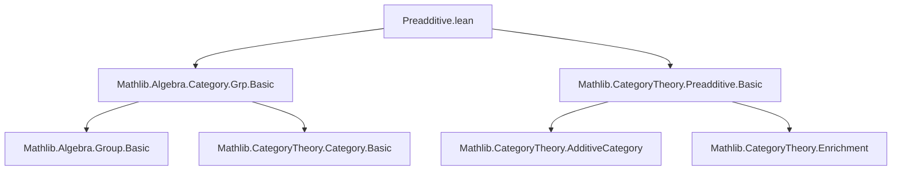

**Technical Brief: `Preadditive.lean` (Mathlib)**  
*Domain: Category Theory — Preadditive Categories — The Category of Additive Commutative Groups*

---

### 1. **Key Definitions & Theorems**

| Name | Type / Signature | Purpose |
|------|------------------|---------|
| `Add (M ⟶ N)` | `Add (M ⟶ N)` | Defines pointwise addition of morphisms in `AddCommGrpCat` via underlying group homomorphisms. |
| `Zero (M ⟶ N)` | `Zero (M ⟶ N)` | Defines zero morphism as the zero homomorphism. |
| `SMul ℕ (M ⟶ N)` | `SMul ℕ (M ⟶ N)` | Defines natural-number scalar multiplication via repeated addition. |
| `Neg (M ⟶ N)` | `Neg (M ⟶ N)` | Defines negation of morphisms via group inverse. |
| `Sub (M ⟶ N)` | `Sub (M ⟶ N)` | Defines subtraction via group subtraction. |
| `SMul ℤ (M ⟶ N)` | `SMul ℤ (M ⟶ N)` | Extends scalar multiplication to integers. |
| `AddCommGroup (P ⟶ Q)` | `instance : AddCommGroup (P ⟶ Q)` | Shows hom-sets are abelian groups under pointwise operations. |
| `Preadditive AddCommGrpCat` | `instance : Preadditive AddCommGrpCat` | Proves `AddCommGrpCat` is preadditive: hom-sets are abelian groups and composition is bilinear. |
| `homAddEquiv` | `(M ⟶ N) ≃+ (M →+ N)` | Bundled additive equivalence between morphisms in the category and group homomorphisms; shows hom-sets are literally additive groups of homomorphisms. |

**Auxiliary lemmas (all `@[simp]`):**
- `hom_add`, `hom_zero`, `hom_nsmul`, `hom_neg`, `hom_sub`, `hom_zsmul`: describe how hom-operations commute with the `ofHom` constructor.
- `hom_add_apply`: pointwise action of sum of morphisms.

---

### 2. **Naming Conventions**

- **Prefixes:**
  - `hom_`: properties of the `hom` projection (e.g., `hom_add`, `hom_zero`).
  - `ofHom`: constructor for morphisms from underlying group homs.
- **Suffixes:**
  - `_equiv`: equivalence (e.g., `homAddEquiv`).
  - `_add`, `_zero`, `_neg`, `_sub`, `_smul`: indicate operation being defined or analyzed.
- **Structure naming:**
  - `Add`, `Zero`, `SMul`, `Neg`, `Sub`, `AddCommGroup`, `Preadditive`: standard typeclass names.

---

### 3. **Tactic Stack**

- `rfl`: dominant tactic — most lemmas are definitional equalities.
- `simp`: used implicitly via `@[simp]` attributes.
- `Function.Injective.addCommGroup`: leverages injective lift of algebraic structure along injective maps.
- `congr` / `ext`: likely used in `simps!` generation (note `@[simps!]` on `homAddEquiv`).
- No heavy automation (e.g., `aesop`, `ring`, `linarith`) needed — structure is definitional.

---

### 4. **Proof Logic**

- **Strategy**: *Definitional lifting* along the embedding `Hom : AddCommGrpCat ⥙ Type u`.
- Morphisms are *bundled* group homomorphisms; hom-sets are embedded into function spaces via `ConcreteCategory.hom`.
- All algebraic structure on `M ⟶ N` is *transported* via the injective map `hom : (M ⟶ N) → (M →+ N)`.
- Proof of `Preadditive` follows from:
  1. `AddCommGroup (M ⟶ N)` (via `Injective.addCommGroup`),
  2. Bilinearity of composition: follows from naturality of group homomorphisms and distributivity in target groups.
- No induction or case analysis required — all properties are definitional.

---

### 5. **Imports**

| Import | Role |
|--------|------|
| `Mathlib.Algebra.Category.Grp.Basic` | Provides `Grp`, `Ab`, and basic categorical constructions over groups. |
| `Mathlib.CategoryTheory.Preadditive.Basic` | Defines `Preadditive` category, hom-additive structure, bilinearity of composition. |
| `Mathlib.CategoryTheory.ConcreteCategory.Basic` (via `Hom.hom`) | Used to access underlying homs and `homEquiv`. |

---

### 6. **Mermaid Diagrams**

#### **Dependency Graph (Module-Level)**



#### **Overview of `AddCommGrpCat` Structure**

```mermaid
graph LR
  subgraph Objects
    M[Object M: Additive Commutative Group]
    N[Object N: Additive Commutative Group]
  end

  subgraph Morphisms
    MtoN[M ⟶ N]
    hom[M →+ N]
  end

  MtoN -- hom -->> hom
  MtoN -.->|Add| MtoN
  MtoN -.->|Zero| MtoN
  MtoN -.->|SMul ℤ| MtoN

  hom -- Add →+ hom + hom --> hom
  hom -- Zero →+ 0 --> hom
  hom -- n • - →+ n • (-) --> hom

  MtoN <==|≃+|==> hom
  style MtoN fill:#f9f,stroke:#333
  style hom fill:#bbf,stroke:#333
```

#### **Preadditivity Verification Flow**

```mermaid
graph TD
  A[Define +, 0, - on M ⟶ N via hom] --> B[Show (M ⟶ N) is AddCommGroup]
  B --> C[Show composition is ℤ-bilinear]
  C --> D[Conclude Preadditive]
  A -->|hom_add_apply, etc.| B
  B -->|Injective.addCommGroup| C
```

---

### 7. **Theoretical Significance**

- This file establishes the foundational example of a **preadditive category**: `AddCommGrpCat` (equivalently, `Ab`).
- It demonstrates how to *bundled-structure transport* along a concrete embedding.
- The equivalence `homAddEquiv` shows that morphisms in `AddCommGrpCat` are *literally* group homomorphisms — no coherence issues.
- Sets the stage for enrichment over `AddCommGrpCat`, derived categories, homological algebra in Mathlib.

--- 

*End of Technical Brief.*
