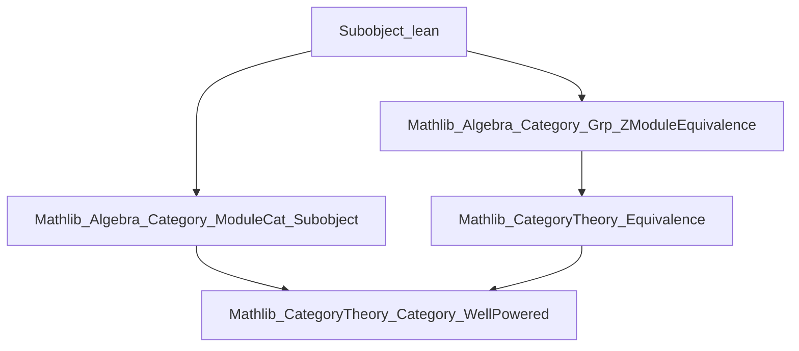
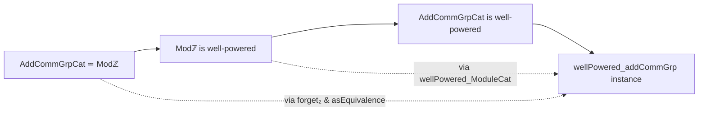

**Technical Brief: `Subobject.lean` (Mathlib — Category of Abelian Groups is Well-Powered)**

---

### 1. **Key Definitions & Theorems**

| Name | Type / Declaration | Purpose |
|------|--------------------|---------|
| `wellPowered_addCommGrp` | `instance : WellPowered.{u} AddCommGrpCat.{u}` | Proves that the category of abelian groups (`AddCommGrpCat`) is *well-powered*, i.e., for every object $G$, the class of subobjects (monomorphisms into $G$ modulo isomorphism) forms a set (not a proper class). |
| `wellPowered_of_equiv` | From `Mathlib.CategoryTheory.Category.WellPowered` | A general criterion: if two categories are equivalent and one is well-powered, then so is the other. |
| `forget₂ (ModuleCat.{u} ℤ) AddCommGrpCat.{u}` | The forgetful functor from $\mathsf{Mod}_\mathbb{Z}$ to $\mathsf{AddCommGrpCat}$ | This functor is part of an equivalence of categories (via `asEquivalence`). |
| `asEquivalence` | Proof that the forgetful functor is part of an equivalence | Used to transport the well-powered property from $\mathsf{Mod}_\mathbb{Z}$ (known to be well-powered) to $\mathsf{AddCommGrpCat}$. |

---

### 2. **Naming Conventions**

- **Prefixes**:
  - `wellPowered_`: Indicates a proof that a category satisfies the *well-powered* condition.
  - `forget₂`: Standard Mathlib notation for the forgetful functor from a structured category (e.g., modules) to a more basic one (e.g., abelian groups).
- **Suffixes**:
  - `_of_equiv`: Indicates a result derived via an equivalence of categories.
- **Module-related**:
  - `ModuleCat.{u} ℤ`: The category of $\mathbb{Z}$-modules (i.e., abelian groups), used as a proxy for `AddCommGrpCat`.

---

### 3. **Tactic Stack**

- **`exact` / `assumption`**: Implicit in instance proofs (Lean fills in via typeclass inference).
- **`apply` / `refine`**: Used internally in `wellPowered_of_equiv` (not visible here, but part of the imported module).
- **`equiv` / `asEquivalence`**: Typeclass inference and equivalence machinery (handled by `CategoryTheory.Equivalence` infrastructure).
- **No explicit tactics** appear in this short file — the proof is *declarative*, relying on high-level categorical lemmas.

---

### 4. **Proof Logic**

The proof follows a *categorical transport* strategy:

1. Recognize that $\mathsf{AddCommGrpCat}$ is equivalent to $\mathsf{Mod}_\mathbb{Z}$ (via the standard equivalence between abelian groups and $\mathbb{Z}$-modules).
2. Use the fact that $\mathsf{Mod}_\mathbb{Z}$ is well-powered (imported from `ModuleCat.Subobject`).
3. Apply the general lemma `wellPowered_of_equiv`, which states:  
   If $\mathcal{C} \simeq \mathcal{D}$ and $\mathcal{D}$ is well-powered, then $\mathcal{C}$ is well-powered.

No induction, case analysis, or manual subobject reasoning is needed — the heavy lifting is done by pre-established categorical infrastructure.

---

### 5. **Imports**

| Import | Role |
|--------|------|
| `Mathlib.Algebra.Category.Grp.ZModuleEquivalence` | Provides the equivalence $\mathsf{AddCommGrpCat} \simeq \mathsf{Mod}_\mathbb{Z}$. |
| `Mathlib.Algebra.Category.ModuleCat.Subobject` | Contains the proof that $\mathsf{Mod}_\mathbb{Z}$ is well-powered (via `wellPowered_ModuleCat`). |

> Note: The file does *not* import `WellPowered` directly — it is transitively available via the above modules or via `CategoryTheory.Category.WellPowered`.

---

### 6. **Mermaid Diagrams**

#### Dependency Graph (File-Level)

#### Conceptual Proof Flow

---

### 7. **Summary**

This file is a concise application of *categorical equivalence* to transfer a structural property (well-poweredness) from modules over $\mathbb{Z}$ to abelian groups. It exemplifies Lean’s strength in high-level category theory: minimal code, maximal reuse of general theorems. The proof is *non-constructive* in the sense that it does not build subobject lattices explicitly — it relies on the equivalence to inherit the set-sizedness of subobjects.
