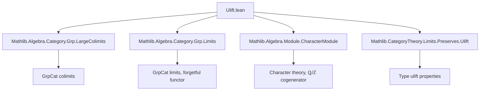
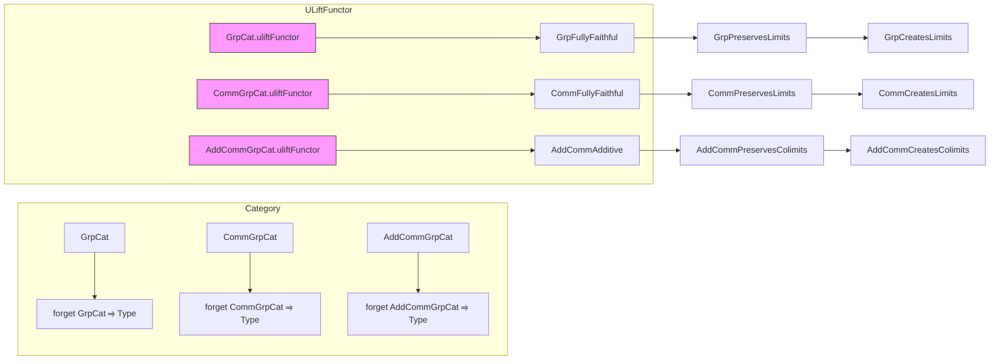

Here is the structured technical brief extracted from `Ulift.lean`:

---

### **1. KEY DEFINITIONS & THEOREMS**

| Name | Type / Signature | Purpose |
|------|------------------|---------|
| `uliftFunctorFullyFaithful` (for `GrpCat`, `CommGrpCat`, `AddCommGrpCat`) | `uliftFunctor.{u, v}.FullyFaithful` | Proves the universe lift functor is fully faithful (i.e., bijective on hom-sets). |
| `uliftFunctor_preservesLimit` | `PreservesLimit K uliftFunctor.{v, u}` | Shows that `uliftFunctor` preserves limits of a diagram `K`. |
| `uliftFunctor_preservesLimitsOfShape` | `PreservesLimitsOfShape J uliftFunctor.{v, u}` | Generalizes preservation to limits of a fixed shape `J`. |
| `uliftFunctor_preservesLimitsOfSize` | `PreservesLimitsOfSize.{w', w} uliftFunctor.{v, u}` | Ensures preservation of all limits of size ≤ `w`. |
| `CreatesLimitsOfSize` instance | `CreatesLimitsOfSize.{w, u} uliftFunctor.{v, u}` | Shows the functor creates (i.e., reflects and lifts) all small limits. |
| `uliftFunctor_additive` | `AddCommGrpCat.uliftFunctor.{u, v}.Additive` | Proves the additive universe lift functor is additive (preserves zero morphisms and addition). |
| `PreservesColimitsOfSize` instance (for `AddCommGrpCat`) | `PreservesColimitsOfSize.{w', w} uliftFunctor.{v, u}` | Proves preservation of all colimits of size ≤ `w`. |
| `CreatesColimitsOfSize` instance | `CreatesColimitsOfSize.{w, u} uliftFunctor.{v, u}` | Shows creation of all small colimits. |

---

### **2. NAMING CONVENTIONS**

- **Prefixes**:
  - `uliftFunctor_`: for properties of the universe lift functor.
  - `isLimitOf`, `isColimitOf`: for constructing (co)limits via universal properties.
  - `createsLimitOf`, `createsColimitOf`: for creation of (co)limits.
- **Suffixes**:
  - `FullyFaithful`: for full-and-faithful functors.
  - `PreservesLimit(s)`: for limit preservation.
  - `CreatesLimit(s)`: for limit creation.
  - `Additive`: for additive functors.
- **`to_additive` attribute**: used to derive additive analogues of group-theoretic results.

---

### **3. TACTIC STACK**

- `rfl`, ` rfl`-based simplifications (for definitional equalities).
- `simp_rw`: used implicitly via `to_additive` and `@[to_additive]`.
- `exact`, `apply`, `intro`, `cases`: standard Lean tactics.
- `classical`: for classical logic (e.g., in colimit proofs).
- `rw [eq]`: rewriting using equivalences and universal properties.
- `exact ULift.up_bijective.comp ...`: uses `ULift`-specific bijections.
- `quotQuotUliftAddEquiv`, `AddEquiv.coe_toAddMonoidHom`, `Quot.desc_quotQuotUliftAddEquiv`: specialized algebraic equivalences and descent lemmas.

---

### **4. PROOF LOGIC**

- **Fully Faithful**: Direct construction of preimages using `MulEquiv.ulift` and verification via `rfl`.
- **Limit Preservation**:
  - Use that `forget GrpCat` (resp. `forget CommGrpCat`) creates limits.
  - Use that `uliftFunctor : Type → Type` preserves limits.
  - Combine via `isLimitOfReflects` and `isLimitOfPreserves`.
- **Limit Creation**:
  - Follows from fully faithful + preserves limits ⇒ creates limits (`createsLimitOfFullyFaithfulOfPreserves`).
- **Additivity**:
  - Immediate from definition of `AddCommGrpCat.uliftFunctor` and `Additive` class.
- **Colimit Preservation (for `AddCommGrpCat`)**:
  - Use duality via `ℚ / ℤ`-valued characters.
  - Show bijectivity of the descent map using:
    - `isColimit_iff_bijective_desc`
    - `quotQuotUliftAddEquiv` (a key equivalence for colimits in `AddCommGrpCat`)
    - `ULift.up_bijective` to lift bijections.
  - Creation follows from `createsColimitOfReflectsIsomorphismsOfPreserves`.

> **Note**: The noncommutative case fails for colimits due to existence of large simple groups — the lift does *not* preserve colimits in `GrpCat`.

---

### **5. IMPORTS**

| Import | Role |
|--------|------|
| `Mathlib.Algebra.Category.Grp.LargeColimits` | Colimits in `GrpCat`, especially large ones. |
| `Mathlib.Algebra.Category.Grp.Limits` | Limits in `GrpCat`, forgetful functor properties. |
| `Mathlib.Algebra.Module.CharacterModule` | Duals like `A →+ ℚ / ℤ`, used for cogenerator arguments. |
| `Mathlib.CategoryTheory.Limits.Preserves.Ulift` | General properties of `uliftFunctor` in `Type`. |

---

### **6. DEPENDENCY & OVERVIEW DIAGRAM**

#### **Module Dependency Graph**

#### **Theoretical Overview**

---

### **7. KEY ALGEBRAIC INSIGHTS**

- **Fully Faithful**: `ULift` on underlying types gives equivalence of hom-sets.
- **Limit Preservation**: Follows from `Type`-level preservation + forgetful functor creating limits.
- **Colimit Preservation (Additive Case)**:
  - Uses that `AddCommGrpCat` has a small cogenerator (`ℚ / ℤ`).
  - Allows reduction to small diagrams via duality.
  - Fails for non-abelian groups due to lack of small cogenerators.

---

### **8. LIMITATIONS & NON-EXTENSIONS**

- `GrpCat.uliftFunctor` does **not** preserve arbitrary colimits (counterexample: union of increasing simple groups).
- No additive version of `GrpCat` colimit preservation is attempted.
- No development of full coyoneda restriction or Morita equivalence machinery — only direct constructions.

--- 

Let me know if you'd like a formalized dependency graph in `leanpkg.toml` format or a proof sketch for the colimit preservation in `AddCommGrpCat`.
