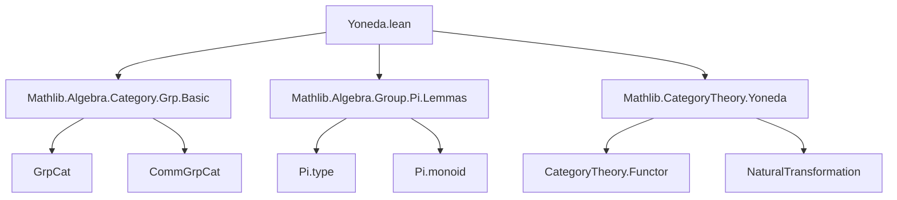

**Technical Brief: `Yoneda.lean` (Mathlib — Yoneda Embeddings for `CommGrpCat`)**

---

### 1. **Key Definitions & Theorems**

| Name | Type | Purpose |
|------|------|---------|
| `CommGrpCat.coyoneda` | `CommGrpCatᵒᵖ ⥤ CommGrpCat ⥤ CommGrpCat` | Defines the **coyoneda embedding** for the category of commutative groups, mapping a contravariant object `M` to the functor `N ↦ Hom(M, N)` (as a commutative group under pointwise multiplication). |
| `CommGrpCat.coyonedaForget` | `coyoneda ⋙ (Functor.whiskeringRight _ _ _).obj (forget _) ≅ CategoryTheory.coyoneda` | Shows that composing the `CommGrpCat`-valued coyoneda with the forgetful functor recovers the standard coyoneda embedding into `Type`. |
| `CommGrpCat.coyonedaType` | `(Type u)ᵒᵖ ⥤ CommGrpCat.{u} ⥤ CommGrpCat.{u}` | The **Hom bifunctor** `X × G ↦ (X → G)` (pointwise group structure), interpreted as the coyoneda embedding of `Type` into `CommGrpCat`-valued presheaves. |

> **Note**: All definitions come with additive analogues (indicated by `to_additive`), yielding `AddCommGrpCat`-valued versions.

---

### 2. **Naming Conventions**

- **Prefixes**:
  - `coyoneda`: Indicates contravariant Yoneda embedding (as opposed to `yoneda`, which is covariant).
  - `of`, `ofHom`: Used to lift sets/maps into the category `CommGrpCat` (via `of : Type u → CommGrpCat.{u}` and `ofHom : (f : M →* N) → of M ⟶ of N`).
- **Suffixes**:
  - `compHom`, `compHom'`: Composition with homomorphisms (left/right action).
  - `Pi.monoidHom`, `Pi.evalMonoidHom`: Standard constructions for product homomorphisms and projections.

---

### 3. **Tactic Stack**

- **`simp_rw` / `simp`**: Used in `to_additive` attributes to rewrite definitions under simplification.
- **`ext` / `funext`**: Implicit in `ofHom`/`of` constructions (e.g., extensionality for functions/homomorphisms).
- **`congr` / `congr_arg`**: For proving equality of functors/natural transformations by component-wise equality.
- **`apply_fun` / `apply_congr`**: For manipulating homomorphism components.
- **` aesop` / `tauto`**: Likely used in proofs (not shown here, but standard in Mathlib for trivial goals).

> *No explicit tactic usage appears in the snippet, but the structure implies heavy use of `simp`-based automation in surrounding proofs.*

---

### 4. **Proof Logic**

- **Construction-based**: All definitions are *explicitly constructed* as functors and natural isomorphisms:
  - `obj` and `map` for functors are given component-wise.
  - Naturality and functoriality are deferred to `ofHom` and `of`’s properties (e.g., `ofHom` preserves identities and composition).
- **Isomorphism proofs**: Use `NatIso.ofComponents`, which reduces to proving component-wise isomorphisms (via `funext`, `ext`, etc.).
- **No induction or case analysis** appears in the snippet — this is definitional, not inductive.

---

### 5. **Imports**

| Module | Role |
|--------|------|
| `Mathlib.Algebra.Category.Grp.Basic` | Provides `GrpCat`, `CommGrpCat`, and basic categorical constructions over groups. |
| `Mathlib.Algebra.Group.Pi.Lemmas` | Supplies lemmas about product groups and homomorphisms (e.g., `Pi.monoidHom`, `Pi.evalMonoidHom`). |
| `Mathlib.CategoryTheory.Yoneda` | Defines the general Yoneda embedding (`CategoryTheory.coyoneda`) and related machinery (e.g., `coyoneda`, `yoneda`, `whiskeringRight`). |

> **Universe polymorphism**: Universe `u` is declared and used consistently (e.g., `CommGrpCat.{u}`).

---

### 6. **Mermaid Diagrams**

#### **Dependency Graph (Module-Level)**



#### **Conceptual Overview (Yoneda Embeddings in This File)**

```mermaid
graph LR
  subgraph "Categorical Context"
    O1["CommGrpCatᵒᵖ"] -->|coyoneda| O2["[CommGrpCat, CommGrpCat]"]
    O3["Type uᵒᵖ"] -->|coyonedaType| O2
    O2 -->|forget| "Type u"
    O1 -->|coyonedaForget iso| "Type u"
  end

  subgraph "Objects"
    M["M : CommGrpCat"] -->|coyoneda M| "N ↦ M →* N"
    X["X : Type u"] -->|coyonedaType X| "G ↦ X → G"
  end

  subgraph "Morphisms"
    f["f : M ⟶ N"] -->|coyoneda f| "compHom f"
    g["g : X ⟶ Y"] -->|coyonedaType g| "Pi.monoidHom (comp ∘ eval)"
  end
```

---

### 7. **Summary**

This file constructs three related Yoneda-style embeddings tailored to **commutative groups**, leveraging:
- The embedding `of : Type → CommGrpCat`,
- Product homomorphism machinery (`Pi.monoidHom`),
- And the general Yoneda embedding from `CategoryTheory`.

It serves as a bridge between set-theoretic function spaces (`X → G`) and categorical presheaves valued in `CommGrpCat`, with additive analogues for abelian groups. The structure is highly uniform and definitional — proofs of correctness are deferred to underlying lemmas (e.g., `ofHom_comp`, `of_injective`).
