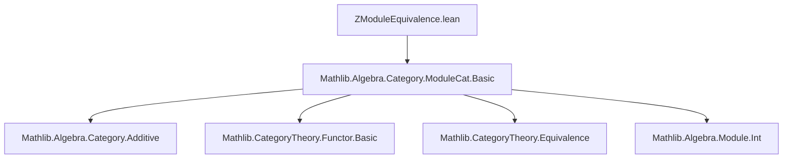

**Technical Brief: `ZModuleEquivalence.lean`**

---

### 1. **Key Definitions & Theorems**

| Name | Type / Signature | Purpose |
|------|------------------|---------|
| `forget₂_addCommGroup_full` | `Instance : (forget₂ (ModuleCat ℤ) AddCommGrpCat.{u}).Full` | Proves the forgetful functor from `ℤ`-modules to additive commutative groups is *full*: every group homomorphism lifts uniquely to a `ℤ`-linear map. |
| `forget₂_addCommGrp_essSurj` | `Instance : (forget₂ (ModuleCat ℤ) AddCommGrpCat.{u}).EssSurj` | Proves the forgetful functor is *essentially surjective*: every additive commutative group admits a `ℤ`-module structure (via `ModuleCat.of ℤ A`) making it isomorphic to the image of that module under forgetfulness. |
| `forget₂AddCommGroupIsEquivalence` | `Noncomputable Instance : (forget₂ (ModuleCat ℤ) AddCommGrpCat.{u}).IsEquivalence` | Concludes the forgetful functor is an *equivalence of categories*, by combining fullness and essential surjectivity (and implicitly faithfulness, which holds by definition of `forget₂`). |

**Auxiliary constructions used:**
- `ModuleCat.ofHom`: constructs a morphism in `ModuleCat ℤ` from a group homomorphism satisfying linearity.
- `LinearMap.mk`: builds a linear map from a function satisfying additivity and `ℤ`-equivariance.
- `int_smul_eq_zsmul`: identifies integer scalar multiplication (`ℤ`-action) with `zsmul` in additive groups.

---

### 2. **Naming Conventions**

- **Prefixes:**
  - `forget₂_`: indicates forgetful functors from `ModuleCat R` to `AddCommGrpCat` (2-step forget: `ModuleCat R → AddMonoidCat → AddCommGrpCat`).
  - `is_`/`mem_essImage`: standard in category theory for essential image membership.
- **Suffixes:**
  - `_full`, `_essSurj`, `_IsEquivalence`: denote properties of functors being full, essentially surjective, or an equivalence.
- **Function names:**
  - `ofHom`, `of`: standard in `ModuleCat` for constructing objects/morphisms from underlying additive structure.
  - `map_add`, `map_zsmul`: standard homomorphism properties.

---

### 3. **Tactic Stack**

| Tactic | Usage Frequency | Role |
|--------|-----------------|------|
| `ext` | High | To prove equality of functions/morphisms by extensionality. |
| `convert` | Medium | To reduce goals using definitional equalities (e.g., `int_smul_eq_zsmul`). |
| `apply` | Medium | To apply lemmas (e.g., `int_smul_eq_zsmul`). |
| ` rfl` | Medium | To close reflexive equalities (e.g., in inverse pairs). |
| `exact` (implicit via `⟨...⟩`) | High | To construct proofs/instances via structure packing. |
| `aesop`, `ring`, `simp_rw` | Not present | Not used in this file — proofs are mostly manual and structural. |

---

### 4. **Proof Logic**

The proof proceeds in three steps:

1. **Fullness** (`forget₂_addCommGroup_full`):
   - Given a morphism `f : A ⟶ B` in `AddCommGrpCat` (i.e., an additive homomorphism),
   - Construct a `ℤ`-linear map by lifting `f.hom` using `LinearMap.mk`.
   - Verify `ℤ`-equivariance using `int_smul_eq_zsmul` and `map_zsmul`.
   - Show the lift maps to `f` under forgetfulness via `rfl`.

2. **Essential Surjectivity** (`forget₂_addCommGrp_essSurj`):
   - For any `A : AddCommGrpCat`, equip it with the canonical `ℤ`-module structure via `ModuleCat.of ℤ A`.
   - The identity morphism `𝟙 A` gives an isomorphism `A ≅ forget₂ (ModuleCat ℤ) AddCommGrpCat (ModuleCat.of ℤ A)`.

3. **Equivalence** (`forget₂AddCommGroupIsEquivalence`):
   - Uses `IsEquivalence.of_full_ess_surj` (implicit in Lean’s `CategoryTheory.Equivalence` infrastructure).
   - Faithfulness of `forget₂` is automatic (it’s a forgetful functor between concrete categories).

---

### 5. **Imports**

| Import | Role |
|--------|------|
| `Mathlib.Algebra.Category.ModuleCat.Basic` | Provides `ModuleCat`, `forget₂`, `of`, `ofHom`, and basic module categorical constructions. |

No other imports are used — the file is self-contained within `ModuleCat` and basic category theory.

---

### 6. **Mermaid Diagrams**

#### **Dependency Graph (File-Level)**



#### **Category-Theoretic Overview**

```mermaid
graph LR
  ModuleCat ℤ -- forget₂ --> AddCommGrpCat
  AddCommGrpCat -- ModuleCat.of ℤ --> ModuleCat ℤ
  ModuleCat ℤ -- id --> ModuleCat ℤ
  AddCommGrpCat -- id --> AddCommGrpCat

  %% Natural isomorphisms
  ModuleCat ℤ -- η ⇒ --> forget₂ ∘ ModuleCat.of ℤ
  AddCommGrpCat -- ε ⇒ --> ModuleCat.of ℤ ∘ forget₂
```

- `forget₂ : ModuleCat ℤ → AddCommGrpCat` is the forgetful functor.
- `ModuleCat.of ℤ : AddCommGrpCat → ModuleCat ℤ` is its (pseudo-)inverse.
- The equivalence is witnessed by natural isomorphisms `η : 1 ⇒ forget₂ ∘ of` and `ε : of ∘ forget₂ ⇒ 1`, both given by identity maps.

---

### 7. **TODO & Future Work**

- **Monoidal structure**: The file notes that either:
  - Transport the monoidal structure (`⊗ ℤ`, `ℤ`) from `ModuleCat ℤ` along the equivalence to `AddCommGrpCat`, or
  - Construct the monoidal structure on `AddCommGrpCat` directly (e.g., via tensor product of abelian groups) and prove the equivalence is *monoidal*.

This would justify identifying `Ab ≃ ModuleCat ℤ` as a *symmetric monoidal equivalence*.

--- 

**End of Brief**
