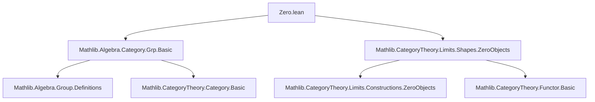
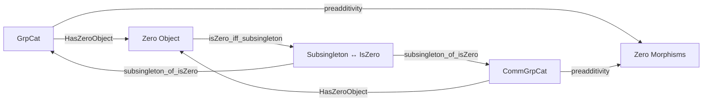

**Technical Brief: `Zero.lean` — Zero Object in `GrpCat` and `CommGrpCat`**

---

### 1. **Key Definitions & Theorems**

| Name | Type | Purpose |
|------|------|---------|
| `isZero_of_subsingleton` (for `GrpCat`) | `∀ (G : GrpCat), [Subsingleton G] → IsZero G` | Shows any subsingleton group is a zero object. Constructs unique morphisms to/from it. |
| `isZero_of_subsingleton` (for `CommGrpCat`) | `∀ (G : CommGrpCat), [Subsingleton G] → IsZero G` | Same as above, but for commutative groups. |
| `GrpCat.hasZeroObject` | `HasZeroObject GrpCat` | Instance proving `GrpCat` has a zero object: the trivial group `of PUnit`. |
| `CommGrpCat.hasZeroObject` | `HasZeroObject CommGrpCat` | Same for `CommGrpCat`. |
| `subsingleton_of_isZero` | `∀ (G : GrpCat), IsZero G → Subsingleton G` | Converse: if an object is zero, then its underlying type is subsingleton. |
| `isZero_iff_subsingleton` | `∀ (G : GrpCat), IsZero G ↔ Subsingleton G` | Equivalence between being a zero object and being subsingleton. Same for `CommGrpCat`. |

All theorems are duplicated for additive notation via `@[to_additive]`, with corresponding names like `AddGrpCat.hasZeroObject`.

---

### 2. **Naming Conventions**

- **Prefixes**:
  - `isZero_`: relates to `Limits.IsZero` (zero object property).
  - `subsingleton_of_`: implication from zero object to subsingleton.
- **Suffixes**:
  - `_of_subsingleton`: direction from subsingleton to zero object.
  - `_iff_subsingleton`: equivalence statement.
- **Instance naming**:
  - `HasZeroObject` instances named after the category (`GrpCat.hasZeroObject`, `CommGrpCat.hasZeroObject`).
- **Additive variants**:
  - Use `@[to_additive]` attribute; additive names inferred automatically (e.g., `AddGrpCat.hasZeroObject`).

---

### 3. **Tactic Stack**

- `refine ⟨..., ...⟩`: to construct pairs of morphisms (for `IsZero`).
- `ext x` / `ext`: extensionality for functions/elements.
- `subsingleton`: tactic to solve goals using `Subsingleton` instances.
- `rw [this, map_one, map_one]`: rewriting using equality derived from subsinglton and group homomorphism properties (`map_one`).
- Implicit use of `Subsingleton.elim _ _` to derive equalities.

No heavy automation (e.g., `aesop`, `ring`, `simp_rw`) is used—proofs are mostly manual but straightforward.

---

### 4. **Proof Logic**

- **Structure**:
  1. Prove `isZero_of_subsingleton` by constructing the unique morphism to/from any object using the constant map at identity.
  2. Use `Subsingleton.elim` to show all elements are equal, and `map_one` to verify morphism laws.
  3. For the converse (`subsingleton_of_isZero`), use that any zero object is isomorphic to the terminal/initial object (here `of PUnit`), and pull back the subsingleton property via the isomorphism.
  4. Combine both directions into `isZero_iff_subsingleton`.

- **Pattern**:
  - Induction-free; relies on categorical definitions (`IsZero`, `HasZeroObject`) and type-theoretic properties (`Subsingleton`, `PUnit`).
  - Symmetric for `GrpCat` and `CommGrpCat`, with `to_additive` handling additive variants.

---

### 5. **Imports**

- `Mathlib.Algebra.Category.Grp.Basic`: defines `GrpCat`, `CommGrpCat`, morphisms, etc.
- `Mathlib.CategoryTheory.Limits.Shapes.ZeroObjects`: defines `IsZero`, `HasZeroObject`, zero morphisms.

These imports define the ambient categorical and algebraic structure.

---

### 6. **Mermaid Diagrams**

#### Dependency Graph (Module-Level)

#### Overview of Theoretical Flow

> **Note**: The comment in the file notes that *zero morphisms* for `AddCommGroup` are inferred from *preadditivity*, not directly from the zero object—this file focuses on the zero object existence, not the full preadditive structure.

--- 

Let me know if you'd like the additive version (`AddGrpCat`) formalized separately or want to extend this to `Mod R`.
