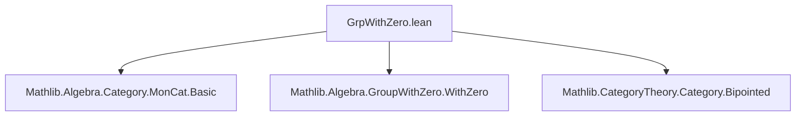
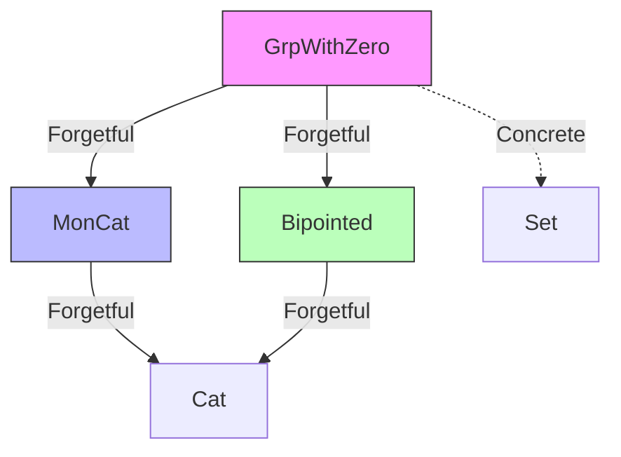
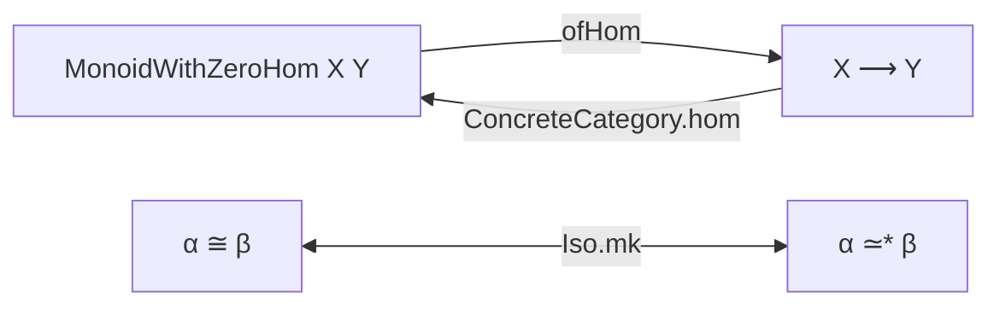

**Technical Brief: `GrpWithZero.lean`**

---

### 1. **Key Definitions & Theorems**

| Name | Type / Signature | Purpose |
|------|------------------|---------|
| `GrpWithZero` | `Type u → Type u` (structure) | Bundled category of groups with zero (i.e., groups equipped with a zero element, where multiplication respects zero). |
| `of` | `GrpWithZero.of : GroupWithZero α → GrpWithZero` | Constructor to build a bundled `GrpWithZero` from an unbundled `GroupWithZero`. |
| `carrier` | `GrpWithZero → Type*` | Projection of the underlying type. |
| `Hom` | `X ⟶ Y := MonoidWithZeroHom X Y` | Morphisms in `GrpWithZero` are zero-preserving monoid homomorphisms. |
| `id`, `comp` | `MonoidWithZeroHom.id`, `comp` | Identity and composition inherited from `MonoidWithZeroHom`. |
| `ofHom` | `MonoidWithZeroHom X Y → of X ⟶ of Y` | Embeds unbundled zero-preserving monoid homs as categorical morphisms. |
| `Iso.mk` | `(e : α ≃* β) → α ≅ β` | Constructs a categorical isomorphism from a group-with-zero isomorphism. |
| `hasForgetToBipointed` | `HasForget₂ GrpWithZero Bipointed` | Forgets to bipointed objects (objects with distinguished zero and one). |
| `hasForgetToMon` | `HasForget₂ GrpWithZero MonCat` | Forgets to the category of monoids. |
| `groupWithZeroConcreteCategory` | `ConcreteCategory GrpWithZero (MonoidWithZeroHom · ·)` | Equips `GrpWithZero` with a concrete structure over `MonoidWithZeroHom`. |

**No theorems are named explicitly beyond lemmas like `hom_id`, `hom_comp`, etc., which are definitional equalities.**

---

### 2. **Naming Conventions**

- **Prefixes**:
  - `of_`: for unbundled-to-bundled embeddings (`ofHom`, `of`).
  - `hom_`: for projections from categorical morphisms to underlying functions (`hom_id`, `hom_comp`).
  - `coe_`: for coercion lemmas (`coe_id`, `coe_comp`).
  - `forget_`: for forgetful functor actions (`forget_map`).
- **Suffixes**:
  - `_mk`: for isomorphism constructors (`Iso.mk`).
  - `_to_`: for coercion to underlying homs (`toMonoidHom` in `hasForgetToMon`).
- **Structure fields**:
  - `carrier`, `str` (for structure instance).

---

### 3. **Tactic Stack**

- **`ext`**: Used twice in `Iso.mk` to prove morphism inverses — relies on extensionality of functions.
- **`rfl`**: Dominates proofs — most lemmas are definitional (`hom_id`, `hom_comp`, `coe_id`, `coe_comp`, `forget_map`).
- **No heavy automation** (e.g., no `aesop`, `ring`, `simp_rw`) — proofs are trivial or definitional.

---

### 4. **Proof Logic**

- **Definitional equality-driven**: Almost all proofs are `rfl`, indicating that structure is defined so that equalities hold *by definition*.
- **Extensionality for isomorphisms**: In `Iso.mk`, after constructing `hom` and `inv`, the two inverse laws are proven by `ext` + `e.symm_apply_apply _` / `e.apply_symm_apply _`, i.e., using the group isomorphism properties.
- **No induction or case analysis** — the structure is categorical and algebraic, not inductive.

---

### 5. **Imports**

| Import | Purpose |
|--------|---------|
| `Mathlib.Algebra.Category.MonCat.Basic` | Provides `MonCat`, the category of monoids. |
| `Mathlib.Algebra.GroupWithZero.WithZero` | Defines `GroupWithZero`, the algebraic structure (unbundled). |
| `Mathlib.CategoryTheory.Category.Bipointed` | Provides `Bipointed`, used for `HasForget₂` to bipointed objects (objects with two distinguished points: 0 and 1). |

---

### 8. **Mermaid Diagrams**

#### **Dependency Graph (Module-Level)**

#### **Category-Theoretic Overview**

- **Concrete structure**: `GrpWithZero` is concretely modeled over `Set` via `carrier` and `MonoidWithZeroHom`.
- **Forgetful functors**:
  - `forget₂ : GrpWithZero → Bipointed`: sends `X` to `(X, 0, 1)`, and `f` to `⟨f, f.map_zero', f.map_one'⟩`.
  - `forget₂ : GrpWithZero → MonCat`: sends `X` to `MonCat.of X`, and `f` to `MonCat.ofHom f.toMonoidHom`.

#### **Morphism & Isomorphism Flow**

- `ofHom` embeds unbundled zero-preserving homs into categorical morphisms.
- `Iso.mk` lifts group-with-zero isomorphisms (`≃*`) to categorical isomorphisms (`≅`).

---

**Summary**:  
`GrpWithZero.lean` formalizes the category of groups with zero as a concrete category over `MonoidWithZeroHom`, leveraging Lean’s bundling mechanism and category-theoretic infrastructure. It is minimal, definitional, and designed for compatibility with `MonCat`, `Bipointed`, and algebraic structures like `GroupWithZero`.
