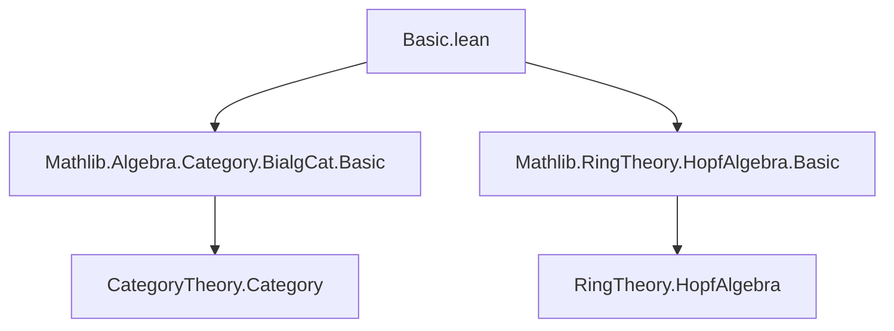
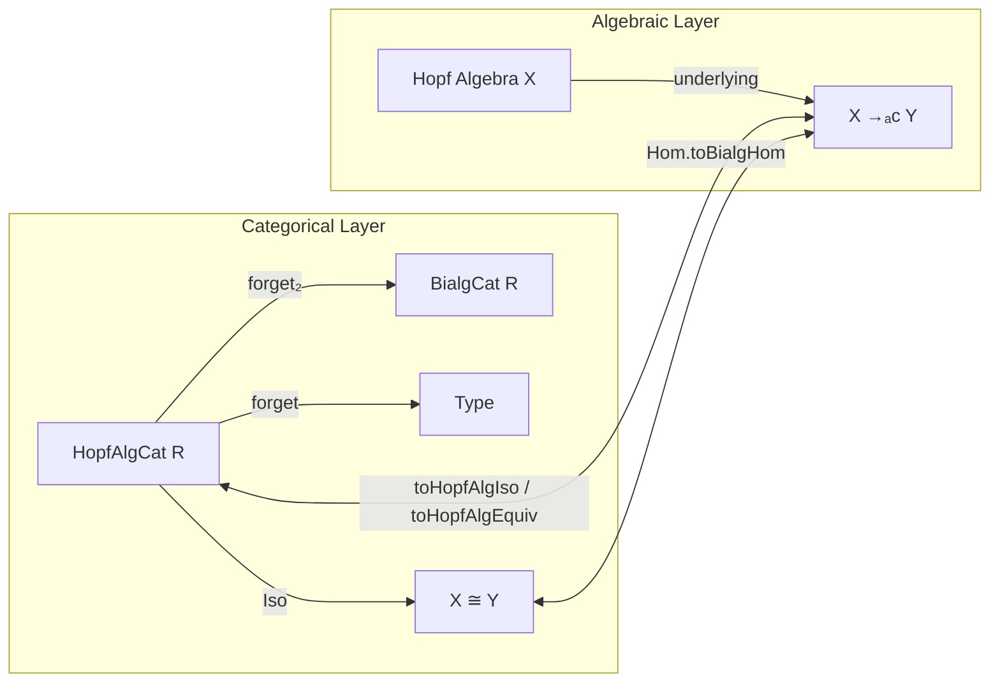
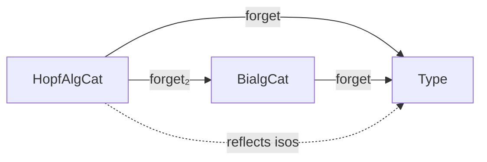

**Technical Brief: `Basic.lean` — Category of Hopf Algebras over a Commutative Ring**

---

### 1. **Key Definitions & Theorems**

| Name | Type / Structure | Purpose |
|------|------------------|---------|
| `HopfAlgCat R` | `Type (u+1) → Type u → Type u` (universe-polymorphic) | Bundled category of Hopf algebras over a commutative ring `R`. Objects are types equipped with a ring and Hopf algebra structure over `R`. |
| `Hom V W` | `Structure` | Morphisms in `HopfAlgCat R` are `BialgHom`s (bialgebra homomorphisms) between underlying bialgebras. |
| `of R X` | `abbrev` | Embeds a concrete `R`-Hopf algebra `X` as an object in `HopfAlgCat R`. |
| `ofHom f` | `abbrev` | Lifts a `BialgHom` `f : X →ₐc[R] Y` to a morphism `of R X ⟶ of R Y` in `HopfAlgCat R`. |
| `Hom.toBialgHom f` | `abbrev` | Forgets the categorical structure to recover the underlying `BialgHom`. |
| `hasForgetToBialgebra` | `instance` | Provides the forgetful functor `HopfAlgCat R → BialgCat R`. |
| `BialgEquiv.toHopfAlgIso e` | `def` | Converts a bialgebra equivalence `e : X ≃ₐc[R] Y` into an isomorphism `of R X ≅ of R Y` in `HopfAlgCat R`. |
| `CategoryTheory.Iso.toHopfAlgEquiv i` | `def` | Converts an isomorphism `i : X ≅ Y` in `HopfAlgCat R` back to a bialgebra equivalence `X ≃ₐc[R] Y`. |
| `HopfAlgCat.forget_reflects_isos` | `instance` | The forgetful functor `HopfAlgCat R → Type` reflects isomorphisms (i.e., if the underlying map is an iso, then the categorical map is an iso). |

**Key lemmas**:
- `of_comul`, `of_counit`: `of` preserves coalgebra structure.
- `hom_ext`, `Hom.toBialgHom_injective`: Extensionality via underlying bialgebra hom.
- `toBialgHom_comp`, `toBialgHom_id`: Compatibility of `Hom.toBialgHom` with composition and identity.
- `toHopfAlgIso_*`, `toHopfAlgEquiv_*`: Functonality of the equivalence between bialgebra isos/equivalences and categorical isos.

---

### 2. **Naming Conventions**

- **Prefixes**:
  - `of_`: Embedding from concrete algebraic objects to bundled ones (`of`, `ofHom`).
  - `to_`: Conversion *to* bundled/categorical form (`toBialgHom`, `toHopfAlgIso`, `toHopfAlgEquiv`).
  - `forget₂_`: Forgetful functor components (`forget₂_bialgebra_obj`, `forget₂_bialgebra_map`).
- **Suffixes**:
  - `_hom`, `_inv`: Hom/inv parts of isomorphisms (e.g., `i.hom`, `i.inv`).
  - `_id`, `_symm`, `_trans`: Identity, symmetry, transitivity lemmas.
- **Structure fields**:
  - `toBialgHom'`: Internal field (prime indicates internal representation).
  - `carrier`: Underlying type.

---

### 3. **Tactic Stack**

Frequent tactics used in proofs and automation:
- `rfl`: For definitional equalities (e.g., `of_comul`, `toBialgHom_id`).
- `congr`: To apply congruence on equalities of functions/structures.
- `ext`: Extensionality (via `@[ext]` attributes on `Hom` and `BialgEquiv`).
- `Funext`, `DFunLike.ext`: For extensionality of functions.
- `congr_arg` + `BialgHom.congr_fun`: To extract pointwise equalities from morphism equalities.
- `simp` (implicit via `@[simp]` attributes): For simplification of `of`, `toBialgHom`, etc.
- `let` + `exact`: In `reflects_isos`, to construct the inverse using the equivalence of underlying types.

No heavy automation (e.g., `aesop`, `ring`, `linarith`) appears—proofs are mostly definitional or rely on structure-preserving properties.

---

### 4. **Proof Logic**

- **Structure**: The development follows the standard bundled-category pattern (cf. `QuadraticModuleCat.lean`):
  1. Define bundled objects (`HopfAlgCat`) with implicit instances.
  2. Define morphisms as algebraic homs (`BialgHom`) with explicit coercion.
  3. Define category structure via `ConcreteCategory`.
  4. Define forgetful functors and prove they preserve/reflect structure.
  5. Establish equivalence between categorical isomorphisms and algebraic equivalences (`BialgEquiv` ↔ `Iso`).
- **Typical proof flow**:
  - Use `ext` to reduce morphism equality to equality of underlying maps.
  - Use `simp` + `rfl` for structure-compatibility lemmas (e.g., `of_comul`).
  - For reflection of isomorphisms: construct equivalence via underlying map + inverse, then lift to iso.

---

### 5. **Imports & Dependencies**

| Import | Purpose |
|--------|---------|
| `Mathlib.Algebra.Category.BialgCat.Basic` | Provides `BialgCat`, `BialgHom`, `BialgEquiv`, and forgetful structure. |
| `Mathlib.RingTheory.HopfAlgebra.Basic` | Provides bundled `HopfAlgebra R A` typeclass and basic constructions. |
| `CategoryTheory` (core) | For `Category`, `ConcreteCategory`, `Iso`, `HasForget₂`, etc. |

**Scope**: This module sits *above* Hopf algebra theory and bialgebra category theory, forming a categorical refinement.

---

### 6. **Mermaid Diagrams**

#### **Dependency Graph (Module-Level)**

#### **Theoretical Overview (Object/Morphism Relationships)**

#### **Forgetful Functors**

---

### Summary

This file formalizes the **category of Hopf algebras over a commutative ring** `R`, building on the bialgebra category and Hopf algebra theory. It follows a standard bundled-category pattern, emphasizing:
- **Exact correspondence** between categorical isomorphisms and algebraic equivalences.
- **Forgetful functors** to both `BialgCat` and `Type`.
- **Extensionality principles** via underlying bialgebra homs.

The development is highly structured, with minimal automation—proofs rely on definitional equalities and structure-preserving properties.
