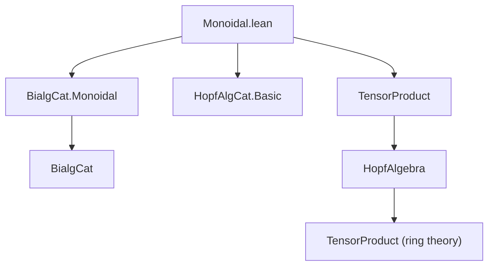
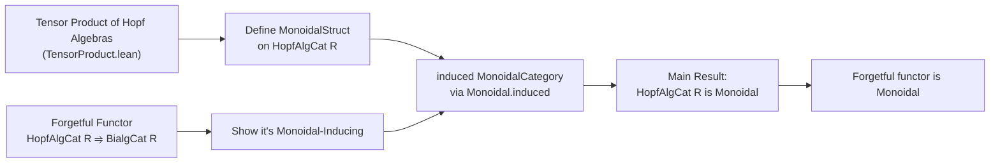

**Technical Brief: `Monoidal.lean` — Monoidal Structure on `HopfAlgCat R`**

---

### 1. **Key Definitions & Theorems**

| Name | Type / Signature | Purpose |
|------|------------------|---------|
| `instMonoidalCategoryStruct` | `MonoidalCategoryStruct.{u} (HopfAlgCat R)` | Constructs the *preliminary* monoidal structure data on `HopfAlgCat R` using tensor product of Hopf algebras and existing bialgebra tensor constructions. |
| `MonoidalCategory.inducingFunctorData` | `Monoidal.InducingFunctorData (forget₂ (HopfAlgCat R) (BialgCat R))` | Provides the data showing that the forgetful functor `HopfAlgCat R ⥤ BialgCat R` *induces* a monoidal structure on `HopfAlgCat R` from that on `BialgCat R`. |
| `instMonoidalCategory` | `MonoidalCategory (HopfAlgCat R)` | The final monoidal category instance, obtained via `Monoidal.induced` using the forgetful functor and `inducingFunctorData`. |
| `forget₂ (HopfAlgCat R) (BialgCat R).Monoidal` | Instance | Shows the forgetful functor is *strictly* monoidal (i.e., preserves tensor unit and tensor product on the nose). |

---

### 2. **Naming Conventions**

- **Prefixes**:
  - `inst_`: for typeclass instances (`instMonoidalCategoryStruct`, `instMonoidalCategory`)
  - `forget₂`: standard Mathlib notation for the forgetful functor from Hopf algebras to bialgebras.
- **Suffixes**:
  - `_eq`: used in `inducingFunctorData` to denote proofs of equality/commutativity of diagrams (e.g., `whiskerLeft_eq`, `associator_eq`)
- **Functional naming**:
  - `of R _`, `ofHom _`: embedding constructions from underlying algebraic objects into the categorical setting.
  - `lTensor`, `rTensor`, `map`: inherited from `TensorProduct` and `Bialgebra.TensorProduct`.

---

### 3. **Tactic Stack**

- `ext`: used repeatedly to extend extensionality over linear maps, tensor products, and homs.
- `rfl`: for definitional equalities (e.g., `Iso.refl _` reduces to `rfl` in many cases).
- `TensorProduct.ext`, `BialgCat.Hom.ext`, `BialgHom.coe_linearMap_injective`: to prove equality of morphisms via underlying linear maps.
- `by ext; rfl`: standard pattern for proving definitional equalities in hom-spaces.
- `simp_rw` is *not* used here — the file relies on `ext` + definitional reduction.

---

### 4. **Proof Logic**

- **Strategy**: *Transport of monoidal structure along a forgetful functor*.
  - Step 1: Define monoidal structure data (`tensorObj`, `whiskerLeft`, etc.) on `HopfAlgCat R` using the tensor product of Hopf algebras (already constructed in `TensorProduct.lean`).
  - Step 2: Show that the forgetful functor `forget₂ : HopfAlgCat R ⥤ BialgCat R` satisfies the conditions of `Monoidal.inducingFunctorData`, i.e., it *reflects* the monoidal structure from `BialgCat R`.
  - Step 3: Apply `Monoidal.induced` to lift the monoidal structure from `BialgCat R` to `HopfAlgCat R`.
  - Step 4: Prove the forgetful functor is monoidal (trivial on objects/morphisms, since the structure is defined via it).

- **Key proof technique**: Use `BialgHom.coe_linearMap_injective` to reduce equality of bialgebra homs to equality of linear maps, then use `TensorProduct.ext` twice to reduce to element-wise equality.

---

### 5. **Imports**

| Import | Role |
|--------|------|
| `Mathlib.Algebra.Category.BialgCat.Monoidal` | Provides the monoidal structure on `BialgCat R`, including `tensorObj`, `associator`, etc. |
| `Mathlib.Algebra.Category.HopfAlgCat.Basic` | Defines `HopfAlgCat R`, `of`, `ofHom`, and basic categorical structure. |
| `Mathlib.RingTheory.HopfAlgebra.TensorProduct` | Constructs the Hopf algebra structure on $A \otimes_R B$, and the associator/left/right unitors as Hopf algebra isomorphisms. |

---

### 8. **Mermaid Diagrams**

#### **Dependency Graph (Module-Level)**



#### **Overview of `Monoidal.lean`**



#### **Categorical Structure Diagram**

```mermaid
graph LR
  subgraph "Underlying Algebraic World"
    H1["Hopf R-Algebra A"] -->|⊗[R]| H2["Hopf R-Algebra A ⊗ B"]
    H3["Hopf R-Algebra B"] -->|⊗[R]| H2
  end

  subgraph "Categorical World"
    A["HopfAlgCat R"] -->|tensorObj| B["HopfAlgCat R"]
    B -->|tensorObj| C["HopfAlgCat R"]
    A -->|tensorHom| D["Hom-space"]
  end

  subgraph "Forgetful Functor"
    A -->|forget₂| BA["BialgCat R"]
    B -->|forget₂| BB
    C -->|forget₂| BC
    BA -->|tensorObj| BB
    BB -->|tensorObj| BC
  end

  style A fill:#f9f,stroke:#333
  style BA fill:#bbf,stroke:#333
```

--- 

This file formalizes the *monoidal closure* of Hopf algebras over a commutative ring, leveraging existing bialgebra theory and tensor product constructions. It exemplifies Mathlib’s “structure transport” pattern: building new categorical structures by reflecting along forgetful functors.
