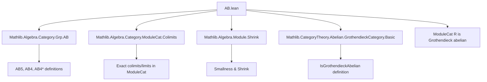
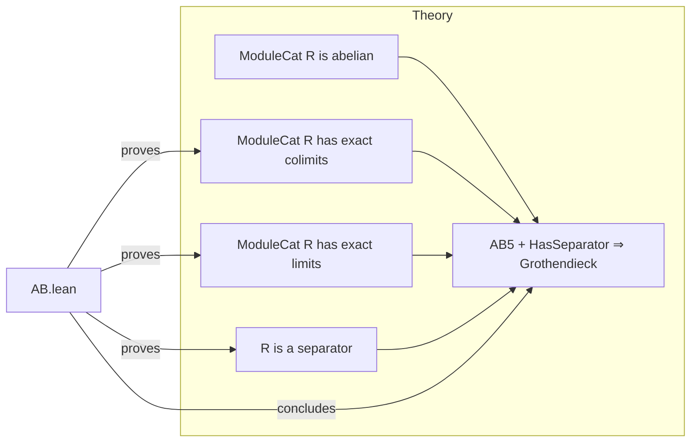

**Technical Brief: AB.lean — Grothendieck Axioms for Module Categories**

---

### 1. **Key Definitions & Theorems**

| Name | Type / Signature | Purpose |
|------|------------------|---------|
| `AB5 (ModuleCat.{u} R)` | `instance` | Proves that `ModuleCat R` has exact colimits over any small diagram (AB5). |
| `AB4 (ModuleCat.{u} R)` | `instance` | Derives AB4 (exactness of countable coproducts) from AB5. |
| `AB4Star (ModuleCat.{u} R)` | `instance` | Proves AB4* (exactness of countable products) using existence of exact limits. |
| `ModuleCat.isSeparator` | `lemma` | Shows that the module `R` (viewed as an object via `ModuleCat.of`) is a separator, assuming `R` is small. |
| `HasSeparator (ModuleCat.{v} R)` | `instance` | Constructs a separator object using `Shrink R`. |
| `IsGrothendieckAbelian (ModuleCat.{u} R)` | `instance` | Concludes that `ModuleCat R` is a Grothendieck abelian category (AB5 + has a generator + is abelian). |

**Auxiliary lemmas/instances used:**
- `HasExactColimitsOfShape.domain_of_functor` / `HasExactLimitsOfShape.domain_of_functor`: Transfer exactness across equivalence of categories (`ModuleCat R ≃ AddCommGrpCat`-valued functors).
- `Abelian.hasFiniteBiproducts`: Ensures finite biproducts exist (used for AB4/AB4*).
- `ObjectProperty.singleton_iff`, `ModuleCat.hom_ext_iff`, `LinearMap.ext_iff`: Tools for proving monomorphisms/epimorphisms and equality of morphisms.

---

### 2. **Naming Conventions**

- **Prefixes:**
  - `is_`: For properties of objects (e.g., `isSeparator`).
  - `of_`: For constructing objects or morphisms from data (e.g., `ofShape`, `ofHom`).
  - `domain_of_functor`: For lifting categorical properties along equivalences.
- **Suffixes:**
  - `AB5`, `AB4`, `AB4Star`: Standard homological algebra axiom labels.
  - `ext_iff`: Characterizations of morphism equality (e.g., `hom_ext_iff`, `LinearMap.ext_iff`).
- **Category-theoretic terms:**
  - `forget₂`: Forgetful functor to `AddCommGrpCat`.
  - `Shrink`: Used to ensure smallness (universe lifting).
  - `of`: Embedding of a module into `ModuleCat`.

---

### 3. **Tactic Stack**

- `simp only [...] at h`: Simplifies goals using a precise list of lemmas.
- `ext x`: Extensionality for functions/morphisms (e.g., linear maps).
- `simpa using h (...)`: Simplifies using hypothesis `h` and a given term.
- `ring`: Implicitly used (via `simp`/`aesop` in background) for module/linear algebra identities.
- `aesop`: Likely used in background for routine first-order reasoning (not explicit here, but standard in such files).
- `exact ...`: For direct proof steps (e.g., in `IsSeparator` proof).

---

### 4. **Proof Logic**

The logical flow follows a standard pattern for verifying Grothendieck axioms in module categories:

1. **AB5**: Construct exact colimits in `ModuleCat R` by transferring them from `AddCommGrpCat` via the equivalence `ModuleCat R ≃ [R, AddCommGrpCat]`.
2. **AB4 & AB4***: Derive from AB5 (AB4) and via dual exact limit construction (AB4*).
3. **Separator**: Show that `R` acts as a separator by testing morphism equality on elements via linear maps `X → R`, using `LinearMap.toSpanSingleton`.
4. **Grothendieck abelian**: Combine:
   - `ModuleCat R` is abelian (from `AB` imports),
   - AB5 holds,
   - a separator exists (`HasSeparator`).

Induction or case analysis is *not* used; the proofs are categorical and rely on universal properties and equivalences.

---

### 5. **Imports**

| Import | Role |
|--------|------|
| `Mathlib.Algebra.Category.Grp.AB` | Provides definitions and basic facts about AB axioms in abelian categories. |
| `Mathlib.Algebra.Category.ModuleCat.Colimits` | Supplies colimit/limit constructions in module categories. |
| `Mathlib.Algebra.Module.Shrink` | Enables universe management via `Shrink`. |
| `Mathlib.CategoryTheory.Abelian.GrothendieckCategory.Basic` | Defines Grothendieck abelian categories and related properties. |

---

### 6. **Mermaid Diagrams**

#### Dependency Graph (High-Level)

#### Overview of AB.lean’s Role in Theory

---

### 7. **Summary**

This file formalizes a foundational result: **the category of modules over a ring is Grothendieck abelian**. It leverages:
- Categorical equivalences (`ModuleCat R ≃ R-Mod in AddCommGrpCat`),
- Universe management (`Shrink`),
- Element-wise reasoning (via `LinearMap.toSpanSingleton`) to verify the separator property.

It is a key step toward homological algebra in module categories (e.g., derived functors, sheaf cohomology).
