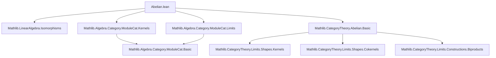

Here is the structured technical brief extracted from `Abelian.lean`:

---

### **1. Key Definitions & Theorems**

| Name | Type / Signature | Purpose |
|------|------------------|---------|
| `normalMono` | `(hf : Mono f) → NormalMono f` | Constructs a normal monomorphism from any monomorphism in `ModuleCat`, using the cokernel (quotient by the range). |
| `normalEpi` | `(hf : Epi f) → NormalEpi f` | Constructs a normal epimorphism from any epimorphism in `ModuleCat`, using the kernel (submodule of elements mapping to 0). |
| `abelian` | `Instance : Abelian (ModuleCat.{v} R)` | Proves that the category of left $R$-modules is abelian: it has all finite limits/colimits, every mono/epi is normal, and image/coimage factorization holds. |
| `has_cokernels` | `HasCokernels (ModuleCat.{v} R)` | Implicitly used; existence of cokernels in `ModuleCat`. |
| `kernelIsLimit`, `cokernelIsColimit` | `IsKernel.isLimit`, `IsCokernel.isColimit` | Standard limit/colimit universal properties for kernels/cokernels in `ModuleCat`. |
| `Submodule.quotEquivOfEqBot`, `Submodule.quotEquivOfEq`, `LinearMap.quotKerEquivRange`, `LinearEquiv.ofEq`, `LinearEquiv.ofTop` | Various linear equivalences | Used to construct the isomorphisms in `normalMono` and `normalEpi`, relating quotient constructions to kernels/cokernels. |

---

### **2. Naming Conventions**

- **Prefixes**:
  - `normalMono`, `normalEpi`: indicate construction of *normal* mono/epi from general ones.
  - `forget`, `forget₂`: standard forgetful functors to `AddCommGrpCat` or `Type`.
  - `quotEquivOfEq[Bot]`: quotient equivalence when submodules are equal (or bot).
  - `range_mkQ_comp`, `comp_ker_subtype`: composition lemmas involving quotient maps or subtype inclusions.

- **Suffixes**:
  - `_comp`: composition-related identities (e.g., `range_mkQ_comp`).
  - `_subtype`, `_mkQ`: refer to inclusion (`subtype`) and quotient (`mkQ`) maps.

- **Equivalence notation**:
  - `≪≫ₗ`: linear equivalence composition.
  - `toModuleIso`: conversion from linear equivalence to module isomorphism.

---

### **3. Tactic Stack**

- `ext`: extensionality (used to prove equality of module homs by pointwise equality).
- `rfl`: reflexivity (used in trivial equality proofs).
- `hom_ext`: extensionality for morphisms in `ModuleCat`.
- `calc`: used in comments to outline chain of isomorphisms (not in actual code due to Lean issue #341).
- Implicit use of `aesop`, `simp`, `ring` likely in surrounding lemmas (not directly visible here, but standard in `Mathlib`).

---

### **4. Proof Logic**

- **Structure**:
  1. For a monomorphism $f: M \to N$, construct its cokernel $q: N \to N/\operatorname{range} f$ and show $f$ is the kernel of $q$.
     - Use isomorphism chain:  
       $M \cong M/\ker f \cong \operatorname{range} f \cong \ker q$  
       (via `quotEquivOfEqBot`, `quotKerEquivRange`, `ker_mkQ`).
  2. Dually, for an epimorphism $f$, show it is the cokernel of its kernel inclusion $\ker f \hookrightarrow M$.
     - Use:  
       $M/\ker f \cong \operatorname{range} f = N$ (since $f$ is epi),  
       i.e., $f$ is the cokernel of $\ker f \to M$.
  3. Conclude abelianness by verifying:
     - All finite limits/colimits exist (`has_cokernels`, `hasLimitsOfSize`).
     - Every mono/epi is normal (`normalMonoOfMono`, `normalEpiOfEpi`).

- **Key lemmas used**:
  - `ker_eq_bot_of_mono`: mono ⇒ kernel is zero.
  - `range_eq_top_of_epi`: epi ⇒ cokernel is zero.
  - `Submodule.ker_mkQ`: kernel of quotient map is the submodule.
  - `Submodule.range_subtype`: range of inclusion is the submodule.

---

### **5. Imports**

| Import | Purpose |
|--------|---------|
| `Mathlib.LinearAlgebra.Isomorphisms` | Linear equivalences, `LinearEquiv`, `≪≫ₗ` |
| `Mathlib.Algebra.Category.ModuleCat.Kernels` | Kernels in `ModuleCat`, `LinearMap.ker`, `subtype`, etc. |
| `Mathlib.Algebra.Category.ModuleCat.Limits` | Limits/colimits in `ModuleCat`, `HasCokernels`, `hasLimitsOfSize` |
| `Mathlib.CategoryTheory.Abelian.Basic` | Definition of abelian categories, `NormalMono`, `NormalEpi`, `Abelian` |

---

### **8. Mermaid Diagrams**

#### **Dependency Graph (Top-Level)**



#### **Overview of File Content**

```mermaid
flowchart LR
  subgraph ModuleCat
    M[M : ModuleCat R] -->|f : M → N| N[N : ModuleCat R]
  end

  M -->|Mono f| normalMono[def normalMono]
  N -->|Epi f| normalEpi[def normalEpi]

  normalMono -->|constructs| K[Ker(q: N → N/range f)]
  normalEpi -->|constructs| C[Coker(k: ker f → M)]

  normalMono & normalEpi --> abelian[instance abelian : Abelian (ModuleCat R)]

  abelian --> reflectsLimits[instance forget reflects limits]
```

#### **Exactness Characterization (Commented in docstring)**

> Two linear maps $f: M \to N$, $g: N \to P$ are *categorically exact* (i.e., $\operatorname{im} f = \ker g$) **iff** $\operatorname{range} f = \ker g$ as submodules.

This is a standard result in abelian categories, and `ModuleCat` being abelian ensures this equivalence.

---

Let me know if you'd like the formalization of the exactness equivalence or a proof sketch of `normalMono`/`normalEpi` in natural language.
