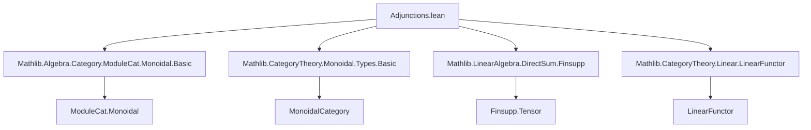
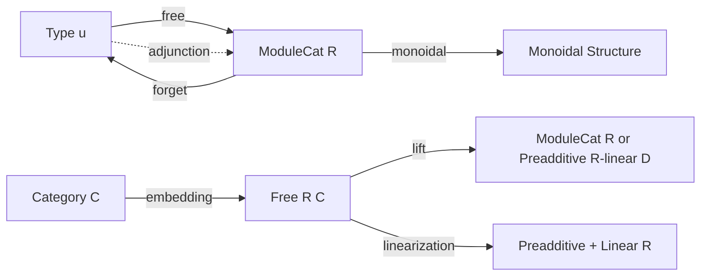

### Technical Brief: `Adjunctions.lean`

---

#### **1. Key Definitions & Theorems**

| Name | Type / Signature | Purpose |
|------|------------------|---------|
| `free` | `Type u ⥤ ModuleCat R` | The *free module functor*: sends a type `X` to the module of finitely supported functions `X →₀ R`. |
| `freeMk` | `X → (free R).obj X` | Embeds a generator `x : X` into the free module as `single x 1`. |
| `free_hom_ext` | `(∀ x, f (freeMk x) = g (freeMk x)) → f = g` | Extensionality principle for module homs out of a free module. |
| `freeDesc` | `(X ⟶ M) → (free R).obj X ⟶ M` | Universal property: extends a function `X → M` uniquely to a module hom. |
| `freeDesc_apply` | `freeDesc f (freeMk x) = f x` | Computes the action of `freeDesc` on generators. |
| `free_map_apply` | `(free R).map f (freeMk x) = freeMk (f x)` | Action of `free` on morphisms on generators. |
| `freeHomEquiv` | `((free R).obj X ⟶ M) ≃ (X → M)` | The bijection underlying the adjunction. |
| `adj` | `free R ⊣ forget (ModuleCat R)` | The *free–forgetful adjunction* for `R`-modules. |
| `εIso` | `𝟙_ (ModuleCat R) ≅ (free R).obj (𝟙_ (Type u))` | Unit isomorphism for monoidal structure on `free`. |
| `μIso` | `(free R).obj X ⊗ (free R).obj Y ≅ (free R).obj (X ⊗ Y)` | Multiplication isomorphism for monoidal structure on `free`. |
| `instance : (free R).Monoidal` | `free R` is a *lax monoidal functor* (in fact strong). | Enables monoidal enrichment of linearization. |
| `Free` | `Type u → Type u` | Type synonym for linear completion of a category. |
| `categoryFree` | `Category (Free R C)` | Constructs the *`R$-linearization* of a category `C`. |
| `embedding` | `C ⥤ Free R C` | Canonical embedding of `C` into its `R$-linear completion. |
| `lift` | `(C ⥤ D) → (Free R C ⥤ D)` | Universal property: extends a functor to the linear completion. |
| `liftUnique` | Uniqueness of `lift` up to iso | Ensures `Free R C` satisfies a universal property. |

---

#### **2. Naming Conventions**

- **Prefixes**:
  - `free_`: properties of the free module functor (`freeMk`, `freeDesc`, `free_map_apply`, `free_ε_one`, etc.)
  - `εIso`, `μIso`: structural isomorphisms for monoidal structure.
  - `embedding`, `lift`: canonical constructions for linearization.
- **Suffixes**:
  - `_hom_ext`: extensionality lemmas for homs.
  - `_apply`: evaluation lemmas (e.g., `freeDesc_apply`, `μIso_hom_freeMk_tmul_freeMk`).
  - `_single`: lemmas involving `Finsupp.single`.
- **General**:
  - `Iso`-based names (`εIso`, `μIso`) for structural isomorphisms.
  - `ext`, `unique`, `naturality` for universal properties.

---

#### **3. Tactic Stack**

| Tactic | Usage Frequency | Purpose |
|--------|-----------------|---------|
| `simp` | Very High | Simplification of `Finsupp`, `freeMk`, `freeDesc`, `εIso`, `μIso`. |
| `ext` | High | Extensionality for homs, functions, `Finsupp`. |
| `rw` | High | Rewriting using lemmas like `Finsupp.lift_apply`, `single_eq_same`. |
| `aesop` | Medium | Closing trivial goals, especially naturality and unit laws. |
| `induction ... using Finsupp.induction_linear` | Medium | Structural induction on `Finsupp` elements. |
| `erw` | Medium | Rewrite with `eq`-like lemmas (e.g., `Finsupp.lapply_apply`). |
| `dsimp` | Medium | Simplify definitions before `rw`. |
| `congr` | Low | Congruence for function extensionality. |
| `all_goals` | Low | Apply tactic to all goals. |

---

#### **4. Proof Logic**

- **Adjointness Proof (`adj`)**:
  - Constructed via `Adjunction.mkOfHomEquiv`.
  - Uses `freeHomEquiv` as the hom-isomorphism.
  - Naturality follows from `free_hom_ext` and simplifications.

- **Monoidal Structure (`instance : (free R).Monoidal`)**:
  - Uses `Functor.CoreMonoidal.toMonoidal`.
  - Verifies triangle and pentagon identities by:
    - Reducing to generators (`freeMk`).
    - Applying `μIso_hom_freeMk_tmul_freeMk`, `μIso_inv_freeMk`, `free_map_apply`.
    - Using `cancel_epi` to reduce to generator-level equalities.

- **Linear Completion (`Free R C`)**:
  - Defines morphisms as `Finsupp (X ⟶ Y) R`.
  - Verifies category axioms via `Finsupp` lemmas (`sum_sum_index`, `add_mul`, etc.).
  - `lift` constructed via `Finsupp.induction_linear` (induction on finite support).
  - Uniqueness (`liftUnique`) via `ext`, using naturality on embedding.

---

#### **5. Imports**

| Module | Role |
|--------|------|
| `Mathlib.Algebra.Category.ModuleCat.Monoidal.Basic` | Monoidal structure on `ModuleCat R`. |
| `Mathlib.CategoryTheory.Monoidal.Types.Basic` | Basic monoidal category theory. |
| `Mathlib.LinearAlgebra.DirectSum.Finsupp` | `Finsupp` and its tensor product properties (`finsuppTensorFinsupp'`). |
| `Mathlib.CategoryTheory.Linear.LinearFunctor` | Linear functors and preadditive/linear categories. |

---

#### **8. Mermaid Diagrams**

##### **Dependency Graph (Top-Level)**



##### **Overview of Theory Flow**



##### **Universal Property Diagram (Free–Forgetful)**

```mermaid
graph LR
  X[Type u] -->|f| M[ModuleCat R]
  X -->|η_X| (free R).obj X
  (free R).obj X -->|∃! freeDesc f| M
  (free R).obj X -.->|η_X| X
```

##### **Monoidal Structure (Free Functor)**

```mermaid
graph LR
  𝟙 -->|εIso| (free R).obj 𝟙
  (free R).obj X ⊗ (free R).obj Y -->|μIso| (free R).obj (X ⊗ Y)
```

---

### Summary

This file formalizes the **free module adjunction** and its **monoidal refinement**, then extends to the **$R$-linear completion of categories**. It leverages `Finsupp` heavily for explicit constructions and uses standard categorical techniques (hom-isomorphisms, induction on finite support, naturality checks). The structure is modular: first adjunction, then monoidal structure, then linearization of categories.
